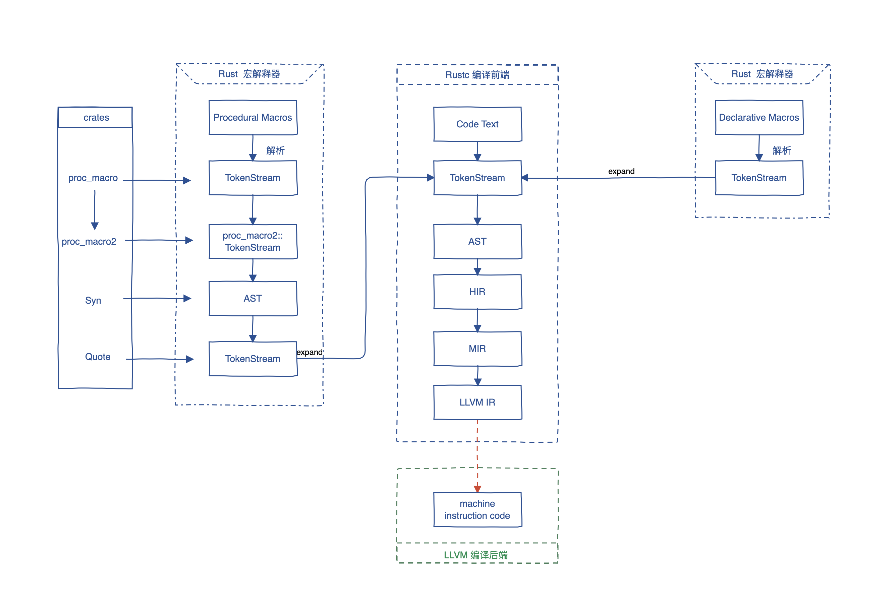

# rust

:::tip
学习资源
:::

- [The Tao of Rust](https://github.com/ZhangHanDong/tao-of-rust-codes/blob/master/tao_of_rust_english.md)
- [Translation of the official The Rust Programming Language book](https://github.com/KaiserY/rust-book-chinese)
- [Translation of the Rust By Example](https://github.com/rust-lang-cn/rust-by-example-cn)
- [RustPrimer](https://github.com/rustcc/RustPrimer)
- [Chinese Rust Community](https://github.com/RustChina/rust-china.org)
- [The book in Traditional Chinese](http://askeing.github.io/rust-book/)
- [Translation of The Little Book of Rust Macros](https://github.com/DaseinPhaos/tlborm-chinese)
- [The Rust Course](https://github.com/sunface/rust-course)

## 安装

> 以下为在 linux、macos 安装 rust 通用的方法 —— rustup(一个管理 Rust 版本和相关工具的命令行工具。)

```bash
$ sudo curl --proto '=https' --tlsv1.2 https://sh.rustup.rs -sSf | sh
```

🔐 实际执行后会经过一系列的选项操作并最后在 `.bashrc` 里面创建 `. "$HOME/.cargo/env"`（暴露在环境变量）。如果使用的不是 `bash` 作为默认终端的话可以将当前配置复制到对应终端的配置环境中，比如 `.zshrc`

```bash
$ rustc -V # 检查是否安装成功
rustc 1.70.0 (90c541806 2023-05-31)
```

:warning: 除此之外还需要安装一个链接器( `rustc` 依赖 gcc、glibc )，在 ubuntu 中可以通过安装 `build-essential`，安装的过程会附带安装 `G++, dpkg-dev, GCC and make....`

```bash
$ sudo apt update
$ sudo apt install build-essential
```

- 查看本地文档

```bash
$ rustup doc
```

> `cargo` 可帮助快速初始化 `rust` 项目，有别于将构建结果放在与源码相同的目录，Cargo 会将其放到 `target∕debug` 目录

- cargo new 创建项目。
- cargo build 构建项目。
- cargo run 一步构建并运行项目。
- cargo check 在不生成二进制文件的情况下构建项目来检查错误

🔐 完成以上环境的安装后，就要配置 IDE (vscode) 编程环境了，主要是安装相关插件

- `rust-analyzer`：rust 代码补全以及格式化
- `even better toml`：支持 `.toml` 文件完整特性

🔐 `rustrc`、`rustup`、`cargo` 概念区分

- `rustrc`：编译器，编译项目代码
- `rustup`：工具链管理，用于安装 `rustrc` 版本以及常用组件
- `cargo`：包管理工具

## 编译过程



## 常见编程概念

> rust 变量定义、基础语法，包括数据结构.....

### 变量

- 定义一个不可变变量（不能二次赋值）

```rust
let x = 5
```

- 定义可变变量

```rust
let mut x = 5
```

> 🔐 存在一个隐藏变量的概念 —— 可同时使用 `let` 声明同名变量，后面的覆盖前面的声明。当前变量仍然不可二次修改。

`隐藏变量` 概念和 `mut` 的区别

- 前者每次都要加上 `let` 定义
- 前者定义同名变量时类型可不一致（实际上是创建了一个新的变量）

### 常量

> 常量与变量的区别

- 不允许对常量使用 `mut`
- 声明常量使用 `const` 关键字
- 必须注明值的类型
- 只能被设置为常量表达式，而不可以是其他任何只能在 `运行时计算出的值`

```rust
const THREE_HOUR_IN_SECONDS: u32 = 60 * 60 * 3
```

🔐 Rust 对常量的命名约定是在单词之间使用全`大写加下划线`

### 数据类型

`rust` 是 **静态类型** 语言，在编译时就需要知道所有变量的类型

#### 标量

`标量类型`代表一个单独的值，Rust 有四种基本的标量类型：整型、浮点型、布尔类型和字符类型

##### 整型

> 一个没有小数部分的数字

🔐 表格：rust 中的整型类型

| 长度    | 有符号  | 无符号  |
| ------- | ------- | ------- |
| 8-bit   | `i8`    | `u8`    |
| 16-bit  | `i16`   | `u16`   |
| 32-bit  | `i32`   | `u32`   |
| 64-bit  | `i64`   | `u64`   |
| 128-bit | `i128`  | `u128`  |
| arch    | `isize` | `usize` |

对应 `bit位` 的变体都可以设置为有符号和无符号。

- 对于 `有符号`变体来说，存储范围

$$
-(2^{n-1}) 到 2^{n - 1} - 1
$$

- 对于 `无符号` 变体来说，存储范围

$$
0 到 2^{n} - 1
$$

- `isize` & `usize` 类型依赖运行程序的计算架构：64 位 架构上时 64 位，32 位架构上为 32 位
- rust 数字类型默认是 `i32`

🔐 表格：rust 中的整型字面值

| 数字字面值                    | 例子          |
| ----------------------------- | ------------- |
| Decimal (十进制)              | `98_222`      |
| Hex (十六进制)                | `0xff`        |
| Octal (八进制)                | `0o77`        |
| Binary (二进制)               | `0b1111_0000` |
| Byte (单字节字符)(仅限于`u8`) | `b'A'`        |

- `98_222` 等价于 `98222` ，`_` 作为分隔符号方便读数

##### 浮点型

> rust 浮点分为 单精度浮点(`f32`) 和 双精度浮点 (`f64`)

```rust
fn main() {
    let x = 2.0; // f64(默认)
    let y: f32 = 3.0; // f32
}
```

##### 布尔类型

> rust 布尔类型有两个可能的值 `true` & `false`

```rust
fn main() {
    let t = true;
    let f:bool = false;
}
```

##### 字符类型

> rust 字符类型被定义为 `char`，代表原生字母类型

🔐 需要注意的是，使用`单引号`声明 `char` 字面量；使用 `双引号`声明字符串的字面量

#### 复合

复合类型将多个值组合成一个类型，包括 `tuple` 和 `array`

##### 元组

- 长度不可变

- 定义 & 访问

  ```rust
  fn main() {
    let tup:(i32, f64, bool, char) = (10, 0.5, true, 'a');
    println!(
      "tup.0:{}, tup.1:{}, tup.2:{}, tup.3:{}",
      tup.0, tup.1, tup.2, tup.3
    )
  }
  ```

- 解构取值

  ```rust
  fn main() {
    let tup:(i32, f64, bool, char) = (10, 0.5, true, 'a');
    let (x, y, q, z) = tup;
  }
  ```

##### 数组

区别于 `元组`，数组中每个元素类型必须相同；且在 `rust` 中，数组的长度是固定的

- 初始化数组

  ```rust
  let array: [i32; 5] = [1, 2, 3, 4, 5]; // 数组长度为5,且所有值类型均为i32
  let array = [3; 5] // 数组长度为5,且所有值均为3
  ```

- 通过 `array[index]` 的形式访问值

#### 函数

函数定义与 `js` 相差不多，同样是 `()` 包裹参数、`{}` 包裹函数体，但以下几点需要注意

- 函数命名—— 全部采用小写，存在多单词时使用` _` 分隔

- 函数参数全部需要注明类型

- 函数返回基于表达式，表达式不需要在末尾加上 `;`

  ```rust
  fn main() {
      let x = plus_one(5);
      println!("The value of x is: {x}");
  }

  fn plus_one(x: i32) -> i32 {
      x + 1; // 报错；因为这是一个语句，语句并没有返回值
      x + 1 // 正确；代表这是一个表达式，表达式返回计算值
  }
  ```

#### 循环

> `rust` 中有三种循环：`loop`、`while`、`for`，相对来说比较常用的时后两者

##### loop

- 可以通过 `break` 返回循环值

- 可定义标签，在多层 `loop` 循环嵌套情景下终止对应标签循环

  ```rust
  fn for_loop() {
      let mut count = 0;
      'counting_up: loop {
          let mut remaining = 10;
  		// 嵌套 loop
          loop {
              if remaining == 9 {
                  break;
              }
              if count == 2 {
                  break 'counting_up;
              }
              remaining -= 1;
          }

          count += 1;
      }
  }
  ```

##### while

与 `js ` 相差不多

##### for

这里的 `for ` 指的是 `for...in` 循环，也是使用频率最高且不容易出错的循环

## 所有权

> 所有权是 rust 的核心理念，用于 **内存回收**

并不是所有的数据类型都有所有权的概念，像 `i32` 、`boo` 这些基本标量以及元组和数组这些复合变量其实都不涉及所有权相关，而 `String` 这样复杂类型才涉及这个概念。

🔐 理解所有权就要理解 `rust` 变量内存分配模式。

- 对于编译阶段就能确定所需要内存空间的变量来说，主要存储在`栈内存`中，当变量离开对应的作用域后自动回收（出栈）
- 对于在运行时才能确定内存空间的变量来说，数据存储在 `堆内存` ，而在 `栈内存`中则开辟一个空间存储 堆内存的地址、数据长度、容量

所有权机制：对于数据存储在 `堆内存`中的变量，一旦被赋值给了其他变量，则内存所有权转交，当前变量被认为不再有效。

```rust
let s1 = String::from("hello");
let s2 = s1; // s1 指向的堆内存所有权转交给了 s2，s1不再有效
```

🔐 对于不希望出现上诉所有权转交的情况则需要理解 `借用` 机制

```rust
let s1 = String::from("hello");
let s2 = &s1; // s2具备访问s1堆内存能力但所有权不转交
```

`借用` 机制存在风险 —— 借用的作用域为**借用开始到最后一次使用结束**，在该作用域内：

- 可以同时存在不可变的借用
- 不能同时存在可变和不可变的借用

```rust
let s1 = String::from("hello");
let s2 = &s1;
let s3 = mut &s1;
println("{s3}") // no error
println("{}{}", s2, s3) // error
```

🔐 **slice** 类型

`slice` 类型的引入主要是保证对 String 类型的引用持续有效

```rust
fn main() {
    let s1 = String::from("hello");
    let i = get_first_index(&s1);
    s1.clear()
    // s1清空了i作为其内部的索引自然也就无效，看上去 get_first_index 的存在毫无意义，但在编译阶段无法检查该无用行为
}
```

为了解决上面问题，可以在 `get_first_index` 返回一个对 `s1` 的引用 `&s1[2..]` 来代替索引，这样就能保持对 `s1` 的持久引用，一旦 `clear` ，就在尝试获取可变的引用，与 i 作为不可变引用可相互牵制

```rust
let s1 = String::from("hello");
let s2 = &s1[..] // 引用 s1 整个字符串
let s3 = &s1[..2] // 引用 s1 前两个字符串
```

###

## 结构体

> 结构体与 C 里面的概念相似，可以被理解为是某类属性的集合

```rust
struct User {
    active: bool,
    username: String,
    email: String,
    sign_in_count: u64,


fn main() {
    let user = User {
        active: true,
        username: String::from("jzyismylover"),
        email: String::from("3011543110@qq.com"),
        sign_in_count: 10,
    };
}
```

🔐 以上定义的是不可变结构体，变量是否可变取决于结构体本身；结构体同样存在所有权的概念，因此往往在使用的时候都会以借用方式使用

```rust
fn get_username(&user: User) {}
get_username(&user)
```

🔐 结构体可定义内部方法，通常我们叫他关联函数；方法的第一个参数一般是 `&self:Self` 简写为 `&Self`

```rust
impl Rectangle {
    fn area(&self) -> u32 { // 关联函数
      return self.width * self.height
    }
}
```

🔐 关联函数可以不是方法，可用作返回一个结构体新实例的构造函数

`let sq = Rectangle::square(3);`

```rust
impl Rectangle {
    fn square(size: u32) -> Self {
        Self {
            width: size,
            height: size,
        }
    }
}
```

🔐 结构体元组

```rust
struct Color(i32, i32, i32);
fn main() {
    let rgb = Color(0, 255, 255);
    let Color(red, blue, green) = rgb; // 允许解构
}
```

## 枚举

> 相比于结构体，枚举提供了集合聚集功能，也就是允许我们定义一个集合里面的若干类别

- 定义 `枚举`

  ```rust
  enum Message {
      Quit,
      Move { x: i32, y: i32 },
      Write(String),
      ChangeColor(i32, i32, i32),
  }
  // 使用的时候需要 Message::Quit 指定成员
  ```

- `Options` 枚举

  ```rust
  // 区别于普通枚举，Option 枚举挂载在全局作用域
  // 使用到了泛型概念
  enum Option<T> {
      None,
      Some(T)
  }
  // 使用的时候直接使用类型即可 Some(5)
  ```

- 类型判定：枚举中对应的是同一类别不同的实体，因此往往需要去进行对应实体类型判定，常用可以使用 `match` 或者 `if let` 去界定类型

  ```rust
  fn value_in_cents(coin: Coin) -> u8 {
      match coin {
          Coin::Penny => 1,
          Coin::Quarter(state) => {
              // state 指代泛型值
          }
      }
  }
  ```

## 模块

> 模块在 rust 里面是一个比较重要的概念，规定了我们如何去导包以及组织项目结构

```text
src
├─front_of_house.rs
├─lib.rs
├─main.rs
├─bin
|  ├─enum.rs
|  ├─loop.rs
|  ├─ownership.rs
|  ├─struct.rs
|  └variable.rs
```

`rust` 中其实模块指代的就是一个包(crate)，`crate` 其实有两种，一种是 `binary crate`，一种是 `package crate`。

- `binary crate`：包含 `main` 函数，可执行
- `package crate`：不包含 `main` 函数，通常是一个集合方法的定义暴露给其他模块使用

🔐 定义 `package crate`

```rust
// src/lib.rs
mod front_of_house {}
mod user {}
```

以上几乎所有的模块都定义在 `crate` 根目录，即 `src/lib.rs`，代码过于冗余，因此需要将模块内部的代码进行拆分。因此才会出现上面展示的项目目录，即在 `src` 内部定义 `front_of_house.rs` 文件

- 私有 & 公有

默认情况下一个模块内定义的方法、枚举、结构体都是私有的，如果需要能够暴露给外部使用的话需要加上 `pub` 字段

```rust
mod frontend {
    pub fn add() {}
}

mod frontend {
    pub mod practise {
        pub fn add() {}
    }
}
```

```rust
mod hosting {
    pub struct Mode {
        pub name: String,
        pub age: i32
    }
}
// no error
let mut user = hosting::Mode {
    name: String::from("username"),
    age: 18,
};
```

🔐 定义 `binary crate`

一般 `binary crate ` 定义在 `bin` 目录下，使用 `cargo` 执行的时候

```bash
$ cargo run --bin [binary package name]
```

## vetur

> vetur 允许在单独的数据结构中存储多个相同类型的值

- 初始化

```rust
let v: Vec<i32> = Vetur::new() // 初始化未知数据类型
let v = vec![1, 2, 3] // 初始值已知情况下
```

- 更新 `vetur`

```rust
v.push(item)
```

- 读取 `vetur`

```rust
&v[index]

v.get(index)
```

两种方式的区别：

- 通过借用方式访问索引的方式一旦遇到 `index` 越界会抛错给编译器；返回值以一个对该索引对应数值的引用
- 通过 `get` 方式访问在遇到上诉情况会返回 None；返回值是一个可以用于 `match` 的 `Option<T>`，因此可通过 `match` 对越界情况作出相应的用户提示

## 泛型

> 与 TS 类似，泛型使得代码整体可复用性更好，兼容更多的类型

```rust
struct Point<T> {
    x: T,
    y: T,
}

impl<T> Point<T> {
    fn x(&self) -> &T {
        &self.x
    }
}

fn main() {
    let integer = Point { x: 5, y: 10 };
    let float = Point { x: 1.0, y: 4.0 };
}
```

比较有意思的点是一个类型专用，以下实例化泛型，如果 `Point` 结构体成员的类型均为 `f32` 才具备 `distance_from_origin` 方法

```rust
impl Point<f32> {
    fn distance_from_origin(&self) -> f32 {
        (self.x.powi(2) + self.y.powi(2)).sqrt()
    }
}
```

🔐 泛型性能

得益于 `rust` 在编译时对泛型代的单态化，因此实际不会对运行时效率产生影响。单态化是一个通过填充编译时使用的具体类型，将通用代码转换为特定代码的过程。

```rust
let integer = Some(5);
let float = Some(5.0);

// 单态化后
enum Option_i32 {
    Some(i32),
    None,
}

enum Option_f64 {
    Some(f64),
    None,
}

fn main() {
    let integer = Option_i32::Some(5);
    let float = Option_f64::Some(5.0);
}
```
