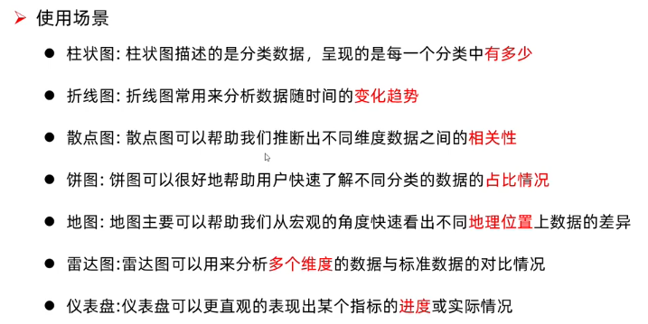
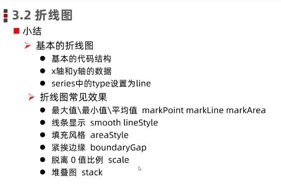
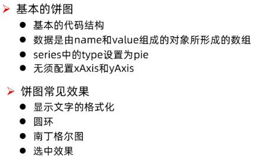

# echarts

可视化图表开源库

🔐 `echarts` 启动步骤

1. 注册 `DOM` 作为容器
2. 初始化 `echarts` 实例
3. 配置项定义
4. 将配置项注入 `echarts` 实例（ `setOptions` ）

因此关键是理解配置项！！！

## options

> 配置可以分为通用配置和特定图表配置

- 通用配置

  - `title`：图表标题
  - `tooltip`：提示。主要指当悬浮或者点击后图表显示对应的数据
  - `tooltox`：工具按钮。包含导出、数据切换、放大缩小、数据视图、重置
  - `legend`：图例；主要用于筛选

- 数据配置
  - `xAxis`：配置 x 轴
  - `yAxis`：配置 y 轴
  - `series`：配置图表数据、类型……

## charts

> 各种类型图表配置项



### line



```js
const options = {
  xAxis: {
    type: 'category',
    data: [],
    boundaryGap: true, // x轴数据紧挨y轴
  },
  yAxis: {
    type: 'value',
    scale: true, // y轴从最小的数据开始
  },
  series: [
    {
      type: 'line'
      smooth: true, // 堆叠
      data: [],
      markPoint: {
        data: [
          {
            type: 'max',
          },
          {
            type: 'min',
          },
        ],
      },
      markLine: {
        data: [
          {
            type: 'average',
          },
        ],
      },
      areaStyle: {
        // 填充
      },
    },
  ],
};

```

## scatter

散点图，用于呈现两组变量之前相关性。区别于折线图或者柱状图之类，`x y` 轴都是 `value` 轴，因此对应 `series` 要配置成数组

```js
const options = {
  xAxis: {
    type: "value",
    scale: true,
  },
  yAxis: {
    type: "value",
    scale: true,
  },
  series: [
    {
      type: "scatter",
      data: [[]],
    },
  ],
};
```

可以扩展实现 **涟漪动画** 或者 **气泡图** 效果

- 涟漪动画：散点动画效果
- 气泡：散点大小根据条件呈现不一样的大小

## pie

饼图可以帮助快速了解不同分类的数据的占比情况



🔐 其中说明下圆环以及南丁格尔图的实现

- 圆环：对应设置圆环的是 `radius`

  ```js
  radius: ["50%", "75%"];
  // 50% 对应的是内圆半径
  // 75% 对应的是外园半径
  ```

- 南丁格尔图：直白说就是每个饼图区域半径大小都不一致（根据数据大小区分），对应的设置属性是 `roseType`，置为 `true` 即可

## radar

雷达图应用与需要比较多个维度数据相对于最大值情况或者不同产品的对比

## gauge

仪表盘，呈现一个动作的得分情况

## display


对于显示 `echarts` 支持进行不同级别对上述属性进行配置

- 主题：可从 `echarts` 官网自定义主题并下载成 `js` 的方式引入即可

  ```js
  instance.init(dom, themeName);
  ```

- 调色板：调色板即为颜色配置

  - 主题级别
  - 全局级别
  - 局部级别

  可在不同级别对 `color` 进行配置，按照“就近原则”，配置越近优先级越高

- 样式

  - `itemStyle`
  - `lineStyle`
  - `areaStyle`
  - `label`

## animation

- `echarts` 自带的 `loading` 动画

```js
instance.showLoading(); // 显示加载动画

instance.hideLoading(); // 隐藏加载动画
```

- 增量动画：增量动画的触发基于 `setOptions` 执行

  🔐 `setOptions`

  多次执行 `setOptions` 遵顼相同覆盖，不同融合的原则
