# 主流技术
桌面应用开发技术其实有很多， qt、nw.js、electron、tauri。
- qt 使用 c++ 开发，贴近底层开发，效率高
- nw.js & electron ：允许我们使用 web 开发的技术构建应用
- tauri：近期兴起，使用 rust 作为逻辑后端，可以使用前端技术开发逻辑前端
- flutter：使用 dart 开发
- tauri 使用 rust 作为逻辑后端，基于 rust 内存占用低 和 tauri 本身放弃 chromium 转而使用系统内置 webview 的策略，解决了 electron 高内存占用 & 打包体积过大的问题，因此具备很高的潜力。但是由于逻辑后端是 rust 技术栈，上手难度会比较高，学习成本大。
- flutter 作为一个在 app 端跨平台的工具，目前其实也已经逐步能迁移到桌面开发，基于自建的一套 ui 渲染引擎同样可以避免打入 chromium 的问题，同样具备一套代码兼容多平台开发的能力


以上是从整个开发生态上的介绍，那针对前端开发人员，主流技术栈为：JS/TS，上手开发成本最低的是 nw.js & electron，electron 相比 nw.js 社区更活跃，很多大应用基于 electron 构建。像 vscode、QQ（使用 electron 重构），很多问题在社区都能找到解决方案。因此没有特殊需求的情况下其实还是首选 electron 作为开发框架。下面也主要围绕 electron 相关进行介绍。

# 工作原理
对于跨端框架我们可能比较感兴趣这个框架是怎么去实现多平台兼容以及实现过程中都解决了什么重要的问题。那对于 electron 来说，能够跨端的原因是集成了 chromium。chromium 是一个渲染引擎，本身是可以在多个 os 架构下使用，因此使用 chromium 作为 UI 渲染可以做到多端 UI 一致（不需要考虑平台兼容性的问题）。chromium 作为一个渲染引擎本身并不能进行 一些与系统相关 GUI 编程 ，因此 electron 同时集成了 node 提供文件、网络处理的能力。既然是桌面应用，那应用免不了是要跟操作系统打交道，像系统托盘，消息通知……，这是 node 无法解决的问题，因此最后封装了 native api 提供应用调用底层系统 api 功能的能力。

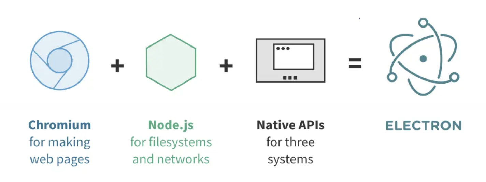
<div style="text-align:center;">图 1 electron 三剑客</div><br>

集成了 chromium & node.js 最大问题是需要解决 chromium & node.js 事件循环不一致的问题。好奇一下为什么要需要解决这个问题？electron 采用多进程架构，分为主进程和渲染进程，无论是主进程还是渲染进程都由 js 去控制，框架并不限制渲染进程内使用 node api，因此这就有一个矛盾点：在 chromium main thread 中会同时出现两个运行时，各自都有事件循环机制（控制 js 周期执行），js 单线程同一时间只能存在一个事件循环，因此需要协调。

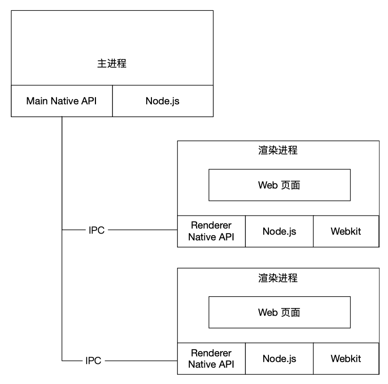
<div style="text-align:center;">图 2 electron 多进程架构</div><br>

怎么整合呢？electron 给出了一个整合方案：使用 libuv 重写 chromium message loop 接口
重写分为两个过程
chromium render 进程
chromium browser 进程
为啥是这两？要从 chromium 多线程架构说起 introduction

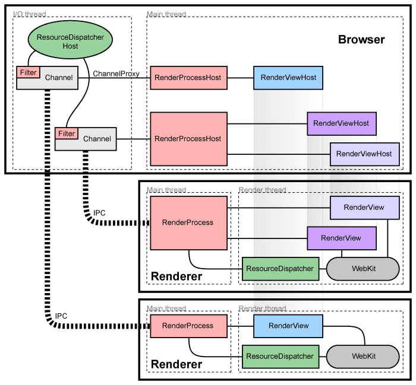
<div style="text-align:center;">图 3 chromuim 多进程架构<</div><br>

重写的过程中发现：render 进程只需要覆盖事件监听的机制就好；而对于 browser 进程，不同操作系统实现的事件循环底层逻辑还不一样（我理解是不同系统处理事件订阅使用库文件不一样），适配工作量大很难处理一些边界条件，因此这个方案算是告吹了。

放弃整合确保同一时间只有一个事件循环执行可以使用“轮询策略”。以 node event loop 作为主事件循环，在 node event loop 轮询 GUI 事件执行。
时机不准确（GUI 事件反馈延迟）
占用 cpu 资源 过多

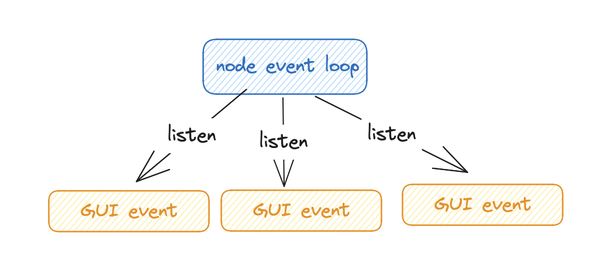
<div style="text-align:center;">图 4 轮询 GUI 事件示例图</div><br>

🌟 最后基于 libuv 提供 backend fd 标识（backend fd 可以标识 libuv 有新事件推送），以 chromium event loop 作为主事件循环，新开一个线程来执行轮询操作，同样是轮询好处在于不需要针对多个 GUI 事件轮训，cpu 占用降低。

# 功能分析

## 启动
目前社区上其实有一些已经集成了 electron 的脚手架，像 vite-plugin-electron、vue-cli-electron...... 很多时候会比较好奇整个启动的流程是什么样子的？要说明这个问题首先介绍一下 electron 的整个运作机制。

前面其实也有提到，electron 采用的是多进程架构，分为主进程和渲染进程
主进程：处理与操作系统的交互（窗口、系统托盘）
渲染进程：UI 渲染
一个 electron 应用中有且只有一个主进程，一个窗口对应一个渲染进程，因此实际是一个一对多的架构。主进程和渲染进程之间使用 ipc 进行通信 因此项目启动需要同时启动主进程和渲染进程。
- 渲染进程的启动很好理解，和 web 开发模式一致，通过 webpack / vite 等构建工具编译打包，通过 index.html 文件设定挂载点引入资源从而完成 spa 页面渲染。
- 对于主进程的启动，可以理解为是使用 node 监听端口启动了一个单例本地服务。两者如何连接在一起？electron 有一个 loadURL 的 api 可以加载一个 html 文件，html 文件设定为渲染进程打包好资源的入口文件就可以实现将页面嵌入 chromium 当中实现视图渲染。

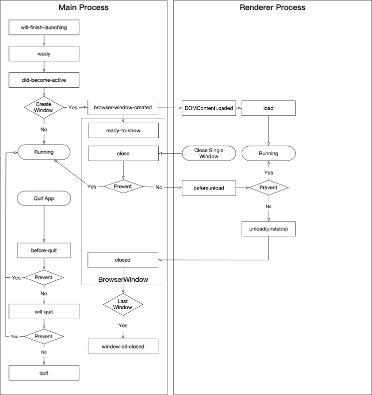
<div style="text-align:center;">图 6 electron 生命周期</div><br>

## 进程通信
为什么需要进程通信这个过程？—— 在渲染进程想要使用 node / electron api
- 方式一：设置 nodeIntegration: true，即允许直接通过 import / require 的方式导入 electron / node api（不安全 -- 一旦被劫持了就 gg（直接执行方法、原型链污染））
- 方式二：基于事件订阅，主进程监听事件流，渲染进程通过数据推送触发事件更新，主进程执行事件，相比于方式一，劫持者也没有这么容易去更改过程中的行为


### 单窗口通信
> 单窗口怎么与逻辑主进程进行数据通信
electron 封装了 ipcMain、ipcRenderer 模块
```
ipcMain.on("toMain", (event, args) => {
  fs.readFile("path/to/file", (error, data) => {
    // 文件读取数据推送给渲染进程
    win.webContents.send("fromMain", responseObj);
  });
});

// 渲染进程接受数据
ipcRenderer.on(channel, (event, ...args) => func(...args));

// 渲染进程推送数据
ipcRenderer.send(channel, data);
```

### 多窗口通信
如果存在多窗口的情况下不同窗口之前需要进行数据通信的话又是怎么样的一种形式？
- 方式一：以主进程作为沟通桥梁
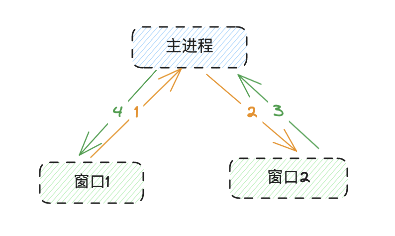
<div style="text-align:center;">图 7  简单多窗口通信方式</div><br>
基于两个窗口这种方式当然不会出问题，但是一旦出现多窗口，主进程就会出现多个数据同类型的事件监听（窗口膨胀）

<br>

-  方式二：定义 globalWindowMap
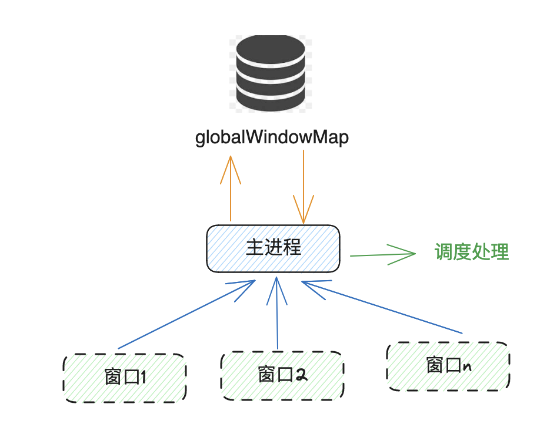
<div style="text-align:center;">图  8 全局存储已创建窗口</div><br>

preload
想象一下用户可以在渲染进程直接操作系统文件，包括删除修改等操作，在没有授权的情况下这是非常危险的行为，参考 web 应用为什么不能操作文件系统）。
在渲染进程中进行进程通信就会用到 ipcRenderer，而直接通过  const {ipcRenderer } = require('electron') 的方式又违反了安全策略，因此 electron 提供了一个 context preload 作用域没，在页面先执行一个 js 文件，将 node、electron api 通过函数的形式暴露给客户端.

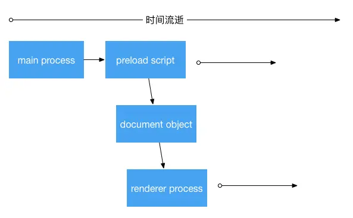
<div style="text-align:center;">图 7 electron 进程执行顺序</div><br>

```js
const {
  contextBridge,
  ipcRenderer
} = require("electron");

contextBridge.exposeInMainWorld(
  "api", {
      send: (channel, data) => {
          // whitelist channels
          let validChannels = ["toMain"];
          if (validChannels.includes(channel)) {
              ipcRenderer.send(channel, data);
          }
      },
      receive: (channel, func) => {
          let validChannels = ["fromMain"];
          if (validChannels.includes(channel)) {
              // Deliberately strip event as it includes `sender` 
              ipcRenderer.on(channel, (event, ...args) => func(...args));
          }
      }
  }
);
```
其实在 contextBridge 引出之前还有一种方式是直接设置 window，但这被认为是不安全！
如果直接在 window 上设置的话，可以会存在篡改风险，黑客通过劫持网络请求通过 JS 完全可以重写 window 上的方法从而实现一些危险的操作。而 contextBridge 定义的上下文方法其实是不允许被重写的。


api
demo 演示
BrowserView
允许在窗口中嵌入 web url、browserwindow

BrowserWindow
main process 创建窗口，窗口放大、缩小、focus 都是通过这个 BrowserWindow 实例操作

Tray
系统托盘设置. 菜单、图标的定制……

Notification
系统通知

webContents
主进程对窗口（渲染进程）的引用，包括一些数据推送、窗口获取……

## 打包
在 electron 中，打包可以分为两个阶段，一个阶段是资源的打包（渲染进程、主进程代码），另外一个阶段是生成不同平台不同架构的二进制程序包。

### 资源打包
和开发过程类似，同样需要处理主进程和渲染进程的打包
```js
// 渲染进程打包
function buildRenderer() {
    return Vite.build({
        configFile: Path.join(__dirname, '..', 'vite.config.js'),
        base: './',
        mode: 'production'
    });
}

// 主进程打包
function buildMain() {
    const mainPath = Path.join(__dirname, '..', 'src', 'main');
    return compileTs(mainPath); // 编译 typescript
}
```

渲染进程打包与 web 相差无异
主进程打包其实就是一个编译的过程，将原来的代码编译压缩成一个 [name].js 文件
生成二进制程序包
不同操作系统安装程序方式不太一样
macos：dmg、app store
linux：deb、rpm、pacman
windows：nsis、portable
因此如果要开发真正跨端使用的应用，需要针对不同平台打包生辰不同二进制程序包。electron 官网提供了一个构建工具 electron-builder，可以通过选项配置完成上述打包流程。
```js
const builder = require('builder')

await builder.build({
    ...targetInfo.buildOptions, // 二进制包格式
    // buildOptions: { win: ['nsis'] },
    // buildOptions: { linux: ['dev', 'pacman'] },
    publish: publishType ?? 'never',
    x64: arch == 'x64' || arch == 'x86_64',
    ia32: arch == 'x86' || arch == 'x86_64',
    arm64: arch == 'arm64',
    armv7l: arch == 'armv7l',
    config: { ...options, ...targetInfo.options },
})
lx-music 跨平台打包
const options = {
    files: [
      '!node_modules/**/*',
      'node_modules/font-list',
      'node_modules/better-sqlite3/lib',
      'node_modules/better-sqlite3/package.json',
      'node_modules/better-sqlite3/build/Release/better_sqlite3.node',
      'node_modules/electron-font-manager/index.js',
      'node_modules/electron-font-manager/package.json',
      'node_modules/electron-font-manager/build/Release/font_manager.node',
      'node_modules/node-gyp-build',
      'node_modules/bufferutil',
      'node_modules/utf-8-validate',
      'build/Release/qrc_decode.node',
      'dist/**/*',
  ],
}
```
比较重要的一个选项是 files 的配置，files 配置了哪些文件是在生成二进制包的过程中需要一同拷贝进去，这是程序是否能正常运行的关键。why？应用程序包在执行的时候会去寻找入口文件，而入口文件的配置在 package.json main 选项中，因此主进程的 chunk 文件路径需要和 package.json 中main 选项一致才能确保启动的时候能正常启动并执行后续渲染进程加载程序

 
## 更新
electron 的更新可以分为两种：全量更新、增量更新
全量更新：全量更新即每次需要更新的时候都需要用户重新下载完整应用包后重启应用
增量更新：每次只下载有差异的部分
blockmap
asar

version: 2.0.0
files:
  - url: YourAppName-Mac-2.0.0-Installer.dmg
    sha512: Qc3PvBSJAn+D/HtyT7b9pLDoE0WAzBmaMahaf+7OQG+cJvrbYjerIlS0QZhGvfAEWnyBaPIRi50rvdmlGEP8rg==
    size: 91650113
path: YourAppName-Mac-2.0.0-Installer.dmg
sha512: Qc3PvBSJAn+D/HtyT7b9pLDoE0WAzBmaMahaf+7OQG+cJvrbYjerIlS0QZhGvfAEWnyBaPIRi50rvdmlGEP8rg==
releaseDate: '2023-12-19T01:40:43.774Z'

全量更新
electron-builder 在打包的过程中会生成一个 latest.yml 文件（在 macos 上是  latest-mac.yml ，在 linux 中为 latest-linux.yml），描述应用的版本、下载链接、签名等信息，electron-updater 判断版本更新的就是基于 latest.yml 中的 version 字段。
```json
"build": {
    "publish": [
      {
        "provider": "generic", // 允许定义 http server
        "url": "<store_url>" // 存放 latest.yml & [name].exe 路径
      }
    ]
}
```

```yml
latest.yml
version: 
files:
  - url:
    sha512: 
    size:
path: 
sha512: 
```


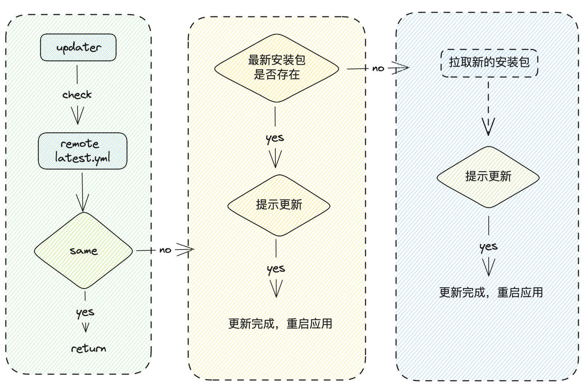
<div style="text-align:center;">图 7 全量更新流程</div><br>


缺点：每次更新都需要拉取完整程序安装包，更新时间慢，需要流量大

## 增量更新

### blockmap

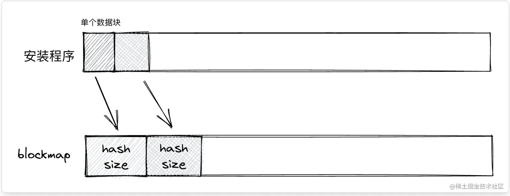
<div style="text-align:center;">图 8 blockmap diff 算法</div><br>

增量更新是基于 blockmap 进行 diff 比较。blockmap 是一个使用 gzip 压缩过的 json 资源，存储了二进制安装包分段的索引以及对应的哈希值，通过比较线上和本地的分段的哈希值来判断这个分段是否发生更新，更新则重新发起请求，最后重新拼接为一个完成的安装包程序。

```
{ 
   "version": "2", 
   "files": [ 
     { 
       "name": "file", 
       "offset": 0, 
       "checksums": [ "VxFZSGxhDYz5FXgMiOUk5oCc" ], 
       "sizes": [ 32768 ] 
      } 
    ]
}
```
blockmap 大概长这样子，checksums 就是对应的哈希值，offset 就是分片偏移

### asar
electron-builder 打包的时候可以配置生成 asar 文件
app.asar：打包一般不频繁更新的文件
app.asar.unpack：打包频繁更新的文件（一般是渲染进程代码）


<div style="text-align:center;">图 9 electron asar 启动流程</div><br>

electron-builder 生成 asar 配置文件
```json
{
  "appId": "com.test.app",
  "productName": "APP",
  "files": ["./build/**/*"],
  "compression": "maximum",
  "asar": true,
  "asarUnpack": [
    "./build/src", // 不需要打包到 asar 中的文件，也就是有改动的代码
    "./build/sdk/one",
    "./build/sdk/two"
  ],
  "directories": {
    "output": "dist"
  },
  "mac": {
    "target": ["dmg", "zip"]
  }
}
```

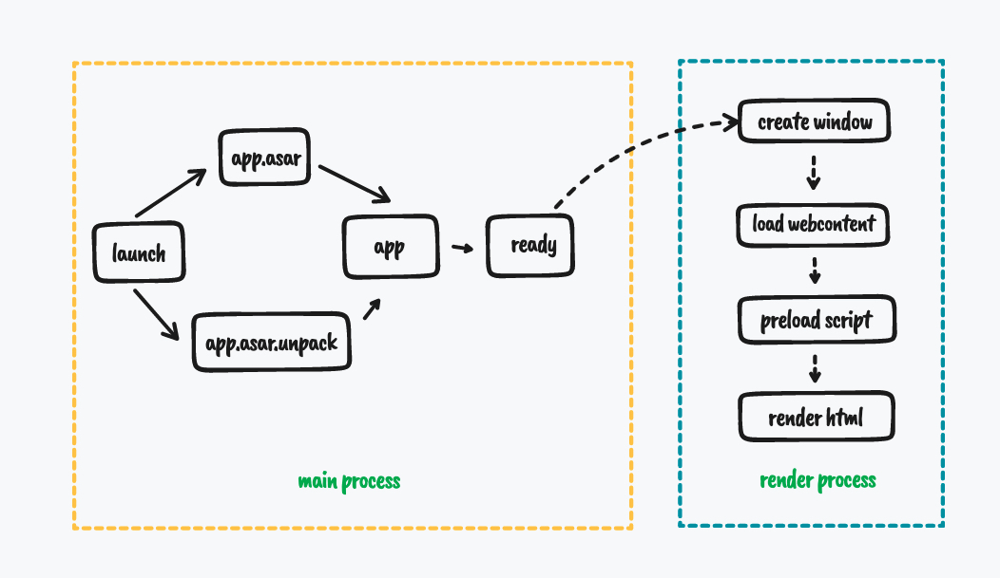
<div style="text-align:center;">图 10 electron 拉取 asar 更新过程</div><br>