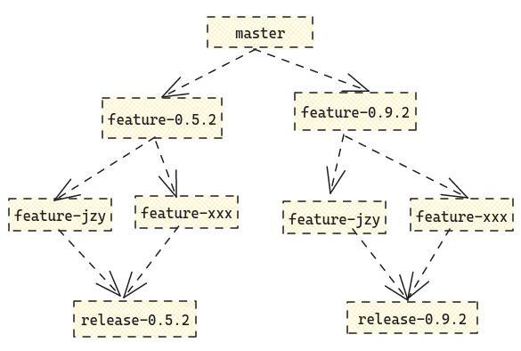
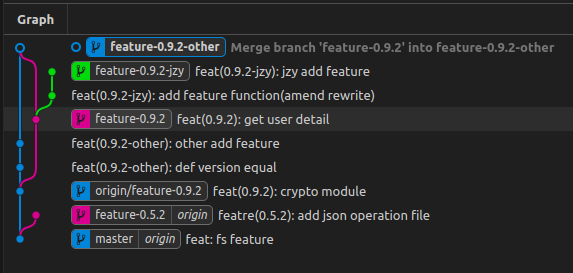
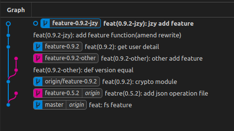
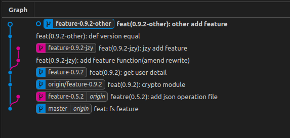

# 版本控制

- git 是分布式版本控制系统。可以有效、高速的处理从很小到非常大的项目版本管理。
- 那什么是版本控制呢？版本控制也是一种软件工程技巧，借此能在软件开发的过程中，确保由不同人所编辑的同一程序文件都得到同步。通俗的来说就是版本控制其实是一个记录着我们对文件不同修改的一个工具。

**1. 本地版本控制**
本地版本控制主要通过在硬盘上保存一些补丁集，通过应用所有的补丁可以重新计算各个版本的内容。我们在清理电脑垃圾时有时候会看到有windows更新后的缓存文件，那它其实就是记录着上一个版本的一些信息。
优点：很多系统都有内置配置
缺点：由于是在自己电脑上，不适合多人协作

**2. 集中化的版本控制系统**<br>


<div style="text-align: center;">图1 集中式版本控制系统图示</div>

<br>
集中化的版本控制系统，所有的版本库都是保存在中央仓库中，更新和推送版本都必须推送到中央仓库。
优点：相比于本地版本控制系统，解决了无法多人协作的问题，可以通过中央仓库看到别人对项目做出的修改，同时每个人的修改都可以上传到仓库实现同步。
缺点：每个版本的提交都必须基于联网的情况下提交到中央仓库，在没有及时备份的情况下，一旦中央仓库损坏，就会导致项目资料销毁，虽然每个开发者的电脑上都有部分代码，但是重新拼凑在一起的时间成本开销大。
<br>

**3. 分布式的版本控制系统**<br>
分布式的版本控制系统同样有一个中央仓库，但不同的是它允许每台电脑自己都拥有一个本地仓库，本地仓库保存着中央仓库的历史记录。


<div style="text-align: center;">图2 分布式版本控制系统图示 </div>

<br>
优点：解决了集中式版本控制系统完全依赖中央仓库的缺点，每个开发者的电脑上都能够在断网的情况下对本地仓库进行提交、版本回滚的操作。而且即使中央仓库出现故障，也能够通过某个电脑的本地仓库镜像重新生成。


<br>


<div style="text-align: center;">图3 git图示</div>

<br>

- 工作区：本地编写代码的地方，比如说 vscode
- 暂存区：保存在了下次要提交的文件列表信息
- 版本库：本地仓库
- 远程仓库：远程托管文件的仓库，比如 github

## init
- 初始化本地仓库
```js
git init 
// 通常在没有本地仓库为空的情况下使用
```

## clone
- 从远程服务器克隆项目到本地仓库
```js
git clone [url] 
//整体的步骤是 git init初始化本地仓库，然后拉取远程的内容到本地
```


## commit

- 将暂存区的内容提交到本地仓库

```bash
git commit -m [comment]
```

- 如果存在想修改上一次提交的 `comment` 或者文件

```bash
git commit --amend
```

`git ` 默认使用的是 `nano` 作为交互文本编辑器，但由于 `nano` 操作键与系统绑定的一些快捷键冲突因此需要修改指定 `vim` 作为交互文本编辑器

```bash
$ git config --global core.editor "vi"
```


## branch

- 查看本地、远程分支
```js
git branch [option]
git branch  // 查看本地分支
git branch -r  // 查看远程分支
git branch -a  // 查看所有分支（包括本地和远程）
```


## fetch
- 首先先理解清楚 fetch 命令的使用场景和使用背景
- 从一个或多个其他存储库中获取分支和/或标签(统称为“引用”)以及完成其历史所必需的对象。 远程跟踪分支已更新(Git术语叫做commit)，需要将这些更新取回本地，这时就要用到`fetch`


## rebase

- rebase 常常与 merge 相比较，以保持线性历史而被常使用

```bash
$ git rebase -i master
```

将当前分支整体移动到 `master` 分支，同时 `-i` 选项包含更多操作，详细请看 【https://waynerv.com/posts/git-rebase-intro/】


## stash
- stash常用于暂时缓存当前分支修改的内容，然后再切换到别的分支去修改紧急的 bug
- 常用的命令有
```js
//https://www.cnblogs.com/tocy/p/git-stash-reference.html
git stash list // 查看当前 stash堆栈的信息
git stash // 存储当前分支的信息到堆栈
git stash save 'xxxxx' // 存储当前分支的信息到堆栈(更推荐使用这种方法)
git stash pop // 将堆栈当中的最后一项恢复出来并删除
git stash apply stash@{n} // 将堆栈的第 n 项恢复出来
git stash drop stash@{n} // 删除第 n 个堆栈的信息
```


## config

> `git config` 主要用于设置 git 的一些选项，包括 `username`、`email`、`proxy`……

配置可分为三个级别

- `system`：对当前操作系统的所有用户都生效
- `global`：对当前用户生效
- `local`：对当前文件夹生效（默认值）


- 设置 `email` & `username`

  ```bash
  $ git config user.email "3011543110@qq.com"
  $ git config user.username "jzyismylover"
  ```

- 设置 `proxy` —— 提升 `git ` 拉取速度

  ```bash
  $ git config https.proxy "http://127.0.0.1:7890" # clash 暴露的端口
  ```

- 查看配置

  ```bash
  $ git config --[level] --list
  ```


## 多人协作



一个常见的多人协作场景：

- 基于 `master` 分支创建不同功能分支，不同功能分支由不同开发组维护。
- 在一个开发小组内又有不同开发人员，对应的也需要从`feature版本分支` `fork` 出来 `个人feature分支`。
- 个人开发完成后 `pr` 到 `feature版本分支`
- 该版本功能全部开发完成通过冒烟测试后开始提测，生成 `release 分支`
- 提测完成视情况再整体再合并到 `master`
- 



🔐 理解 `merge` & `rebase`

图中 `feature-0.9.2-other` 采用 `merge`，`feature-0.9.2-jzy` 采用 `rebase`。两者其实都是在原始`feature-0.9.2` 分支上克隆出来然后修改了两个版本。而后 `feature-0.9.2` 更新了一个版本。

因此需要两个分支同步下 `feature 主干分支` 的修改后再进行开发



—— `feature-0.9.2-jzy` 使用 `git release master` 分支后状况

相比之下：

- `merge` 呈现的是一个交叉状态
- `rebase` 呈现的是一个线性状态

>  `merge` 可以回滚，也就是说上图一可以回滚会图二



—— 两个 `个人 feature` 分支完成 `rebase` 
