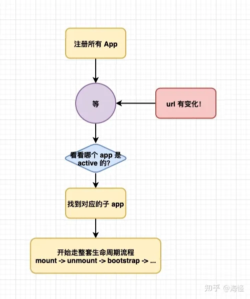
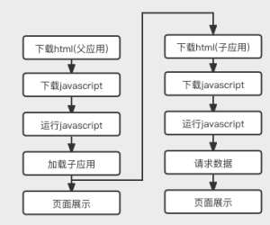

# 微前端

[微前端技术圆桌](https://www.yuque.com/kuitos/gky7yw/rhduwc)

[2023 微前端开源项目排行榜](https://www.libhunt.com/topic/microfrontend)

[vivo 擎天](https://www.cnblogs.com/vivotech/tag/%E6%93%8E%E5%A4%A9/)

:::tip 微前端
微前端是一种多个团队通过独立发布功能的方式来共同构建现代化 web 应用的技术手段及方法策略
:::

- 与技术栈无关：主框架不限制接入应用的技术栈
- 独立开发、独立部署：微应用仓库独立，可独立开发部署完成后主框架自动完成同步更新
- 增量升级：可针对项目的某个部分进行升级、重构而不影响其他模块
- 独立运行：每个微应用之间状态隔离，运行时状态不共享

核心思想：使用微前端的目的是为了将大型项目拆解成若干可以分治的松耦合应用

## 技术对比

:::tip
iframe
:::

iframe 能够完全隔离不同页面上下文（样式、数据、页面结构），那看上去是满足了应用隔离，那为什么在社区中还是有一大部分声音是否定 iframe 能够稳定作为微前端方案？

- **慢**：每次子应用进入都是一次浏览器上下文重建、资源重新加载的过程
- **全局上下文完全隔离，内存不共享**：数据的同步完全依赖于相互推送信息
- **url 不同步**：这里的不同步主要指的是浏览器搜索框上的 `url` 和子应用对应的 `spa 路由`不一致。当在浏览器刷新页面，`iframe`随之刷新，子应用对应的 `spa 路由` 就没了 —— 子应用的状态不能保持，且无法进行一些前进后退的的操作
- **ui 不同步**：ui 不同步指的是在父应用中无法操作子应用的布局，最明显的就是假如一个 iframe 的dialog 想要在浏览器居中显示，只能设置浏览器自动居中。

:::tip
single-spa [精读](https://zhuanlan.zhihu.com/p/378346507)
:::

single-spa 的思路是监听 window.location.url 变化，然后走应用切换的流程。下图 single-spa 控制的生命周期

- register：全局注册子应用，非生命周期内容
- load：加载主应用
- bootstrap：寻找匹配子应用
- mount：挂载某个子应用
- unmount：卸载某个子应用
- unload：卸载主应用

而对于这种切换子应用的方案也会存在一定性能上的问题：

> 上图是从整个应用初始化的情况而言，从父应用到子应用的加载会经历的一个阶段。而每个子应用的加载也都会重复经历右边模块的流程。

- 加载慢：初始需要先注册不同的子应用，在子应用比较多的情况下会影响首屏
- 切换慢：每次切换都会经历 `应用销毁-> 应用创建` 的生命周期，会导致页面卡顿
- 样式冲突：传统微前端框架中所有子应用都在同一上下文中，如出现全局样式、全局监听、全局变量，便会对其他子应用有影响，容易出现样式冲突，内存泄漏，或者不可预知的bug。

:::tip
single-spa 其实严格意义来说并不算是微前端框架
:::
从上面的介绍可以看到，其实 `single-spa` 仅仅是提供了一个监听 url 变化后生命周期函数周期。而对于真正意义上的微前端框架来说，应该具备的特性（前面有提到）：
- 与技术栈无关：主框架不限制接入应用的技术栈
- 独立开发、独立部署：微应用仓库独立，可独立开发部署完成后主框架自动完成同步更新
- 增量升级：可针对项目的某个部分进行升级、重构而不影响其他模块
- 独立运行：每个微应用之间状态隔离，运行时状态不共享

对于 `single-spa` 来说，实际上并不具备这样功能特性