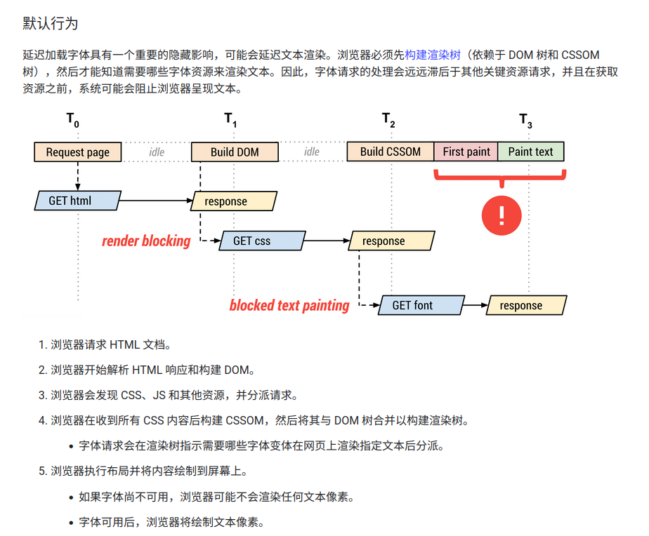
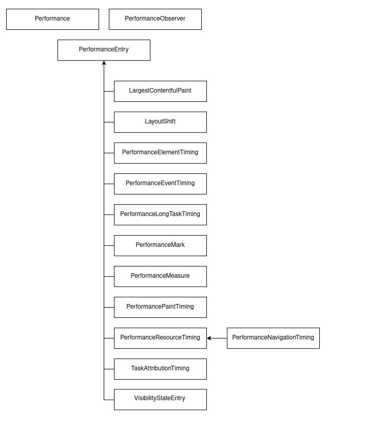

# 性能优化

## 衡量真实性能

衡量真实性能指的是从用户角度来看一些指标的具体表现，crux 可以帮助我们去了解真实用户访问情况。

crux： Chrome 用户体验报告，是一份公开数据集，包含数百万个网站上的真实用户体验数据。

> 真实数据和实验数据存在差异。why？

实验数据很多时候是在一个特定模拟场景下进行（保证使用者的一致性），这种模拟场景有很多限制，比如地理位置、缓存使用、网速限制……，因此相比于真实用户数据数值上还是有明显差异。不同的真实用户也受限于其使用环境数值也会有些许偏差。从具体指标上来说：

- LCP

  - 不同用户使用的设备屏幕尺寸不一致，视口显示元素不一致
  - 不同用户设备上安装的字体集影响文本大小
  - 登陆与未登陆网页上一般显示内容不一致

- FID
  - 用户缓存
  - 浏览器 bfcache 策略，页面可以从内存中恢复
- CLS
  - 受用户行为影响，事件的触发都有可能导致 CLS 数值差异

## 优化资源分发

资源分发字面理解就是从服务器获取资源，优化的方向就是尽可能减少 ttr

- CDN：内容分发网络技术，通过服务器集群优先从离用户最近的下游机器返回数据。可配置缓存，在一定时间内直接从缓存中返回数据，过期再回源站重新获取。

  

- 设置资源优先级别：资源优先级越高越先被处理，因此通常优先级的设置针对的是对首屏重要的资源比如图片、字体，从而提升用户体验。盲目地设定资源优先级很容易导致不同资源抢占带宽的情况反而降低网络请求效率。设置方式：

  - 在标签（ `img/script/iframe/link` ）上设定 `fetch-priority=high`
  - `fetch` 请求设置 `priority=high`

- 预加载资源：首先要区分资源优先级。优先级指的是当遇到这个资源的时候尽可能更快地去请求资源，前提是发现这个资源。但是预加载是直接就加载资源了即使还没有解析到对应位置。对于首屏一些重要资源的预加载可以提升 LCP（最大内容渲染），LCP 与用户体验紧密相关

  ```html
  <link rel="preload" as="script|style|font" href=>
  ```

- DNS 预解析：DNS 预解析意味着提前进行寻址解析 IP 操作，在真实请求发起的时候可以复用之前缓存的解析 IP，避免再次进行 DNS 解析的过程

  ```html
  <link ref="dns-prefetch" href=>
  ```

- 预连接：提前与目标服务器建立 TCP 连接

  ```html
  <link ref="preconnect" href=>
  ```

- 预提取资源：区别于预加载资源，资源优先级会被设置为最低，浏览器在空闲时才开始加载资源

  ```html
  <link ref="prefetch" href=>
  ```

## 优化图片

网站中用到的图片资源非常多，因此单纯从网络角度来说图片资源的优化能够带动很多指标的提升。举个例子：首屏 `banner` 往往是最重要资源，展示速度的快慢直接影响网站真实用户体验。从优化层面可以做的工作：

手段一：**减少图片体积**

- `imagemin`：无损压缩
- `tinypng`：有损压缩

> 使用 tinypng 压缩图片. tinypng 使用的是有损压缩

- 方法一：直接在 `tinypng.com` 上传图片压缩. 每天有 20 张图片限额
- 方法二：调用官方提供的 api 编写脚本批量压缩. 每个月有 500 次免费调用次数. 破解的手段：可以使用 `x-forward-for` & `host` 解决负载均衡限制，当然会存在调用不稳定的情况

手段二：**选择合适的图片格式**

- `	webp`：新一代图片格式，体积更小
- `svg`：矢量图不会受分辨率影响

> 使用 cwebp 批量压缩图片. cwebp 是 google 推出的压缩工具

```bash
for file in images/*; do cwebp "$file" -o "${file%.*}.webp"; done
```

手段三：**使用 `cdn`**

图片 cdn 本身也有压缩策略. 上传后可以对图片进行大小、格式转换

[免费 cdn](https://cdn.gcore.com/origin-groups/403977)：网站提供了免费的 cdn 服务，可配置源站。

手段四：**动图格式替换**，对于动图通常我们会使用 `gif` 数据格式。但是 `gif` 往往体积很大，作为替代可以使用 `video`

> ffmepg 转换 gif

```bash
$ ffmpeg -i <gif> -b:v 0 -crf 25 -f mp4 -vcodec libx264 -pix_fmt yuv420p <video>
# webm 图片格式
$ ffmpeg -i <gif> -c vp9 -b:v 0 -crf 41 <video>
```

🍤 转换后为了模仿 gif 动图的效果，video 需配置：自动播放、循环、无声

```html
<video autoplay loop muted playsinline></video>
```

手段五：**自适应图片**

在不同分辨率的情况展示不同图片. 好处在与能够在移动设备上减少图片大小

`` 上 srcset / size 属性可以帮助实现这个功能

```html

```

计算规则：

- 如果 srcset 指定了 w，则使用 `variables / size` 得到最后 x(像素密度)
- 如果 srcset 指定了 x，则以该值作为像素密度

像素密度：屏幕的对角线长度 / 屏幕英寸

## 延迟加载图片和视频

延时加载能够避免在访问的时候下载全部资源导致带宽被占用，重要资源下载阻塞。

- 图片

  - loading：`chrome` & `firefox` 支持设置 `loading=lazy` 进行延迟加载. 适用于图片数量少的场景

  - `IntersectionObserver` ：通过观察元素是否进入视口再动态下载图片

    ```js
    document.addEventListener("DOMContentLoaded", function () {
      // lazy 标识图片需要懒加载
      var lazyImages = [].slice.call(document.querySelectorAll("img.lazy"));

      if ("IntersectionObserver" in window) {
        let lazyImageObserver = new IntersectionObserver(function (
          entries,
          observer
        ) {
          entries.forEach(function (entry) {
            if (entry.isIntersecting) {
              let lazyImage = entry.target;
              lazyImage.src = lazyImage.dataset.src;
              lazyImage.srcset = lazyImage.dataset.srcset;
              lazyImage.classList.remove("lazy"); // 防止二次加载
              lazyImageObserver.unobserve(lazyImage);
            }
          });
        });

        lazyImages.forEach(function (lazyImage) {
          lazyImageObserver.observe(lazyImage);
        });
      } else {
        // Possibly fall back to event handlers here
      }
    });
    ```

    > 拓展来说，iframe 懒加载过程类似。针对 background 背景图懒加载，思路是通过出现在视口的时机动态添加 .visible classname

- 视频

  - preload：可以设定 none、metadata

  - `IntersectionObserver`

    ```js
    document.addEventListener("DOMContentLoaded", function () {
      var lazyVideos = [].slice.call(document.querySelectorAll("video.lazy"));

      if ("IntersectionObserver" in window) {
        var lazyVideoObserver = new IntersectionObserver(function (
          entries,
          observer
        ) {
          entries.forEach(function (video) {
            if (video.isIntersecting) {
              // video 标签存在多个 source 标签
              for (var source in video.target.children) {
                // 替换 source 标签 src
                var videoSource = video.target.children[source];
                if (
                  typeof videoSource.tagName === "string" &&
                  videoSource.tagName === "SOURCE"
                ) {
                  videoSource.src = videoSource.dataset.src;
                }
              }

              video.target.load();
              video.target.classList.remove("lazy");
              lazyVideoObserver.unobserve(video.target);
            }
          });
        });

        lazyVideos.forEach(function (lazyVideo) {
          lazyVideoObserver.observe(lazyVideo);
        });
      }
    });
    ```

> 拜读了下 [lozad](https://github.com/ApoorvSaxena/lozad.js/blob/master/src/lozad.js#L21) ，支持图片、视频、背景图懒加载

- 基本思路

  - 在元素上通过 `dataset` 设定一个目标值，`previous value` 设置占位 url。
  - 基于 `intersectionObserver`监听判断元素是否出现在视口
  - 使用 `mutationObserver` 监听元素链接是否发生变化，发生变化则重新加载

  ```js
  const validAttribute = [
    "data-iesrc",
    "data-alt",
    "data-src",
    "data-srcset",
    "data-background-image",
    "data-toggle-class",
  ];
  ```

- `IntersectionObserve`
  - callback
    - entries：`IntersectionObserverEntry` 对象，详细属性[参考](https://developer.mozilla.org/zh-CN/docs/Web/API/IntersectionObserverEntry)
    - observer
  - options：
    - root：祖先元素，默认为视口
    - threshold：可见判定百分比阈值
    - rootMagin

## 优化网页字体

- 网页字体通常指的是网络字体，一般由 @font-face 定义
- 网络字体的加载影响正文文本正常展示（该文段可能是网页的重要呈现元素）
- 优化手段一般是从两个角度（缓存除外）
  - 减少网络字体体积
    - 缩小字体子集范围
      - fontmin
      - unicode-range
    - 使用 .woff2 字体格式（体积小、能够被优先加载）
  - 改变浏览器字体渲染策略
    - font-display
      - swap：先用备用字体渲染文本，网络字体请求完成后再替换. Qu：会出现无样式文本闪烁
      - block：阻塞文本渲染知道网络字体下载完成. Qu：会出现无显示文本闪烁
      - options：经历一段很短的交换期后直接使用备用字体渲染. Qu：网络字体可能无法正常展示

> 字体加载时机



> 字体加载 `api`

```js
const fontFile = new FontFace(
	'font-name'.
    'font-url'
)

document.fonts.add(fontFile)
// font 加载回调函数
fontFile.load.then(() => {
})
```

> local 指令

```css
@font-face {
  font-family: "Awesome Font";
  src: local("Awesome Font"), url("/fonts/awesome.woff2") format("woff2"), url("/fonts/awesome.woff")
      format("woff");
}
```

- local：用于引用、加载和使用安装在本地的字体，如果用户已经在系统中安装了该字体，会绕过网络加载
- url：用于加载外部字体，可包含可选的 `format()` 提示，提示网址引用的字体格式

> 字体子集 `unicode-range`

```css
@font-face {
  font-family: "Awesome Font";
  src: local("Awesome Font"), url("/fonts/awesome-l.woff2") format("woff2");
  unicode-range: U+000-5FF;
}
```

`unicode-range`：可以指定字体子集（拉丁、日语……）. 下载时浏览器加载对应子集需要的字体字形。支持指定多个区间子集. 但是因为 unicode 没有包含足够多的语言（亚洲东部象形文字）导致使用上存在限制 [unicode 编码表](https://www.cnblogs.com/csguo/p/7401874.html)

> fontmin

提取 `ttf` 字体中需要用到的字符然后转换为 `ttf` 文件输出从而实现压缩效果. 提取字体是关键

- `font-spider`：提取网页中使用到这个字体的文字集合

## 优化 css

- css 是网页中的样式文件。决定着网页呈现效果
- css 资源会阻塞 js 的解析与执行；同时 cssom 形成的时机决定着渲染开始
- 从优化角度来说
  - 减少 css 体积（重要因素）
  - 分离关键 css 与 非关键 css
  - 多媒体查询加载图片

> 减少体积

通常构建工具都有可以压缩 css 资源的插件.

- webpack
  - `optimize-css-assets-plugin`：压缩 css
  - `mini-css-extract-plugin`：将每个样式表提取到自己的文件中

> 提取关键 css

关键 css 意味着是页面首屏效果必须的样式资源. 将关键 css 内联意味为不需要发起网络请求就可以直接赋予样式变更能力.

Qu：样式内联没办法利用浏览器缓存，需谨慎使用该行为

> 根据不同屏幕大小加载不同尺寸的图片

电脑、平板、手机 —— 不同设备对于图片的大小&分辨率不一致，多媒体查询可以根据不同屏幕大小加载不同图片从而在不同设备上能够实现图片体积递减。通常来说桌面设备屏幕的图片会比移动设备的背景大

## 优化第三方资源

- 第三方资源指的是从第三方网站加载的 JS 脚本
- 第三方 JS 脚本会阻塞页面解析和渲染，如果位置在重要资源前面的化会导致内容延时渲染，降低用户体验
- 优化的手段
  - 异步加载资源
  - 尽早于第三方建立 TCP 连接（DNS 域名解析）

> 异步加载资源

- 对于非关键脚本尽量使用 `async` 标识
- JS 资源的位置尽量放在页面底部

## 优化 javascript

- javascript 通常指的是页面交互的必要资源
- javascript 资源的加载会阻塞页面解析 & 渲染
- 优化手段
  - 异步加载
  - 拆分大文件（构建分离 chunk）
  - 缩减大小、数据压缩
  - 移除未使用的代码

> 拆分大文件

不同构建工具（ webpack、vite ）都有 `splitChunk` 的概念 —— `splitChunk` 即以一定的策略拆分打包的 JS 代码. 以下从 webpack 来讲：

- 新的 chunk 可以被共享，或者模块来自于 `node_modules` 文件夹

- 新的 chunk 体积大于 20kb（在进行 min+gz 之前的体积）
- 当按需加载 chunks 时，并行请求的最大数量小于或等于 30
- 当加载初始化页面时，并发请求的最大数量小于或等于 30

[Wepack 之 splitchunk](https://zhuanlan.zhihu.com/p/152097785)：文章从 chunks 命令讲起，介绍了不同 chunk 命名的场景，同时介绍了 splitchunk 的选项，着重介绍了 `cacheGroup` —— 允许我们自定义去配置一些 chunk 分离的策略（结合 `webpack-analyser-bundle` 可作性能优化）

🔐 拆分的意义在于延迟加载，在初始 bundle 加载的时候不会纳入

> 缩减大小、数据压缩

- 缩减大小：`webpack4` 以上默认支持 `terser`.

  - tree-shaking：删除没有使用的代码块
  - 代码混淆

- 数据压缩
  - gzip
  - botli

# 性能衡量指标

> 以下指标均可以衡量页面加载的情况，其中 LCP、CLS、FID 为 google 规定的核心指标，以下会涵盖指标的描述及其对应的计算

`web-vitals`：`web-vitals` 提供函数可以获取以下指标，但是不兼容苹果浏览器，因此需要我们进行设备兼容。

## FFID

## FCP

## LCP

## CLS

## FID

# Performance API

## Performance.navigation(废弃)

返回一个 `PeformanceNavigation` 对象

- type：导航到这个页面的方式
  - 0 (`TYPE_NAVIGATE`)：通过点击链接，书签和表单提交，或者在浏览器中直接输入网址
  - 1 (`TYPE_RELOAD`)：点击刷新页面或者通过 `location.reload` 刷新页面
  - 2 (`TYPE_BACK_FORWARD`)：页面通过历史记录和前进后退访问
  - 255 (`TYPE_RESERVED`)：任何其他方式
- redirctCount：到达这个页面之前重定向了多少次

## Performance.getEntries()

返回 `PerformanceEntry` 数组. `PerformanceEntry` 每一项代表的是浏览器 metric 数据

- navigation：页面加载周期经历事件. 数据类型 => [MDN](https://developer.mozilla.org/zh-CN/docs/Web/API/PerformanceNavigationTiming)
- resource：资源加载的情况（包括 JS、CSS、图片资源） 数据类型 => [MDN](https://developer.mozilla.org/zh-CN/docs/Web/API/PerformanceResourceTiming)
- mark：使用 `Performance.mark` 创建的自定义 metric 数据. 数据类型 => [MDN](https://developer.mozilla.org/en-US/docs/Web/API/PerformanceMark)
- measure：使用 `Performance.measure` 创建的自定义 metric 范围. 数据类型 => [MDN](https://developer.mozilla.org/en-US/docs/Web/API/PerformanceMeasure)
- paint：关于 `first-paint` & `first-contentful-paint` 数据. 数据类型 => [MDN](https://developer.mozilla.org/zh-CN/docs/Web/API/PerformancePaintTiming)

> resource metric example

```js
{
  "name": "https://www.google-analytics.com/analytics.js", // 资源加载的链接
  "entryType": "resource",                                 // performance metric
  "startTime": 391,                                        // 开始时间
  "duration": 792,                                         // 资源加载持续时间
  "initiatorType": "script",                               // 资源加载类型(script、css(image\svg)、fetch、link(css))
  "nextHopProtocol": "",
  "workerStart": 0,
  "redirectStart": 0,
  "redirectEnd": 0,
  "fetchStart": 391,
  "domainLookupStart": 0,
  "domainLookupEnd": 0,
  "connectStart": 0,
  "connectEnd": 0,
  "secureConnectionStart": 0,
  "requestStart": 0,
  "responseStart": 0,
  "responseEnd": 1183,
  "transferSize": 0,
  "encodedBodySize": 0,
  "decodedBodySize": 0,
  "serverTiming": []
}
```

## Performance.getEntriesByType

- 描述：获取指定 type metric (resource / navigation / mark)

- 使用

```js
performance.getEntriesByType(type); // return array
```

返回的是对应 type metric 类型的数据，详细见上面 MDN 链接

## Performance.getEntriesByName

- 描述：获取指定 type 指定 name(script / css / link ……) metric
- 使用

```js
performance.getEntriesByName(name, type); // return array
```

## Performance.mark

> Performance.mark 和 Performance.measure 可一起理解

- 描述：两者都是通过自定义 browser metric 类型来作一些自定义逻辑处理
- 区别：不同之前在于前者(mark) 是通过创建一个 browser metric，后者 （measure）是通过创建一个 type 区间，即基于两个 type metric 自定义一个 browser metric.

- 使用

  - `performance.mark` 可能会在在某个生命周期或者定时器去定义

    ```javascript
    performance.mark(name);
    ```

  - `performance.measure` 通过用于分析衡量两个周期之间的行为

    ```js
    performance.measure(name, metric1, metric2);
    ```

# Observer API

## PerformanceObserver API

- 描述：监测性能度量事件（浏览器性能时间轴记录新的 `performance entry` 时候会被通知）
- 参数
  - callback
    - PerformanceObserverEntryList
      - getEntries
      - getEntriesByname
      - getEntriesByType
    - observer
- 使用

```js
const observer = new PerformanceObserver(callback);
```

### observe

- 描述：监听传入参数中指定的性能条目类型集合
- 使用

```js
const observer = new PerformanceObserver(callback);

observer.observe({ entryTypes: [] });
```

> 目前一些 entryTypes 还属于是实验室属性，因此可能在支持表格中找不到 [blog](https://www.zhangxinxu.com/wordpress/2023/08/js-performanceobserver-api/)



### disconnect

- 描述：阻止性能观察者接收任务性能条目事件

- 使用

```js
function callback(list, observer) {
  observer.disconnect(); // 后面不再对其他事件进行监听
}

const observer = new PerformanceObserver(callback);
```

## MutationObserver API

- 描述：提供了对 DOM 树更改监听的能力. 会在触发指定 DOM 事件后调用指定的回调函数

- 参数

- - callback
    - `MutationRecord`：[MDN](https://developer.mozilla.org/zh-CN/docs/Web/API/MutationRecord) DOM 节点修改的一些信息
    - `observer`：观察者对象

- 使用

```js
var observer = new MutationObserver(callback);
```

### observe

- 描述：对指定 DOM 进行监听
- 参数
  - `target`：DOM 树中一个要观察变化的 DOM
  - `options`：描述 DOM 的哪些变化应该报告给 `MutationObserver` 的 `callback`（即 `MutationRecord` target）
    - subtree
    - childList
    - attributes
    - attributeFilter
    - attributeOldValue
    - characterData
    - characterDataOldValue

### disconnect

- 描述：停止对 DOM 更新事件的监听

## IntersectionObserver API

## ResizeObserver API
