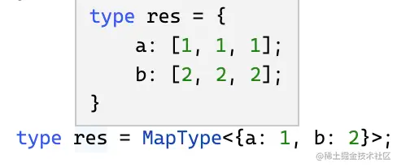
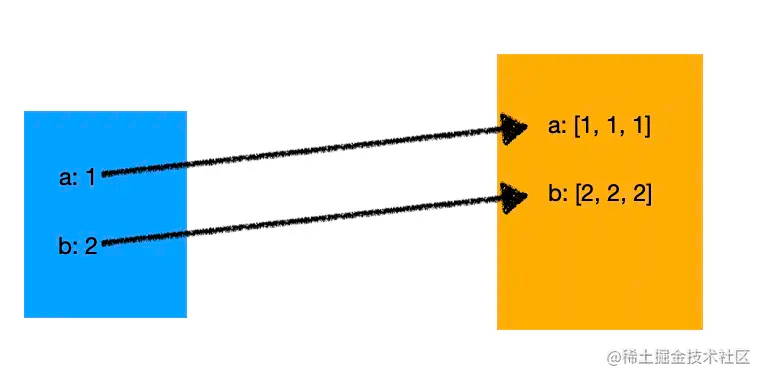
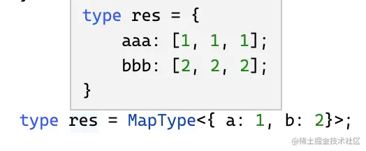
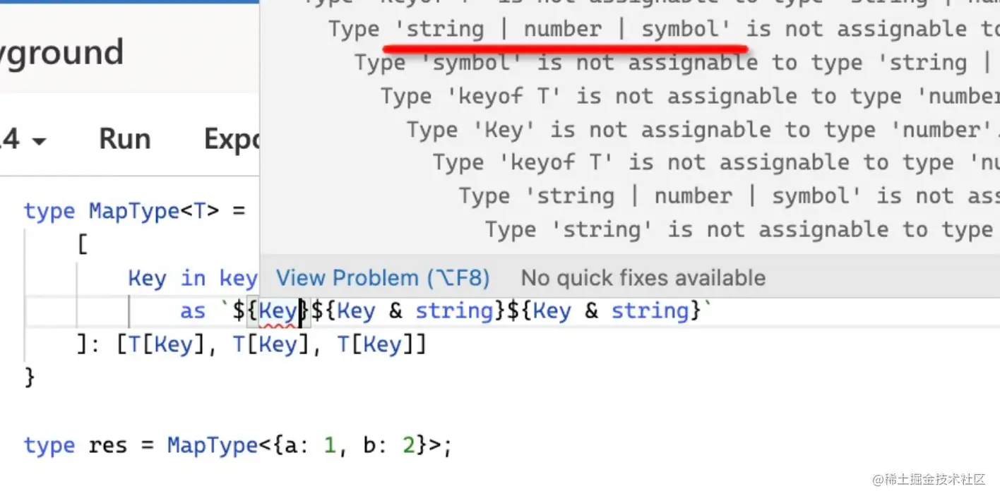
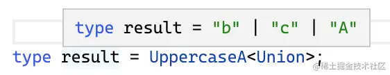
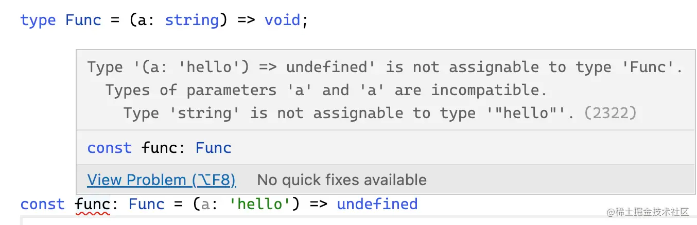
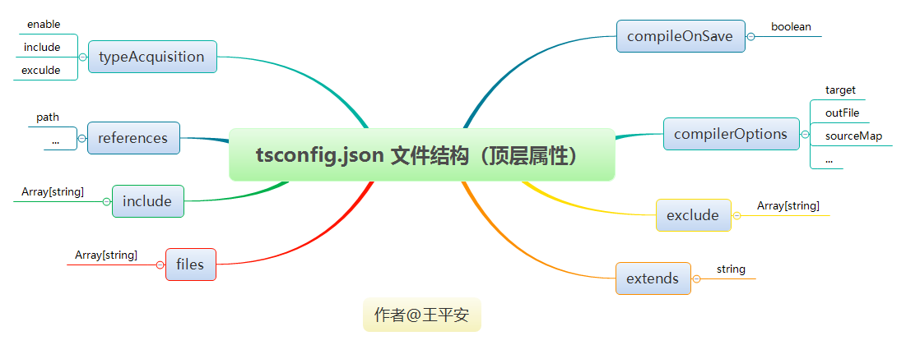

# Typescript

## TS 基础

[TS 在线编辑器](https://www.typescriptlang.org/zh/play)

> 1、什么是动态类型，什么是静态类型？
>
>        1. 动态类型是值在运行中才会对类型进行检测
>        2. 静态类型是值在声明
>
> 2、javascript 发展到 typescript 有哪些性能上的提升

### 一、vscode 运行 .ts 文件

```typescript
npm install -g typescript ts-node

// 在 vscode 终端 使用 ts-node xxx.ts 文件即可
// 或者使用 Code Runner 插件
// 不过需要注意这样子对类型检测十分严格，它并不会帮你去自动推断
```

### 二、typescript 基本类型

- 与 JS 共有： boolean, number, string, array, object
- 独特：tuple，enum，interface

#### tuple

- tuple 叫做元组，表示一个已知元素数量且类型不必相同的数组

```ts
/* 限定了第一个元素只能是 string, 第二个元素只能是 number */
let x: [string, number];
x = ["hello", 10]; // OK
x = [10, "hello"]; // Error
```

:exclamation: 如果出现越界访问怎么办？如果出现越界访问使用联合类型进行替代

```ts
x[3] = "world"; // OK, 字符串可以赋值给(string | number)类型
```

#### unknown

- unknown 是一个和 any 相似的顶级类型，它可以被赋值为任何类型

```typescript
let value: unknown;
value = 10;
value = "abcd";
value = true;
// 所有形如这样的赋值都是可以成立的 ->
// unknown 是顶级类型，变量可以被赋值给任意类型
value = any(10);
```

- unknown 不能作为值赋值给除了 any 和 unknown 以外类型的变量

```typescript
let value: unknown;
let value1: unknown = value; // OK
let value2: any = value; // OK
let value3: boolean = value; // Error
```

- unknown 类型变量不具备对象、数组访问功能

```typescript
let value: unknown;
value.foo.bar; // Error
value.trim(); // Error
value(); // Error
new value(); // Error
value[0][1]; // Error
```

#### null、undefined、void、never

- null 和 undefined 各为一体，都可以赋值给其他类型的变量，但是他们互相不能够赋值给对方。
- void 更多用于没有返回的函数，虽然默认已经帮我们写上了
- never 更多用于无法到达终点的函数

```ts
funtion throw():never {
    throw ('Error') // 永远到不了函数终点的方法例子
}
```

#### object & Object & {}

- object 在 TypeScript 2.2 引入，用于表示非原始类型，在 JavaScript 中以下类型被视为原始类型 string, boolean, number, bigint, symbol, null, undefined
- 所有的其他类型被视为非基本类型

```typescript
// All primitive types
type Primitive = string | boolean | number | bigint | symbol | null | undefined;

// All non-primitive types
type NonPrimitive = object;

// 我们可以理解为 object 就是非基本类型的一个集合
```

- object 的另一个用例是作为 ES2015 的一部分引入的 WeakMap 数据结构。它的键必须是对象，不能是原始

**Object 类型**

- 定义了 Object.prototype 原型对象上的属性
- ObjectConstructor 接口定义了 Object 类的属性

```typescript
interface Object {
  constructor: Function;
  toString(): string;
  toLocaleString(): string;
  valueOf(): Object;
  hasOwnProperty(v: PropertyKey): boolean;
  isPrototypeOf(v: Object): boolean;
  propertyIsEnumerable(v: PropertyKey): boolean;
}

interface ObjectConstructor {
  /** Invocation via `new` */
  new (value?: any): Object;
  /** Invocation via function calls */
  (value?: any): any;
  readonly prototype: Object;
  getPrototypeOf(o: any): any;
  // ···
}
declare var Object: ObjectConstructor;
```

- 与 object 最大的区别是，object 仅仅用于表示非原始类型，不能访问值的任何属性，也就是不能访问 toString, valueOf 等等，而 Object 则包括原始值

**空类型 {}**

- 描述了一个**没有成员**的对象

```typescript
const obj = {};
obj.prop = "semlinker"; // 报错
```

解决的方法一般为初始化时就赋值

```typescript
const pt = {
  x: 3,
  y: 4,
}; // OK

const pt: Point = {
  x: 3,
  y: 4,
};
```

- 使用 Object.assign 的时候需要注意

```typescript
const pt = { x: 666, y: 888 };
const id = { name: "semlinker" };
const namedPoint = {};
Object.assign(namedPoint, pt, id); // 报错

// 解决方法如下
const pt = { x: 666, y: 888 };
const id = { name: "semlinker" };
const namedPoint = { ...pt, ...id };
```

#### type & interface 区别

- 对象字面量类型可以内联，而接口不能（内联其实就是不用额外在需要使用的外面再去定义的意思，和 CSS 里面的内联样式差不多的概念）

```typescript
// Inlined object literal type:
function f1(x: { prop: number }) {}

function f2(x: ObjectInterface) {} // referenced interface
interface ObjectInterface {
  prop: number;
}
```

- 对象字面量名称不可以重复，而含有重复名称的接口将会被合并

```typescript
// 使用 @ts-ignore 忽略错误。
// @ts-ignore: Duplicate identifier 'PersonAlias'. (2300)
type PersonAlias = { first: string };
// @ts-ignore: Duplicate identifier 'PersonAlias'. (2300)
type PersonAlias = { last: string };

interface PersonInterface {
  first: string;
}
interface PersonInterface {
  last: string;
}
const sem: PersonInterface = {
  first: "Jiabao",
  last: "Huang",
};
```

- 映射类型

  对象、class 在 TypeScript 对应的类型是索引类型（Index Type），那么如何对索引类型作修改呢？

  答案是`映射类型`。

  ```typescript
  type MapType<T> = {
    [Key in keyof T]?: T[Key];
  };
  ```

  keyof T 是查询索引类型中所有的索引，叫做`索引查询`。

  T[Key] 是取索引类型某个索引的值，叫做`索引访问`。

  in 是用于遍历联合类型的运算符。

  比如我们把一个索引类型的值变成 3 个元素的数组：

  ```typescript
  type MapType<T> = {
    [Key in keyof T]: [T[Key], T[Key], T[Key]];
  };

  type res = MapType<{ a: 1; b: 2 }>;
  ```

  

  **映射类型就相当于把一个集合映射到另一个集合，这是它名字的由来**。

  

  除了值可以变化，索引也可以做变化，用 as 运算符，叫做`重映射`。

  ```typescript
  type MapType<T> = {
    [Key in keyof T as `${Key & string}${Key & string}${Key & string}`]: [
      T[Key],
      T[Key],
      T[Key]
    ];
  };
  ```

  我们用 as 把索引也做了修改，改成了 3 个 key 重复：

  

  这里的 & string 可能会迷惑，解释一下：

  因为索引类型（对象、class 等）可以用 string、number 和 symbol 作为 key，这里 keyof T 取出的索引就是 string | number | symbol 的联合类型，和 string 取交叉部分就只剩下 string 了。就像前面所说，交叉类型会把同一类型做合并，不同类型舍弃。

  

```typescript
interface Point {
  x: number;
  y: number;
}
type PointCopy1 = {
  [Key in keyof Point]: Point[Key]; // (A)
};
// Syntax error:
// interface PointCopy2 {
//   [Key in keyof Point]: Point[Key];
// };
```

- 多态 this 类型
  多态 this 类型仅仅适用于接口

其实原理上和 Java 所讲的多态是类似的

```typescript
interface AddsStrings {
  add(str: string): this;
}
class StringBuilder implements AddsStrings {
  result = "";
  add(str: string) {
    this.result += str;
    return this;
  }
}
```

#### 联合类型和类型别名

1. 首先是联合类型的概念 - 比较大的一个作用是可以提供多种类型的候选，比如 string|number 就联合了 string 类型和 number 类型。
2. 其次是可辨识联合 - 当多个类或者接口都有相同的变量的时候我们可以通过对该变量辨识不同接口或者类从而使用他们各自的方法去组织逻辑。
3. 最后也是最重要的概念就是类型别名 - type 关键字去声明类型别名。
   [https://juejin.cn/post/6844903753431138311](https://juejin.cn/post/6844903753431138311)

#### 交叉类型（&）

- 通过 & 关键字合并多个不同的类型，需要注意的是合并的是类型，交叉类型的交叉并不是指类型的交集而是指类型的并集。
- 但是存在一种特例 string | number & string | boolean 混合起来的结果是 string，而不是我们想要的 string | number | boolean，至于为什么会这样可能还需深入理解。
- **可以实现 type 的拓展**
- 语法 T & U

> 返回类型既要符合 T 类型也要符合 U 类型
> string | number & string | boolean 这样子的联合存在一定的机制 string 既符合 string |number 也符号 string | boolean 所以最后就会返回最小结果，可以理解为是最小原则

```typescript
interface Ant {
  name: string;
  weight: number;
}

interface Fly {
  flyHeight: number;
  speed: numebr;
}

// 少了任何一个类型都会报错
const flyAnt: Ant & Fly = {
  name: "xxx",
  weight: 0.2,
  flyHeight: 20,
  speed: 1,
};

// 实现 type 的拓展
type Name = {
  name: string;
};
type User = Name & { age: number }; // { name: string, age: number }
```

> 在测试的过程中其实也有了一些 debug 经验，就是说使用关键字正确的语法的时候，编译器一般都会给我们显示推断出结果的，一般难以推断的就证明我们的写法很有可能是出问题的，需要去注意或者修改甚至删除

#### 联合类型（|）

- 联合类型与交叉类型有管理，但是使用上却完全不同
- 语法：T | U
  > 返回类型为连接的多个类型中的任意一个

```typescript
let stringOrNumber: string | number = 0;
stringOrNumber = "";
```

- 不过需要注意下面这种情况，联合类型因为返回类型为多个类型中的任意一个，比如有 array | string，类型推断以后可能为 string，但是 string 没有有 push 方法，所以编译器要做出这样的限制

```typescript
class Bird {
  fly() {
    console.log("Bird flying");
  }
  layEggs() {
    console.log("Bird layEggs");
  }
}

class Fish {
  swim() {
    console.log("Fish swimming");
  }
  layEggs() {
    console.log("Fish layEggs");
  }
}

const bird = new Bird();
const fish = new Fish();

function start(pet: Bird | Fish) {
  // 调用 layEggs 没问题，因为 Bird 或者 Fish 都有 layEggs 方法
  pet.layEggs(); // 会报错：Property 'fly' does not exist on type 'Bird | Fish' // pet.fly(); // 会报错：Property 'swim' does not exist on type 'Bird | Fish' // pet.swim();
}

start(bird);

start(fish);
```

**当类型参数为联合类型，并且在条件类型左边直接引用该类型参数的时候，TypeScript 会把每一个元素单独传入来做类型运算，最后再合并成联合类型，这种语法叫做分布式条件类型。**

比如这样一个联合类型：

```typescript
type Union = "a" | "b" | "c";
```

我们想把其中的 a 大写，就可以这样写：

```typescript
type UppercaseA<Item extends string> = Item extends "a"
  ? Uppercase<Item>
  : Item;
```



可以看到，我们类型参数 Item 约束为 string，条件类型的判断中也是判断是否是 a，但传入的是联合类型。这就是 TypeScript 对联合类型在条件类型中使用时的特殊处理：会把联合类型的每一个元素单独传入做类型计算，最后合并。

#### 枚举类型

```tsx
enum Enum {
  A = 1,
  B = "string",
}
Enum.A === 1;
Enum[1] === A;
```

枚举类型定义数字的话存在双向映射的过程

```tsx
const enum Directions {
  Up,
  Down,
  Left,
  Right,
}

let directions = [
  Directions.Up,
  Directions.Down,
  Directions.Left,
  Directions.Right,
];
```

使用 const 声明可以规避双向映射

#### 类型兼容

```tsx
let y: number | string = "hello-world";
let x: string = y; // ok

let y: number | string = 20;
let x: string = y; // 不 ok

let y: number | string;
let x: string = "hello world";
y = x; // 永远都是 ok
```

存在联合类型的时候，像 string | number 要兼容 string 是完全可以的，但是像 string 要兼容 string | number 的话只有当变量取 string 的时候才被运行，否则就会出现上面第二个例子的问题。

#### 对象类型

```tsx
interface Named {
  name: string;
}

let x: Named;
// y's inferred type is { name: string; location: string; }
let y = { name: "Alice", location: "Seattle" };
x = y;
```

其实对象类型的类型兼容规则：x = y (y 赋值给 x)，意味着 x 的类型要兼容 y 的类型，编译器会对 x 的类型进行遍历，如果 x 需要的类型都出现在 y 中，那么 y 赋值给 x 就是允许的，即使 y 有其余更多的属性也没有关系。

#### 函数类型

```tsx
let x = (a: number) => 0;
let y = (b: number, s: string) => 0;

y = x; // OK
x = y; // Error
```

```tsx
let x = (a: number) => 0;
let y = (b: string, s: number) => 0;
y = x; // 不 ok
```

对于函数类型来说，在返回值类型一致的情况下，x = y(y 赋值给 x)，那么编译器会检查 y 中的每个参数在 x 中相同位置是否能找到相同类型的参数，也就是相同位置的类型相同即可不考虑参数的名字。因为其实在 JS 里面函数的参数其实不一定都要传完

#### 类

类与对象字面量和接口差不多，但有一点不同：类有静态部分和实例部分的类型。 比较两个类类型的对象时，只有实例的成员会被比较。 静态成员和构造函数不在比较的范围内。

```tsx
class Animal {
  feet: number;
  constructor(name: string, numFeet: number) {}
}

class Size {
  feet: number;
  constructor(numFeet: number) {}
}

let a: Animal;
let s: Size;

a = s; //OK
s = a; //OK
```

:key: 私有成员会影响兼容性判断。 当类的实例用来检查兼容时，如果目标类型包含一个私有成员，那么源类型必须包含来自同一个类的这个私有成员。 这允许子类赋值给父类，但是不能赋值给其它有同样类型的类。

```tsx
class Animal {
  private name: string | undefined; // 私有类型限定了只能是子类类型赋值给父类
  feet: number;
  constructor(name: string, numFeet: number) {
    this.feet = numFeet;
  }
}

class A22 extends Animal {
  // A22 继承了 Animal，因此它的实例是可以赋值给 Animal 的实例
  constructor(name: string, numFeet: number) {
    super(name, numFeet);
  }
}

class Size {
  private name: string | undefined;
  feet: number;
  constructor(numFeet: number) {
    this.feet = numFeet;
  }
}

let a1: Animal;
let t1: A22 = new A22("jzy", 22);
let t2: Size = new Size(20);

a1 = t1; //OK
a1 = t2; //不 OK
```

#### 泛型

对于没指定泛型类型的泛型参数时，会把所有泛型参数当成 any 比较。

```tsx
let identity = function <T>(x: T): T {
  // ...
};

let reverse = function <U>(y: U): U {
  // ...
};

identity = reverse; // Okay because (x: any)=>any matches (y: any)=>any
```

```tsx
interface NotEmpty<T> {
  data: T;
}
let x: NotEmpty<number>;
let y: NotEmpty<string>;

x = y; // 不 ok，指定了泛型后 data 的属性不一致
```

### 三、类型守卫

- instanceof 运算符用来判断一个构造函数的 prototype 属性所指向的对象是否存在另外一个要检测对象的原型链上

#### 自定义类型保护的类型谓词

- 类型守护有三个比较基础的关键字：in、typeof、instanceof
- 引入自定义类型保护的类型谓词的原因是很多时候我们需要为不同类型的数据编写不同的类型验证方法，整个过程会比较烦琐，而这个技术通过泛型的概念，可以让我们编写一个通用的类型缩小的函数。

```typescript
function isOfType<T>(
  varToBeChecked: any, // 需要缩减类型范围的变量
  propertyToCheckFor: keyof T // 类型上的某个属性
): varToBeChecked is T {
  return (varToBeChecked as T)[propertyToCheckFor] !== undefined;
}
```

[https://cloud.tencent.com/developer/article/1600711](https://cloud.tencent.com/developer/article/1600711)

## TS 进阶

### 一、命名空间 namspace

namespace 的引出是为了我们更好地去管理类型，当存在多个类型的时候我们可以将一些是一类的类型进行合并，这样子引用的时候就可以通过某个 namespace 的方式去引入

```ts
namespace Validation {
  /* Validation 命名空间 */
  export interface StringValidator {
    isAcceptable(s: string): boolean;
  }

  const lettersRegexp = /^[A-Za-z]+$/;
  const numberRegexp = /^[0-9]+$/;

  export class LettersOnlyValidator implements StringValidator {
    /* 向外暴露类 */
    isAcceptable(s: string) {
      return lettersRegexp.test(s);
    }
  }

  export class ZipCodeValidator implements StringValidator {
    /* 向外暴露类 */
    isAcceptable(s: string) {
      return s.length === 5 && numberRegexp.test(s);
    }
  }
}
```

:key: 整体来看其实命名空间就是一个小型的 ts 文件，我们可以在内部定义变量，定义类型，然后导出等等，但其实在项目里面我们完全可以将这些逻辑写在一个 TS 文件里面，所以说我们在写 TS 文件就相当于再写命名空间了，完全符合命名空间内部隔离，内部封装的特性。

#### 多文件命名空间

```tsx
Validation.ts;
namespace Validation {
  export interface StringValidator {
    isAcceptable(s: string): boolean;
  }
}
```

```tsx
LettersOnlyValidator.ts;
/// <reference path="Validation.ts" />
namespace Validation {
  const lettersRegexp = /^[A-Za-z]+$/;
  export class LettersOnlyValidator implements StringValidator {
    isAcceptable(s: string) {
      return lettersRegexp.test(s);
    }
  }
}
```

```tsx
ZipCodeValidator.ts;
/// <reference path="Validation.ts" />
namespace Validation {
  const numberRegexp = /^[0-9]+$/;
  export class ZipCodeValidator implements StringValidator {
    isAcceptable(s: string) {
      return s.length === 5 && numberRegexp.test(s);
    }
  }
}
```

实际使用的时候

```tsx
/// <reference path="Validation.ts" />
/// <reference path="LettersOnlyValidator.ts" />
/// <reference path="ZipCodeValidator.ts" />

let strings = ["Hello", "98052", "101"];

let validators: { [s: string]: Validation.StringValidator } = {};
validators["ZIP code"] = new Validation.ZipCodeValidator();
validators["Letters only"] = new Validation.LettersOnlyValidator();
```

#### 外部命名空间

```tsx
// declare 声明外部 d3 ts 类型
declare namespace D3 {
  export interface Selectors {
    select: {
      (selector: string): Selection;
      (element: EventTarget): Selection;
    };
  }

  export interface Event {
    x: number;
    y: number;
  }

  export interface Base extends Selectors {
    event: Event;
  }
}

declare var d3: D3.Base; // 外部引用
```

### 二、装饰器

1. 装饰器是一种特殊类型的声明，能够被附加到类的声明，方法，属性或参数上，可以修改类的行为。通俗的来讲装饰器就是一个方法，可以注入到类，方式，属性参数上来扩展他们的功能。
2. 装饰器有 4 种，
   - 类装饰器
   - 属性装饰器
   - 方法装饰
   - 参数装饰器
   - :key: 装饰器执行的顺序是属性 -> 方法 -> 参数 -> 类。

#### 装饰器工厂

> 利用柯里化的概念内部返回一个函数

- 在 TypeScript 里，当多个装饰器应用在一个声明上时会进行如下步骤的操作：
  1. 由上至下依次对装饰器表达式求值。
  2. 求值的结果会被当作函数，由下至上依次调用

```tsx
function color(value: string) {
  // 这是一个装饰器工厂
  return function (target) {
    //  这是装饰器
    // do something with "target" and "value"...
  };
}
```

```tsx
function f() {
  console.log("f(): evaluated");
  return function (
    target,
    propertyKey: string,
    descriptor: PropertyDescriptor
  ) {
    console.log("f(): called");
  };
}

function g() {
  console.log("g(): evaluated");
  return function (
    target,
    propertyKey: string,
    descriptor: PropertyDescriptor
  ) {
    console.log("g(): called");
  };
}

class C {
  @f()
  @g()
  method() {}
}
```

```tsx
f(): evaluated
g(): evaluated
g(): called
f(): called
```

类中不同声明上的装饰器将按以下规定的顺序应用：

1. _参数装饰器_，然后依次是*方法装饰器*，_访问符装饰器_，或*属性装饰器*应用到每个实例成员。
2. _参数装饰器_，然后依次是*方法装饰器*，_访问符装饰器_，或*属性装饰器*应用到每个静态成员。
3. *参数装饰器*应用到构造函数。
4. *类装饰器*应用到类。

#### 类装饰器

类装饰器应用于类构造函数，可以用来**监视，修改或替换类定义**。类装饰器表达式会在运行时当作函数被调用，类的构造函数作为其唯一的参数。

- 类装饰器表达式会在运行时当作函数被调用，类的构造函数作为其唯一的参数（其实就是类本身啦）。
- 如果类装饰器返回一个值，它会使用提供的构造函数来替换类的声明

```tsx
// 类装饰器
function classDecorator<T extends { new (...args: any[]): {} }>(
  constructor: T
) {
  // 当前返回出去的是 Greeter(实际上就是一个 function类型的构造函数)
  return class extends constructor {
    // 增强原来类的属性
    newProperty = "new property";
    hello = "override";
  };
}

@classDecorator
class Greeter {
  property = "property";
  hello: string;
  constructor(m: string) {
    this.hello = m;
  }
}
```

```js
console.log(new Greeter("world"));
{
  "property": "property",
  "hello": "override",
  "newProperty": "new property"
}
// constuctor 不生效
```

- 类装饰器工厂

```tsx
interface Person {
  name: string;
  age: number;
}
// 利用函数柯里化解决传参问题， 向装饰器传入一些参数，也可以叫 参数注解
function enhancer(name: string) {
  return function enhancer(target: any) {
    // 这个 name 就是装饰器的元数据，外界传递进来的参数
    target.prototype.name = name;
    target.prototype.age = 18;
  };
}
@enhancer("小芝麻") // 在使用装饰器的时候, 为其指定元数据
class Person {
  constructor() {}
}
```

#### 方法装饰器

_方法装饰器_ 声明在一个方法的声明之前（紧靠着方法声明）。 它会被应用到方法的 _属性描述符_ 上，**用来监视，修改或者替换方法定义**。 方法装饰器不能用在声明文件( `.d.ts`)，重载或者任何外部上下文（比如`declare`的类）中。

- 方法装饰器表达式会在运行时当作函数被调用，传入下列 3 个参数：

  1. 对于静态成员(static)来说是类的构造函数，对于实例成员是类的原型对象。

  2. 成员的名字。

  3. 成员的*属性描述符*(方法装饰器的主要目的)。

- 如果方法装饰器返回一个值，它会被用作方法的 属性描述符。

```tsx
class Greeter {
  greeting: string;
  constructor(message: string) {
    this.greeting = message;
  }

  // 方法装饰器
  @enumerable(false)
  greet() {
    // 实例方法
    return "Hello, " + this.greeting;
  }
}
```

```ts
function enumerable(value: boolean) {
  return function (
    target: any,
    propertyKey: string,
    descriptor: PropertyDescriptor
  ) {
    // target === Gretter.prototype
    descriptor.enumerable = value;
  };
}
```

#### 访问装饰器

首先得理解访问的概念，这个概念是 ES6 Class 里面的概念

```js
class Point {
  constructor() {}
  get name() {
    console.log("getter");
    return this.name; // 死循环
  }
  set name(val) {
    console.log("setter");
    this.name = val; // 死循环
  }
}
```

像上面其实无法定义正常存储属性的操作，因此可以理解 get / set 常用于属性的拦截

访问器装饰器 声明在一个访问器的声明之前。 访问器装饰器应用于访问器的 *属性描述符*并且可以用来监视，**修改或替换一个访问器的定义**

- 访问器装饰器表达式会在运行时当作函数被调用，传入下列 3 个参数：
  1. 对于静态成员来说是类的构造函数，对于实例成员是类的原型对象。
  2. 成员的名字。
  3. 成员的属性描述符。

```tsx
class Point {
  private _x: number;
  private _y: number;
  constructor(x: number, y: number) {
    this._x = x;
    this._y = y;
  }

  @configurable(false)
  get x() {
    return this._x;
  }

  @configurable(false)
  get y() {
    return this._y;
  }
}
```

```tsx
// 定义属性是否可配置
function configurable(value: boolean) {
  return function (
    target: any,
    propertyKey: string,
    descriptor: PropertyDescriptor
  ) {
    descriptor.configurable = value;
  };
}
```

> 属性装饰器 和 参数装饰器其实都是都涉及到元数据(meta data) 的概念，[掘金](https://juejin.cn/post/7086673578858397732)

#### 属性装饰器

属性装饰器声明在一个属性声明之前。

- 属性装饰器表达式会在运行时当作函数被调用，传入下列 2 个参数：
  1. 对于静态成员来说是类的构造函数，对于实例成员是类的原型对象。
  2. 成员的名字。

> 注意：*属性描述符*不会做为参数传入属性装饰器，这与 TypeScript 是如何初始化属性装饰器的有关。 因为目前没有办法在定义一个原型对象的成员时描述一个实例属性，并且没办法监视或修改一个属性的初始化方法。返回值也会被忽略。因此，属性描述符只能用来监视类中是否声明了某个名字的属性。

#### 参数装饰器

参数装饰器表达式会在运行时当作函数被调用，传入下列 3 个参数：

1. 对于静态成员来说是类的构造函数，对于实例成员是类的原型对象。
2. 成员的名字。
3. 参数在函数参数列表中的索引。

> 注意   参数装饰器只能用来监视一个方法的参数是否被传入。

### 三、协变&逆变



参数的位置是逆变的，也就是被赋值的函数参数要是赋值的函数参数的子类型，而 string 不是 'hello' 的子类型，所以报错了。

返回值的位置是协变的，也就是赋值的函数的返回值是被赋值的函数的返回值的子类型，这里 undefined 是 void 的子类型，所以不报错。

- 型变分为逆变（contravariant）和协变（covariant）。
- 协变很容易理解，就是子类型赋值给父类型。
- 逆变主要是函数赋值的时候函数参数的性质，参数的父类型可以赋值给子类型，这是因为按照子类型来声明的参数，访问父类型的属性和方法自然没问题，依然是类型安全的。但反过来就不一定了。
- 双向协变：函数的参数无论是子类型还是父类型都可以相互地进行赋值

:key: 特例：如何理解联合类型的父子类型

比如 'a' | 'b' 对应 'a' | 'b' | 'c'，很显然 'a' | 'b' 更加具体，因为相对来说范围小了，这个跟索引类型的表现不一致，因此最后 'a' | 'b' 是 'a' | 'b' | 'c' 的子类型，因此可以进行子类型赋值给父类型的协变操作。

## TS 高级类型及类型

1. 比较简单直观的是常见的泛型类、泛型接口、泛型函数
2. 泛型变量 —— 介绍一下一些常见泛型变量代表的意思：

- T（Type）：表示一个 TypeScript 类型
- K（Key）：表示对象中的键类型
- V（Value）：表示对象中的值类型
- E（Element）：表示元素类型

3. 泛型工具（基础知识）

- typeof —— 获取一个变量的声明或对象的类型
- keyof —— 获取对象的所有 key 值
- in —— 遍历枚举类型
- infer —— 获得某个推断值然后使用
- extends —— 继承、泛型约束、条件类型与高阶类型（非常重要）
  有了对上面基础的一些了解，那么其实对于一些内置的 api 也是挺好理解的，因为它们其实都是基于这些基础的东西来进行扩展的。

### [typeof](https://mp.weixin.qq.com/s?__biz=MzI2MjcxNTQ0Nw==&mid=2247484084&idx=1&sn=da6c267d8dd3f6981d1b10cb3cf37254&chksm=ea47a3ecdd302afa38fb56060d2a3e81513b51197cdfaca15b9db1a5dd95cb2a85c06cf8652f&scene=21#wechat_redirect)

```typescript
// 需要注意的点是 typeof 操作的是变量或对象而不是一个类型，这个是区别于 keyof主要的地方
interface Person111 {
  name: string;
  age: number;
}
const sem: Person111 = { name: "semlinker", age: 30 };
type person111 = typeof sem;
```

### [keyof](https://mp.weixin.qq.com/s?__biz=MzI2MjcxNTQ0Nw==&mid=2247484077&idx=1&sn=1215e14604232f1da0031dc3ee4f0b82&chksm=ea47a3f5dd302ae3c89633513fb8c0de72458a1915bb2a079e7961a2f4ea198afc4dc8d4c62e&scene=21#wechat_redirect)

1. 索引访问 —— 在语法上，它们看起来像属性或元素访问，但最终会被转换为类型。
   也就是比如存在一个类型 A，A 里面有若干属性 a, b, c....，A[a | b]返回的是 a、b 的联合类型

```typescript
type a = {
  name: string;
  age: number;
};
type P3 = A["a" | "b"]; // -> string|number
```

2. keyof 实际情况中的用法

```typescript
// 强制性要求函数参数中的 key 必须作为属性在 obj 中出现才能够正常返回
function prop<T extends object, K extends keyof T>(obj: T, key: K) {
  return obj[key];
}
type Todo111 = {
  name: string;
  age: number;
};
const todo111: Todo111 = {
  name: "jzy",
  age: 18,
};
console.log(prop(todo111, "name")); //->jzy
```

3. 一种特殊的情况是当某个接口接受 string 类型属性表达式作为键的时候，使用 keyof 获得的最后结果是 string | number

```typescript
interface StringIndexArray {
  [index: string]: string;
}
interface NumberIndexArray {
  [index: number]: string;
}
type K1 = keyof StringIndexArray; // type K1 = string | number
type K2 = keyof NumberIndexArray; // type K2 = number

// 因为 JS 中其实只有字符串类型的索引类型， // Number 也会被转为 String，这在语法上是支持的。但是反过来 x:number 的时候是不成立的
```

### 分布式条件类型

**当类型参数为联合类型，并且在条件类型左边直接引用该类型参数的时候，TypeScript 会把每一个元素单独传入来做类型运算，最后再合并成联合类型，这种语法叫做分布式条件类型。**

比如这样一个联合类型：

```typescript
type Union = "a" | "b" | "c";
```

我们想把其中的 a 大写，就可以这样写：

```typescript
type UppercaseA<Item extends string> = Item extends "a"
  ? Uppercase<Item>
  : Item;
```


可以看到，我们类型参数 Item 约束为 string，条件类型的判断中也是判断是否是 a，但传入的是联合类型。这就是 TypeScript 对联合类型在条件类型中使用时的特殊处理：会把联合类型的每一个元素单独传入做类型计算，最后合并。

```typescript
// 判断一个类型是否是联合类型
type IsUnion<A, B = A> = A extends A
  ? [B] extends [A] // 如果是联合类型那么肯定是不成立的
    ? false
    : true
  : never;
```

解释下上面这个函数为什么可以判断一个类型是否是联合类型：

首先回到分布式条件类型的定义：**当类型参数为联合类型，并且在条件类型左边直接引用该类型参数的时候，TypeScript 会把每一个元素单独传入来做类型运算，最后再合并成联合类型，这种语法叫做分布式条件类型。**重点在`条件类型左边` A extends B 那么 左边其实就是 A 了，因此上面的 A extends A 其实是触发这个特性使得当前的 A 是每一个单独元素，那么下面的 [B] extends [A] 其实就是为了取消这个特性的操作。因此最后判断整个联合类型 extends 里面的单个类型取假值，就是 true 了。

- 判断两个元素是否相等

```tsx
// [] 是为了阻止类型分配
type IsEqual<X, Y> = [X] extends [Y] ? ([Y] extends [X] ? true : false) : false;
```

### extends 关键字

- 语法 T extends K
  > 这里的 extends 不是类、接口的继承，而是对于类型的判断和约束，意思是判断类型 T 能否分配给类型 K

```typescript
// 判断 T 是否可以赋值给 U，可以的话返回 T，否则返回 never
type Exclude<T, U> = T extends U ? T : never;

type s1 = string | number;
type s2 = string;
// (string | number) extends string
type s3 = s1 extends s2 ? string : number; // 结果是 number
// string extends (string | number)
type s4 = s2 extends s1 ? string : number; // 结果是 string
```

- 通过上面 s1, s2, s3, s4 的测试我们可以得到一个基本的结论：extends 可以理解为是一个转型的过程，其实跟面向对象中父的引用可以被赋值给子的实例 Person p1 = new Student()，也是多态的概念那么在 typescript 里面其实也是类似，s1 可以理解在是在 s2 上联合类型的结果，是 s2 的一个儿子，所以 s2 可以被赋值为 s1

> 上面说到的分布式条件类型：当 extends 前面的是**泛型（且泛型内为联合类型）**的时候，会满足一种分别计算取联合

```typescript
type P<T> = T extends "x" ? string : number;
type A3 = P<"x" | "y">; // A3的类型是 string | number
// 执行过程如下：
// 先判断 'x' extends 'x' ? string : number => string
// 再判断 'y' extends 'x' ? string : number => number
// 最后联合两个判断的结果 string | number
```

- 阻止类型分配

```typescript
type P<T> = [T] extends ["x"] ? string : number;
type A1 = P<"x" | "y">; // number
type A2 = P<never>; // string
```

### 类型映射（in）

遍历指定接口的 key 或者是遍历联合类型

```typescript
interface Person {
  name: string;
  age: number;
  gender: number;
}

type ReadOnly<T> = {
  readonly [p in keyof T]: T[p];
};

type h1 = ReadonlyValue<Person>;
type h2 = string | number;
type h3 = "name" | "gender";
type h4 = {
  [p in h2]: p; // -> [x: string]: string, [x: number]: number
};
type h4 = {
  [p in h3]: p; // -> name: 'name', gender: 'gender'
};
```

### 类型谓词（is）

- 语法： parameterName is Type
  > paramterName 必须是来自于 当前函数签名里的一个参数名，判断 parameterName 是否是 type 类型（可能暂时难以理解？hah 没关系往下走呗）

```typescript
class Bird {
  layEggs() {}
  fly() {}
}

interface Fish {
  swim() {}
  layEggs() {}
}

// 有这么一种应用场景，调用交叉类型中不同类型的不同方法
function start(pet: Bird | Fish) {
    // 调用 layEggs 没问题，因为 Bird 或者 Fish 都有 layEggs 方法
    pet.layEggs();
    if ((pet as Bird).fly) {
        (pet as Bird).fly();
    } else if ((pet as Fish).swim) {
        (pet as Fish).swim();
    }
}
```

- 虽然说可以通过封装函数来简化 if ... else 里面转型的逻辑判断，但是最后判断里面还是得用 as 去做显示转换，使用起来多有不便，于是 is 就可以派上用场了。

```typescript
function isBird(bird: Bird | Fish): bird is Bird {
  return !!(bird as Bird).fly;
}
function start(pet: Bird | Fish) {
  // 调用 layEggs 没问题，因为 Bird 或者 Fish 都有 layEggs 方法
  pet.layEggs();
  if (isBird(pet)) {
    pet.fly();
  } else {
    pet.swim();
  }
}
```

通过 `x is type` 来指定 x 的类型 相当于调用下面的函数 如果返回为`true` 那么 x 类型就是 number

```ts
function isNumber(x: any): x is number {
  return typeof x === "number";
}

function isString(x: any): x is string {
  return typeof x === "string";
}
```

### 待推断类型（infer）

- 可以用 infer P 来标记一个泛型，表示这个泛型是一个待推断的类型，并且可以直接使用

```typescript
// 判断 T 是否能赋值给 (param: infer P)=> any，并且将参数推断为泛型 P
type ParamType<T> = T extends (param: infer P) => any ? P : T;
type FunctionType = (value: number) => boolean;
type Param = ParamType<FunctionType>;

// 判断 T 是否能赋值给 (param: any) => infer U，并且将返回值类型推断为泛型 U
type ReturnValueType<T> = T extends (param: infer P) => infer U ? U : T;
type Return = ReturnValueType<FunctionType>; // boolean
type OtherReturn = ReturnValueType<number>; // number
```

### [原始类型保护（typeof）](https://cloud.tencent.com/developer/article/1597328)

- 语法：typeof v === "typename" 或者 typeof v !== "typename"
- 用来获取一个变量或对象的类型
  > ① 用来判断数据的类型是否是某个原始类型（number、string、boolean、symbol）并进行类型保护
  > ②“typename”必须是 number, string, boolean, symbol，但是 typescript 不会阻止与其他类型进行比较，但是不会把这些表达式识别为类型保护
  > 第二个句子貌似有点难理解喔？但仔细想一想类型保护这个概念，是不是可以理解为是 typescript 自动帮我们进行类型推断

```typescript
// 具备类型保护
function print(value: number | string) {
  if (typeof value === "string") {
  } else {
  }
}

// 不具备类型保护 -- 仅仅会得到对应的类型
const obj = {
  name: "hello world",
  age: 18,
};
type o1 = typeof obj;
```

- 其实也就是说使用了 typeof 进行类型判断后，typescript 会将变量缩减为具体的类型

### 类型保护（instanceof）

- 区别于上面的 typeof，instanceof 类型保护通过构造函数来细化类型

```typescript
function start(pet: Bird | Fish) {
  // 调用 layEggs 没问题，因为 Bird 或者 Fish 都有 layEggs 方法
  pet.layEggs();
  if (pet instanceof Bird) {
    pet.fly();
  } else {
    pet.swim();
  }
}
```

> 需要注意的是 instanceof 右侧要求的是一个构造函数
> 具体细化为：构造函数 prototype 属性的类型 和 构造签名返回的类型集合。感觉说白就是接受一个函数或类，返回他们的原型对象

### 索引类型查询操作符（`keyof`）

- 语法: keyof T
  > 对于任何类型 T， keyof 的结果为 T 上已知**公共属性名**的联合

```typescript
interface Person {
  name: string;
  age: number;
}
type PersonProps = keyof Person; // 'name' | 'age'

class Animal {
  type: string;
  weight: number;
  private speed: number;
}
type AnimalProps = keyof Animal; // "type" | "weight"
```

- 常常配合 extends 使用

```typescript
const person = {
  name: "Jack",
  age: 20,
};

function getPersonValue<T extends keyof typeof person>(
  fieldName: keyof typeof person
) {
  return person[fieldName];
}

const nameValue = getPersonValue("name");
const ageValue = getPersonValue("age");

// 会报错：Argument of type '"gender"' is not assignable to parameter of type '"name" | "age"'
// getPersonValue('gender')
```

### 索引访问操作符（`T[k]`）

- 语法：T[k]
  > 类似于  js 中使用对象索引的方式，只不过  js 中是返回对象属性的值，而在  ts 中返回的是  T 对应属性 P 的类型

```typescript
interface Person {
  name: string;
  age: number;
  weight: number | string;
  gender: "man" | "women";
}

type NameType = Person["name"]; // string
type WeightType = Person["weight"]; // string | number
type GenderType = Person["gender"]; // "man" | "women"
```

### 内置类型

### 只读类型(`Readonly<T>`)

- 定义

```typescript
type Readonly<T> = {
  readonly [p in keyof T]: T[p];
};
```

> 用于将 T 类型的所有属性设置为只读状态

```typescript
interface Person2 {
  name: string;
  age: number;
}
const student: Readonly<Person2> = {
  // 当前的所有属性都不允许修改、删除
  name: "xxx",
  age: 18,
};
```

> readonlu 只读，被 readonlu 标记的属性只能在声明时或类的构造函数中赋值，之后将不可以修改或者删除

### 只读数组（`ReadonlyArray<T>`）

```typescript
interface ReadonlyArray2<T> {
  /** Iterator of values in the array. */
  [Symbol.iterator](): IterableIterator<T>;
  /**
   * Returns an iterable of key, value pairs for every entry in the array
   */

  entries(): IterableIterator<[number, T]>;
  /**
   * Returns an iterable of keys in the array
   */
  keys(): IterableIterator<number>;
  /**
   * Returns an iterable of values in the array
   */
  values(): IterableIterator<T>;
}

interface P3 {
  name: string;
}
const p4: ReadonlyArray<P3> = [{ name: "hello" }]; // 不允许 push、pop之类对数组长度发生改变的操作
p4[0].name = "world"; // 内部如果是引用类型的话仍可以修改
```

### 可选类型（`Partial<T>`）

> 用于将 T 类型的所有属性设置为可选属性，首先通过 keyof T, 取出类型 T 的所有属性，然后通过 in 操作符进行遍历，最后在属性后加上 ？，将属性变为可选属性

```typescript
type Partial<T> = {
  [p in keyof T]?: T[p];
};

interface L1 {
  name: string;
  age: number;
}
const l1: Partial<L1> = {}; // { name? string, age?: number }
```

### 必选类型（`Required<T>`）

> 用于将 T 类型的所有属性设置为必选状态，首先通过 keyof T， 取出类型 T 的所有顺序搞，然后通过 in 操作符进行遍历，最后在属性后的 ？ 前加上 -，将属性变为必选属性

```typescript
type Required<T> = {
  [p in keyof T]-?: T[p];
};

interface R1 {
  name?: string;
  age?: number;
}
const r1: R1 = {};
const r2: Required<R1> = {
  name: "name",
  age: 18,
};
```

### 提取属性（`Pick<T, U>`）

- 定义( T 一般是一个接口或者 type)

```typescript
type Pick<T, K extends keyof T> = {
  [p in K]: T[P];
};
```

> 从 T 类型中提取部分属性，作为新的返回类型。

```typescript
interface Goods { type: string goodsName: string price: number } // 作为网络请求参数，只需要 goodsName 和 price 就可以
type RequestGoodsParams = Pick<Goods, 'goodsName' | 'price'> // 返回类型：
const params: RequestGoodsParams = { goodsName: '', price: 10 }
```

### 排除属性（`Omit<T, U>`）

> 与 Pick 作用相反，用于从 T 类型中，排除部分属性

- 定义

```typescript
type Omit<T, k extends keyof T> = Pick<T, Exclude<keyof T, k>>;
```

```typescript
type Square = Omit<Rectangular, "height" | "width">;
const temp: Square = { length: 5 };
```

### 摘取类型（`Extract<T, U>`）

> 提取 T 中可以赋值给 U 的类型

- 定义

```typescript
type Extract<T, U> = T extends U ? T : never;
```

### 排除类型（`Exclude<T, U>`）

> 从 T 中剔除可以赋值给 U 的类型

- 定义

```typescript
type Exclude<T, U> = T extends U ? never : T;
```

### 属性映射（`Record<K, T>`）

> 接受两个泛型， K 必须是可以赋值给 string | number | symbol 的类型，通过 in 操作符对 K 进行遍历，每一个属性的类型都必须是 T 类型

- 定义

```typescript
type Record<K extends string | number | symbol, T> = {
  [P in K]: T;
};
```

- 可以理解为是把所有的 key 的类型都变成是 T 的类型

```typescript
interface Person {
  name: string;
  age: number;
}

const personList = [
  { name: "Jack", age: 26 },
  { name: "Lucy", age: 22 },
  { name: "Rose", age: 18 },
];

const personMap: Record<string, Person> = {};
// [index: string]: { name: string, age: number }
```

- 有一个常用的就是当一个函数参数不知道具体类型时

```typescript
function doSomething(obj: Record<string, any>) {}
```

## 在 TS 中如何减少重复代码

- 第一种方式是使用 extends 继承的方式（通常出现在某个接口包含一个接口的所有属性并且拓展了自己的一些属性）
- 第二种方式是使用 pick 的方式（从某个接口中挑出和当前有重复的属性避免重复定义）
- 第三种方式是使用 Partial 的方式（常用于我们需要将一个接口的部分或者全部属性编程可选选项）

## tsconfig.json 配置



### complieOnSave

—— 设置保存文件的时候自动编译，但需要编译器支持。

```plain
{
	// ...
  "compileOnSave": false,
}
```

### compilerOptions

—— 配置编译选项

```json
{
  // 常用的一些配置选项，详细信息需查看官网
  "compilerOptions": {
    "incremental": true, // TS编译器在第一次编译之后会生成一个存储编译信息的文件，第二次编译会在第一次的基础上进行增量编译，可以提高编译的速度
    "tsBuildInfoFile": "./buildFile", // 增量编译文件的存储位置
    "diagnostics": true, // 打印诊断信息
    "target": "ES5", // 目标语言的版本
    "module": "CommonJS", // 生成代码的模板标准
    "outFile": "./app.js", // 将多个相互依赖的文件生成一个文件，可以用在AMD模块中，即开启时应设置"module": "AMD",
    "lib": ["DOM", "ES2015", "ScriptHost", "ES2019.Array"], // TS需要引用的库，即声明文件，es5 默认引用dom、es5、scripthost,如需要使用es的高级版本特性，通常都需要配置，如es8的数组新特性需要引入"ES2019.Array",
    "allowJS": true, // 允许编译器编译JS，JSX文件
    "checkJs": true, // 允许在JS文件中报错，通常与allowJS一起使用
    "outDir": "./dist", // 指定输出目录
    "rootDir": "./", // 指定输出文件目录(用于输出)，用于控制输出目录结构
    "declaration": true, // 生成声明文件，开启后会自动生成声明文件
    "declarationDir": "./file", // 指定生成声明文件存放目录
    "emitDeclarationOnly": true, // 只生成声明文件，而不会生成js文件
    "sourceMap": true, // 生成目标文件的sourceMap文件
    "inlineSourceMap": true, // 生成目标文件的inline SourceMap，inline SourceMap会包含在生成的js文件中
    "declarationMap": true, // 为声明文件生成sourceMap
    "typeRoots": [], // 声明文件目录，默认时node_modules/@types
    "types": [], // 加载的声明文件包
    "removeComments": true, // 删除注释
    "noEmit": true, // 不输出文件,即编译后不会生成任何js文件
    "noEmitOnError": true, // 发送错误时不输出任何文件
    "noEmitHelpers": true, // 不生成helper函数，减小体积，需要额外安装，常配合importHelpers一起使用
    "importHelpers": true, // 通过tslib引入helper函数，文件必须是模块
    "downlevelIteration": true, // 降级遍历器实现，如果目标源是es3/5，那么遍历器会有降级的实现
    "strict": true, // 开启所有严格的类型检查
    "alwaysStrict": true, // 在代码中注入'use strict'
    "noImplicitAny": true, // 不允许隐式的any类型
    "strictNullChecks": true, // 不允许把null、undefined赋值给其他类型的变量
    "strictFunctionTypes": true, // 不允许函数参数双向协变
    "strictPropertyInitialization": true, // 类的实例属性必须初始化
    "strictBindCallApply": true, // 严格的bind/call/apply检查
    "noImplicitThis": true, // 不允许this有隐式的any类型
    "noUnusedLocals": true, // 检查只声明、未使用的局部变量(只提示不报错)
    "noUnusedParameters": true, // 检查未使用的函数参数(只提示不报错)
    "noFallthroughCasesInSwitch": true, // 防止switch语句贯穿(即如果没有break语句后面不会执行)
    "noImplicitReturns": true, //每个分支都会有返回值
    "esModuleInterop": true, // 允许export=导出，由import from 导入
    "allowUmdGlobalAccess": true, // 允许在模块中全局变量的方式访问umd模块
    "moduleResolution": "node", // 模块解析策略，ts默认用node的解析策略，即相对的方式导入
    "baseUrl": "./", // 解析非相对模块的基地址，默认是当前目录
    "paths": {
      // 路径映射，相对于baseUrl
      // 如使用jq时不想使用默认版本，而需要手动指定版本，可进行如下配置
      "jquery": ["node_modules/jquery/dist/jquery.min.js"]
    },
    "rootDirs": ["src", "out"], // 将多个目录放在一个虚拟目录下，用于运行时，即编译后引入文件的位置可能发生变化，这也设置可以虚拟src和out在同一个目录下，不用再去改变路径也不会报错
    "listEmittedFiles": true, // 打印输出文件
    "listFiles": true // 打印编译的文件(包括引用的声明文件)
  }
}
```

### extends

—— 引入其他配置文件，继承配置，通常用在服务器和客户端都在一个项目里面，抽取出公共的配置信息然后继承后再个性化配置

```plain
{
	// ...
  // 把基础配置抽离成tsconfig.base.json文件，然后引入
	"extends": "./tsconfig.base.json"
}
```

### files

—— 指定需要编译的单个文件列表（只能是文件），通常适用于文件数量可以容易枚举的情况，文件数量多的时候还是使用 include 用 glob 通配符去匹配要有效地多。

```plain
{
	// ...
  "files": [
    // 指定编译文件是src目录下的leo.ts文件
    "scr/leo.ts"
  ]
}
```

### include

—— 指定编译需要编译的文件或目录

```plain
{
	// ...
  "include": [
    // "scr" // 会编译src目录下的所有文件，包括子目录
    // "scr/*" // 只会编译scr一级目录下的文件
    "scr/*/*" // 只会编译scr二级目录下的文件
  ]
}
```

### exclude

—— 指定编译器需要排除的文件或文件夹（默认排除  `node_modules`  文件夹下文件。 ），基于 include 的列表进行排除，通常作为 include 的补充

```plain
{
	// ...
  "exclude": [
    "src/lib" // 排除src目录下的lib文件夹下的文件不会编译
  ]
}
```

- include 和 exclude 都使用 glob 通配符，glob 通配符是 shell 使用路径匹配符，类似于正则表达式，但是与正则又有些不同。
  **—— \***：匹配一个路径部分中 0 个或多个字符，注意不匹配以.开始的路径，如文件.a。

**—— ?**：匹配一个字符。

**—— […]**：匹配一系列字符，如[abc]匹配字符 a, b, c，在[^…]和[!…]表示匹配不在列表中的字符，如[^abc]匹配除了 a, b, c 以外的字符。

**—— \*\***：匹配 0 个或多个子文件夹。

**—— {a,b}**：匹配 a 或则 b，a 和 b 也是通配符，可以由其他通配符组成。

**—— !**：排除文件，如!a.js 表示排除文件 a.js。

### references

—— 指定工程引用依赖，在项目开发中，有时候我们为了方便将前端项目和后端`node`项目放在同一个目录下开发，两个项目依赖同一个配置文件和通用文件，但我们希望前后端项目进行灵活的分别打包。

```plain
{
	// ...
  "references": [ // 指定依赖的工程
     {"path": "./common"}
  ]
}
```

### typeAcquisition

—— 设置自动引入库类型定义文件(.d.ts)相关，包含 3 个子属性：

- `enable` : 布尔类型，是否开启自动引入库类型定义文件(.d.ts)，默认为 false；
- `include` : 数组类型，允许自动引入的库名，如：[“jquery”, “lodash”]；
- `exculde` : 数组类型，排除的库名。

```plain
{
	// ...
  "typeAcquisition": {
    "enable": false,
    "exclude": ["jquery"],
    "include": ["jest"]
  }
}
```

## 参考资料

typescript 高级类型及用法：[https://github.com/beichensky/Blog/issues/12](https://github.com/beichensky/Blog/issues/12)

extends 关键字：[https://cloud.tencent.com/developer/article/1884330](https://cloud.tencent.com/developer/article/1884330)

Object, object, {} 类型之间的区别：[https://cloud.tencent.com/developer/article/1610691](https://cloud.tencent.com/developer/article/1610691)

​
