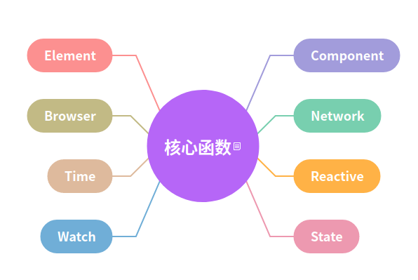

# VueUse

[官方文档](https://vueuse.org/guide/)

- 是什么：VueUse 是基于 Composition Api 封装有状态逻辑的 Vue 工具库
- 为什么：方便、体积

  - 方便：可直接在 setup 通过函数的方式引入，提供的功能覆盖了绝大多数场景。其实这和我们之前为什么用 jquery 的过程有点像，我们之前会经历频繁操作 DOM 的过程，jquery 的出现十分便捷的提升这个过程的效率，同理我认为这个工具的出现也是一个解放生产力的过程。
  - 体积：工具包支持按需引入，多处引入只会打包一次。和之前相比，虽然在 utils 里面集中了部分的公用函数，但是覆盖场景有限，在部分场景下还是各自编写维护工具类，代码打包后难免会混入功能相似的代码（即时这部分场景无法避免）。

:::tip
在介绍这个工具库之前，先介绍下 Vue3 实现功能组合的两种方式
:::

## vue hooks

这一种比较常见 —— 在 setup 里面引入函数，函数内封装响应式变量及对应的更新方法，有点类似于 react 里面的 useState、useEffect 

```js
<script setup>

const target = ref()
const { focused } = useFocus(target)
watch(focused, (focuesd) => {
  // 根据是否活跃执行逻辑
})

</script>
```

## renderless components

[vue patterns](https://www.patterns.dev/vue/renderless-components/)

无渲染组件 —— vue 组件本身并不负责渲染 UI，在插槽上传递数据，父组件根据数据再进行对应 逻辑 ui 的渲染。

> 一个比较经典的例子是切换按纽。这类别的按钮可以用于主题切换、开关切换……，在不同场景下可能 UI 不一致，但实际上对应的都是一个 toggle 状态和 changeState 逻辑

```html
<!-- ToggleComponent -->
<script>
export default defineComponent({
  name: 'ToggleComponent',
  setup(props, { slots }) {
    const checkbox = ref(false);

    const toggleCheckbox = () => {
      checkbox.value = !checkbox.value;
    };

    return () => {
      return slots.default({
        checkbox,
        toggleCheckbox
      })
    }
  }
})
</script>
```

```html
<!-- ThemeSwitchComponent.vue -->
<template>
  <ToggleComponent v-slot:default="{ checkbox, toggleCheckbox }">
    <!-- 渲染 ui -->
  </ToggleComponent>
</template>

<script setup>
import ToggleComponent from '@/components/ToggleComponent'
  
</script>
```
[Composables vs. Renderless Components in Vue 3](https://medium.com/@moein.mirkiani/composables-vs-renderless-components-in-vue-3-1e7386d8182)

对比两种形式组合有状态逻辑代码，其实 Vue 官方本身更推荐使用函数组合的方式
- 更容易进行单元测试。每个组合函数本身就是一个单元，写测试用例和普通函数没有什么区别。而对于组件来说，每一个测试用例都需要一个 demo 引入。
- 更好的 ts 类型支持。函数本身可以定义 ts 类型声明入参以及出口类型，这对于写代码的人员来说可以更清晰了解组合中的功能。


## 核心函数列表




<p style="text-align: center;">图 Vueuse 核心函数分类</p>


### State 

#### createGlobalState 
- 说明：将响应式数据存储在全局，跨组件实例同步读取/更新数据

- 用法

1. 提供全局数据、方法
```ts
import { ref } from 'vue'
import { createGlobalState } from '@vueuse/core'

export const useGlobalState = createGlobalState(() => {
  const count = ref(0)
  const setCount = () => {
    count.value = count.value + 1
  }
  return {
    count,
    setCount,
  };
})
```

2. 在不同组件引入并引用
```html
<!-- Component1.vue -->
<template>
    <div>{{ count }}</div>
    <button @click="setCount">increase</button>
</template>

<script lang='ts' setup>
import { useGlobalState } from './CreateGlobalState'

const { count, setCount } = useGlobalState()
</script>
```

```html
<!-- Component2.vue -->
<template>
    <div>{{ count }}</div>
    <button @click="setCount">increase</button>
</template>

<script lang='ts' setup>
import { useGlobalState } from './CreateGlobalState'

const { count, setCount } = useGlobalState()
</script>
```
以上两个组件，对应不同路由，原生要实现这个数据同步更新修改的过程可以借助 `store`，但是其实很多都是比较简单的场景，用 `store` 比较重。使用这个 api 可以帮助完成这个过程。 [源码](https://github.com/vueuse/vueuse/blob/main/packages/shared/createGlobalState/index.ts) 借助 `@vue/reactive` 里面 effectScope 实现。

:::tips
effectScoped 是什么 [fix 提案](https://github.com/vuejs/rfcs/blob/master/active-rfcs/0041-reactivity-effect-scope.md)
:::

引用官方文档的介绍：创建一个 effect 作用域，可以捕获其中所创建的响应式副作用，捕获的副作用可以一起处理。

> 引入这个提案的原因：响应式数据强绑定到组件作用域，期望是能够有一个不强绑定组件生命周期，能自行控制这个作用域内数据的监听和销毁

#### createInjectionState

- 说明：从祖先组件继承数据


`createInjectionState` 底层基于 `@vueuse/shared` 提供的 `provideLocal` & `injectLocal` 实现。

:::tip
和 `Vue` 提供的 provide、inject 区别
:::

- `provide` 注入数据 & 方法

```html {8,11-14}
<!-- 在供给方组件内 -->
<script setup>
import { provide, ref } from 'vue'

const location = ref()

function updateLocation() {
  // 更新 location
}

provide('location', {
  location,
  updateLocation
})
</script>
```

- `inject` 引入数据 & 方法

```html {5}
<!-- 在注入方组件 -->
<script setup>
import { inject } from 'vue'

const { location, updateLocation } = inject('location')
</script>

<template>
  <button @click="updateLocation">{{ location }}</button>
</template>
```

从 `provideLocal`、`injectLocal` 源码实现来说，底层和上面逻辑相似，同样是一个提供一个取值的过程，区别在于：
- 创建一个全局 map，键为 `vue instance`，值为 WeakMap
- 每次 `provide` & `inject` 的过程都以 WeakMap 作为桥梁

:::tip
个人认为这组 API 有点鸡肋，可有可无的感觉，没有体现出便捷性（可能有忽略的场景）
:::


#### createSharedComposable

- 说明：数据共享
- 描述：和标记清除算法有点类似，通过一个计数器标识当前数据的引用次数；在每个组件卸载周期执行判断逻辑，无引用的情况下再清除 `effectScope` 数据作用域。
- 用法：和 `createGlobalState` 类似

```tsx
// ComponentA.vue
import { createSharedComposable, useMouse } from '@vueuse/core'

const useSharedMouse = createSharedComposable(useMouse)

const { x, y } = useSharedMouse()
```


```tsx
// ComponentB.vue
import { createSharedComposable, useMouse } from '@vueuse/core'

const useSharedMouse = createSharedComposable(useMouse)

const { x, y } = useSharedMouse()
```

两者的数据同步且能互相更新


#### useAsyncState

- 说明：数据异步初始化
- 描述：视图依赖网络请求数据，通常需要我们控制请求完成后再渲染。`useAsyncState` 提供若干属性允许我们配置这个过程。
  - delay(number)：请求发起的延时时间
  - immediate(boolean)：执行回调函数的时机
  - ……

同时也返回了若干属性来反馈请求过程的状态
- isLoading：请求阶段是否在进行中
- isReady：请求是否正常完成
- error：请求过程中发生的错误


```tsx
import axios from 'axios'
import { useAsyncState } from '@vueuse/core'

const { state, isReady, isLoading } = useAsyncState(
  axios
    .get('https://jsonplaceholder.typicode.com/todos/1')
    .then(t => t.data), // state === t.data
  { id: null },
)
```
:::tip
`useAsyncState` 用途蛮大，凡是涉及到页面加载依赖网络请求都可以使用这个 API 来描述对应的过程 [源码学习](https://github.com/vueuse/vueuse/blob/main/packages/core/useAsyncState/index.ts)
:::


#### useDebouncedRefHistory

`useRefHistory` 防抖版本

:::tip
`useRefHistory` 是记录响应式数据变更的快照. 
:::

- 描述：可以理解为 api 记录了数据变更历史记录，提供回滚以及前进的方法操作历史记录
- 用法

```tsx
import { ref } from 'vue'
import { useRefHistory } from '@vueuse/core'

const counter = ref(0)
const { history, undo, redo } = useRefHistory(counter)
```
:::tip
使用过程中需要注意的一些问题
:::

1. 如果需要记录对象类型变更的历史数据，需要注意默认是一个 shallowRef 

- 实现思路

源码基于 `@vueuse/core` 提供的 `useManualRefHistory` 实现。


### Elements