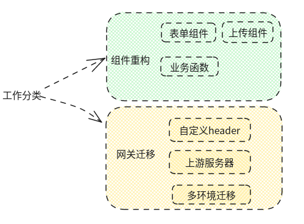
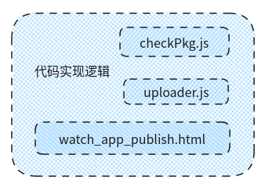
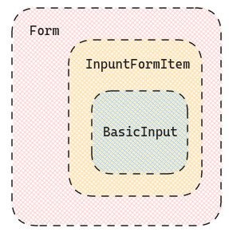

# 9 月工作汇总

概览来看，9 月份是真正开始业务工作的第一个月，具体分类如下：



## 组件重构

组件重构最终目标：将原 `php` 组件代码迁移为 `vue` 。

组件重构思路：理清原来代码逻辑，从具体代码文件来说



- `checkPkg.js`：apk 文件校验逻辑实现
  - 合并完成解析 `apk` 文件，`node` 有 `apk-parser` 可以完成类似任务，解析过程中需要实现一个 `sleep` 函数 —— 解析过程需要我们轮询进行，即每间隔 3 s 向后端发起请求根据返回状态判断解析是否成功。
- `uploader.js`：文件上传逻辑实现

  - 分块上传逻辑
    - 上传前生成上传任务，得到需要分块的数量以及每一个分块的大小
    - 上传过程中检查分块，判断当前分块在服务器中是否存在缓存
    - 并行上传分块 `concurrency`
    - 上传完成合并多个分块生成完整文件
  - 普通文件上传逻辑
    - 封装 `formdata` 向后端发送请求，根据 `type` 区分不同上传类型

- `watch_app_publish.html`：发布页面 `html` 实现，需进行表单组件重构

### 工具函数

`concurrency`：主要任务是限制并行执行任务个数并在某个任务完成后进行任务调度

```js
async function concurrency(tasks, callback, limit, params) {
  const running = [];
  for (const task of tasks) {
    // 等待任务完成进行后进行调度
    if (running.length >= limit) {
      await Promise.rac;
    }
    // 设定任务完成回调，刷新 running 列表
    const task = Promise.resolve()
      .then(() => callback(params))
      .then(() => running.splice(running.indexOf(task), 1));
    // 添加任务
    running.push(task);
  }
}
```

`sleep`：主要任务是完成轮询并在状态发生变化后进行对应回调处理

```js
function sleep(timeInterval) {
  return new Promise((resolve, reject) => {
    setTimeout(() => {
      resolve();
    }, timeInterval);
  });
}
```

```js
async function checkApk() {
    return new Promise((resolve, reject) => {
		while(1) {
            const { errno, data } = await request('/api/check/apk')
            if(errno) {
                // 完成处理（apk异常/正常回调）
                break
            }
           await sleep(3000)
            // 等待 3000 ms 后再重新执行 request 函数
        }
    })
}
```

### 表单组件重构

为什么要重构？从模板本身来说，需要重构那就意味着模块本身是存在缺陷的。从当前业务上来说：

- 每个页面都需要一个 `html` 文件，表单控件需要复用只能借助于 `gulp` （`gulp-file-include`）
- 上面使用场景更多是一些比较大的模块比如像 `header`、`footer` 等等，粒度比较小的不好去定制（可通过 `php` 模板变量去解决无法传递参数问题，但是毕竟模板变量不好维护）
- 综上，考虑用 `vue` 进行重构（基于项目采用 `vue` 重构的基础上），封装成公用组件方便复用

封装思路：将表单里面的控件单独封装为组件

封装要求：

- 能够动态绑定表单数据
- 能够正常进行表单校验
- 能够进行数据回填

封装实现：封装的表单控件可以分为两类

- 单一控件组件：组件只包含一个控件，一个输入框或者一个选择器
- 交互控件组件：组件包含若干个控件，且控件之间可能存在级联操作（当某个控件有值时另外的控件才正常显示）

#### 单一控件组件

```vue
<template>
  <!-- 表单区域 -->
  <form-item v-bind="$attrs" labelWidth="labelWidth">
    <input v-model="value" v-bind="inputOptions" @change="onInputChange" />
  </form-item>
  <!-- 表单插槽 -->
  <p class="form-item-tooltip" v-html="tooltip"></p>
</template>

<script>
export default {
  name: "InputFormItem",
  model: {
    prop: "value",
    event: "change",
  },
  props: {
    value: String,
  },
  methods: {
    onInputChange(val) {
      this.$emit("change", val);
    },
  },
};
</script>
```

- 动态绑定：[组件上使用 v-model](https://v2.cn.vuejs.org/v2/guide/components.html#%E5%9C%A8%E7%BB%84%E4%BB%B6%E4%B8%8A%E4%BD%BF%E7%94%A8-v-model)，如文档所说，在组件上使用 `v-model` 会默认绑定一个 `value` 属性和一个 `input` 方法，但是考虑到 `value` 属性可能会有其他用途，因此可以使用 [`model` 属性](https://v2.cn.vuejs.org/v2/guide/components-custom-events.html#%E8%87%AA%E5%AE%9A%E4%B9%89%E7%BB%84%E4%BB%B6%E7%9A%84-v-model) 重新定义 `v-model` 绑定命名
- 表单校验：在 `form-item` 上通过 `v-bind` 绑定 `$attrs` ，实际使用的时候可以传入 `prop` & `rules` 来完成表单校验。
- 数据回填：使用 `v-model` 进行动态绑定，数据回填自动完成

> 需要注意

1.  `v-bing="$attrs"` 的行为在 `Vue2`和 `Vue3` 中存在差异，在 `Vue2` 中属性的定义永远高于 `v-bind="$attrs"`，而在 `Vue3` 中则由出现的顺序决定，后者覆盖前者。

#### 交互控件组件

- 动态绑定：首先要考虑的问题就是动态绑定的对象是什么。总结有两种绑定方式：
  - 绑定一个 `object`
  - 绑定若干个属性，数据更新时根据 `type` 去更新对应属性

**第一种方法**

[`Vue.js: Using v-model with objects for custom components`](https://simonkollross.de/posts/vuejs-using-v-model-with-objects-for-custom-components) 文章有详细说明，使用也简单

```vue
<template>
  <contact-form-item v-model="formState" />
</template>
```

```vue
<!-- ContactFormItem.vue -->
<template>
  <form-item>
    <input
      :value="formState.business_name"
      @change="update('business_name', $event.target.value)"
    />
    <input
      :value="formState.business_email"
      @change="update('business_email', $event.target.value)"
    />
  </form-item>
</template>

<script>
export default {
  name: "ContactFormItem",
  props: ["formState"],
  methods: {
    update(key, value) {
      this.$emit("input", { ...this.formState, [key]: value });
    },
  },
};
</script>
```

**第二种方法**

绑定多个属性，`value change` 时使用 `emit` 更新数据

```vue
<template>
  <contact-form-item
    :businessName="formState.business_name"
    :businessEmail="formState.business_email"
    @handleDataFill="handleContactFormItemChange"
  />
</template>
```

```vue
<template>
  <form-item>
    <input v-for />
  </form-item>
</template>

<script>
export default {
  name: "ContactFormItem",
  props: {
    keysMapping: {
      type: Array,
      default() {
        return [
          {
            label: "姓名",
            value: "business_name",
          },
          {
            label: "邮箱",
            value: "business_email",
          },
        ];
      },
    },
  },
  data() {
    return {
      state: this.generateState(), // 生成 state
    };
  },
  methods: {
    update(key, value) {
      this.$emit("input", key, value);
    },
  },
};
</script>
```

对比两种方式，个人感觉第一种会更好一些，因为它并不需要外部额外处理属性以及事件绑定。但是在参数名称比如 `business_name` 在其他使用场景下可能是 `username` 的情况下就不适用。这时候第二种方法就可以通过 `keysMapping` 来定制，在使用的时候定义好需要使用的映射即可。

> 但是之前没想到第一种方式用了第二种有点后悔了，需要迁移修改下！

- 表单校验：方法与单一控件组件类似，只需要保证 `prop` &`rules` 能够透传在 `form-item` 上就好
- 数据回填：第一种方法能够自动完成数据回填，第二种方法需要监听 `$attrs` 的变化然后再重新执行 `generateState` 保证此时的数据为父组件传递的最新数据。

```vue
<script>
export default {
  watch: {
    $attrs: {
      handler(val) {
        this.generateState(val);
      },
    },
  },
};
</script>
```

> 多层组件数据同步



### 上传组件重构

上传组件本应该归属于表单控件重构，单独设置模块是因为里面涉及组件比较多，`UploadImageFormItem`、`UploadVideoFormItem`、`UploadXlsxFormItem`、`UploadPdfFormItem`、`UploadApkFormItem`、`UploadMultiFormItem`。

**重构思路**

其实概括起来有两类上传组件，一类是直接通过上传框触发，另外一类是通过按钮点击间接触发上传框，所有一开始的封装思路是写两个类的基础组件 `Upload.vue`、`UploadButton.vue`，然后再应用到不同文件上传的组件中。

但是后面发现每个文件上传都对应了一个 `vue` 文件，部分逻辑也是耦合。

1. `UploadImageFormItem`、`UploadVideoFormItem`、`UploadMultiFormItem`、`UploadPdfFormItem`，这四个组件除了上传成功后展示的内容不一致后其实逻辑都相似。`UploadXlsxFormItem`、`UploadZipFormItem` 这两个组件同样只是在展示上存在差异

2. 因此考虑继续封装，简化为两种类别 `UploadFormItem`、`UploadButtonFormItem`，通过 `type` 区分不同上传类型

:star: 如何解决不同上传类型校验需要不同 `props`？

> 图片需要额外检验 `width`&`height`，视频需要额外校验 `lasttime`

如果一个个区分不同类别组件确实比较麻烦，所以采用的解决方案是定义一个通用 `mixins`，包括所有校验需要的属性（多余的不使用其实也没有影响，定义了也不会通过 `$attrs` 透传到组件上影响使用）

:star: 校验逻辑是否可以统一？

> 图片校验需要 `checkSize`、`checkType`、`checkOutline` 三个函数都通过，视频校验需要 `checkSize`、`checkType`、`checkLastTime` 三个函数都通过

定义一个 `FileCheck` 类，囊括所有上传类型需要的处理函数，组件传入需要执行校验函数的别名 （`FileCheck` 维护了一个映射，别名唯一对应到校验函数）

```js
const check = ["size", "type", "outline"]; // 执行 `checkSize`、`checkType`、`checkOutline`
```

> 执行过程统一封装在 `check` 函数，校验成功或者失败统一通过 `check` 返回。涉及到`checkSize`、`checkType` 这些函数都采用了对象属性进行参数传入

```js
checkSize({ file, width, height, size, type }) {}
```

之所以这样做的考虑是：在调用方法传入参数的时候如果采用列举方式需要根据顺序构造参数列表

> 读取传入参数列表 => 生成函数参数 => 传入参数

而采用对象属性传入的话相对清晰，但是也有一定局限性

:warning: 传入的时候必须按照约定 `key` 传入

```js
check(instance, options, file) {
    // instance: FileCheck实例
    // options: 函数参数对象
    // file: 文件对象
}
```

`check` 函数签名如上， `options` 的 `key` 必须为约定好的值，这样才能保证 `checkSize`、`checkType` 能够正常获取参数。

