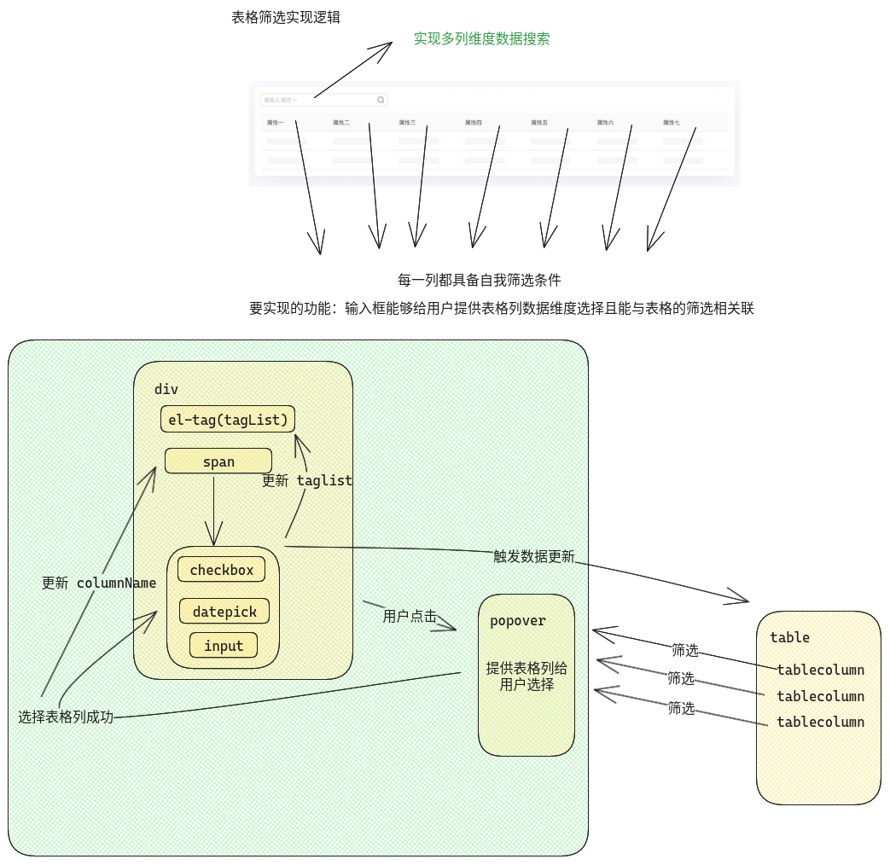
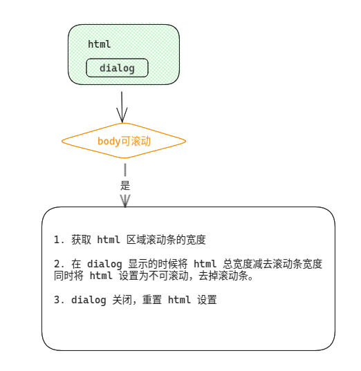
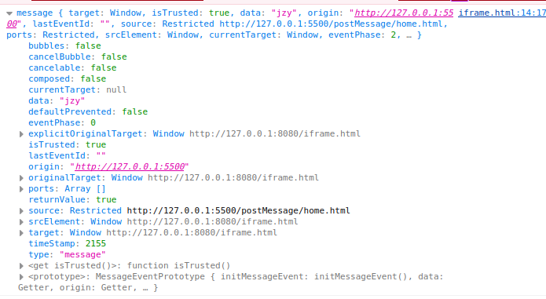

# 10 月工作汇总

## 前端思维

- 如何优雅解决表格设计？[数据表格应该这样设计](https://www.woshipm.com/pd/4239403.html)



在设计实现的时候会遇到一种可以对每个数据列都进行筛选的需求，如上所示为实现流程

- 如何解决 `dialog` 的滚动事件会透穿？透穿主要指的是 `body` 也可以滚动的时候，在 `dialog` 滚动的时候会导致 `body` 的滚动，这是不被允许接收的。[滚动条占宽度吗？](https://tianzi77.github.io/2016/09/07/scroll-bug/)



- `obus` 错误上报。`obus` 是一个前端错误上报工具（公司自研），但是有个问题就是 `obus` 只能实例化一次，即一个应用内只能唯一对应一个上报 `id`，但是存在这样的场景，其他应用使用 `ssi` 接入了开平头部，应用内和开平头部都需要使用 `obus` 进行上报，且对应不同的上报 `app_id`。

  - 初始的设计方案：封装一个 `obus.js` 、`CatchError.js`，前者用于初始并实例化 `obus`，后者负责错误解析，生成对应数据结构进行上报，后利用 `rollup` 将资源打包成一个 `.js` 文件通过 `script` 引入
    - 问题：`obus` 源码的实现是将实例挂载到 `window` 上，同一个 `url` `script` 资源共享 `window` ，`obus` 仍然只能实例化一次
  - 最终设计方案：借用 `iframe`，创建新的 `html` 作用域，隔离 `window` 环境。在 `iframe` 内新建 `obus`，每次发生错误的时候将错误当作 `hash` 参数传入 `iframe`，`iframe` 内部监听 `hash` 变化来实时获取错误并完成错误上报。

  ```html
  <script>
    /* iframe.html */

    // 初始化 obus 实例

    // 监听 HASH
    window.onhashchange = function () {
      const errors = JSON.parse(
        decodeComponentURL(window.location.hash.slice(1))
      );
      // 错误上报
    };
  </script>
  ```

  > **在实现的时候其实有两个坑没注意到**

  1. `iframe` 渲染时机：因为是在 `js` 内创建 `iframe`，浏览器的解析策略是自上而下依次解析，`script` 的引入位置在 `head` 内，解析完 `script` 会接着去解决 `head` 内的资源（包括 `vue` 打包后的 `js` & `css` 相关文件），因此`vue` 初始化的时机是早于 `iframe` 的解析时机，如果初始化就发生多个错误的话最终只会上报最后的错误（hash 取值是最后一个错误序列化结果）。
  2. 在把错误序列化成 `JSON` 传递到 `url` 上时，其实是需要再经过一个 URL 参数序列化的，因为有些字段是和 URL 上的特殊字符冲突（`encodeComponentURL`）

> 从上面映射出来一个知识点，如何在不同源页面之前传输数据？

1.  在 `iframe` 链接上传递 `hash` 参数，`iframe` 再通过 监听`hash` 值变化实现数据通信。（这种方式有一个很大的弊端：如果传递的值每次都是同一个的话 `hash` 不发生变化就监听不到数据的传输过程）

2.  可以使用 `postMessage` 方法

```html
<!-- homePage -->
<body>
  homePage
  <iframe
    id="iframe"
    src="http://127.0.0.1:8080/iframe.html"
    frameborder="0"
  ></iframe>
  <script>
    window.onload = function () {
      const iframe = document.getElementById("iframe");
      setInterval(() => {
        iframe.contentWindow.postMessage("jzy", "http://127.0.0.1:8080");
      }, 2000);
    };
  </script>
</body>

<!-- iframe -->
<script>
  window.addEventListener("message", receiveMessage, false);
  function receiveMessage(event) {
    console.log(event);
  }
</script>
```



> 本质上可以 理解`postMessage` 模式为发布订阅模式

`event` 的数据结构如上图所示，比较关心的是 `origin `属性以及 `data`

- `origin`：可以判断传递过来的父页面 URL，子页面可针对该 URL 作合法性校验
- `data`：本次传递的数据

- 前端组件（表单、表格）基于配置化

:question: 为什么要做这种设计？原来在 `vue` 里面基于模板的方式如果存在大量表单或者表格列的化需要以命名的方式一个个的写在模板里面，如果情景简单还好（不需要针对某一列或者某一个表单项去控制），但是一旦复杂比如说表单项需要可编辑和详情展示，需要不同的表单控件或者表格列需要定制化的对某一列进行 `UI` 展示，这时候如果还以命名的方式写在模板里面整个文件会很大后续难以维护。

:question:什么是配置化？配置化指的是通过在 `JS` 文件中抛出定义，在 `vue` 文件中使用渲染函数的方式引入定义通过遍历的方式完成视图渲染，可以解决的问题：

1. 解耦，在定义好规则后只需修改 `JS` 文件的配置即可，不需要关注渲染函数
2. 简洁，可以很方便的控制显隐，解决模板语法复杂判断

:question: 如何配置化，需要遵循什么规则？涉及表单部分，可首先封装一个个 `form-item`，通过 `type-form-item` 渲染指定 `form-item`。`JS` 文件中一个表单项的定义

```js
{
    type: 'input'|'select'|'textarea'|'datapick'|'radio', // 类型为输入框
    key: string, // 绑定到表单对象上的属性
    validator: Validator[], // 自定义校验器,
    options?: {value: string|number, label: string}[], // 选择器选项
    startIdx?: number, // 选择器选项开始下标
    endIdx?: number, // 选择器选项结束下标
    filter?: (options: Options[]) => void, // 自定义需要选择器的哪些选项
    /* 可自定义各种配置 formItemOptions, controlOptions */
}
```

使用上诉对象可以唯一描述一个表单控件，在渲染函数只需根据以上规则生成即可，方便可维护性高

- `vue` 渲染函数的使用

  其实上面组件配置话就是基于渲染函数的方式实现。渲染函数的优势在与如果要进行复杂的控件逻辑渲染可以通过 **三元表达式** 优化，而模板只能通过 **v-show/v-if** 来控制总体不太方便。对于像表单/表格这类子元素比较类似的场景，渲染函数可以利用 `JS` 原生编程完成不同子组件渲染，这种简洁 `JSX` 或者是 `模板` 所不能做到的。

  - 渲染函数中比较难理解的是插槽部分，对插槽来说，总体可以分为以下五种情况

    - ```vue
      <slot></slot>
      <!-- 默认插槽 -->
      ```

    - ```vue
      <slot name="header"></slot>
      <!-- 命名插槽 -->
      ```

    - ```vue
      <slot name="header" :message="message"></slot>
      <!-- 命名插槽，内部抛出 message 变量 -->
      ```

    - ```vue
      <Component v-slot="props" />
      <!-- 父组件使用默认插槽的数据，并获得其内部抛出数据 -->
      ```

    - ```vue
      <Component v-slot:header="props" />
      <!-- 父组件使用命名插槽，并获得其内部抛出数据 -->
      ```

    > 对应在渲染函数内部如何替换上面的模板语法？

    ```javascript
    function render(h) {
      return h("div", null, [
        this.$slot.default, // 等价于情况一
        this.$slot.header, // 等价于情况二
      ]);
    }
    ```

    ```js
    function render(h) {
      return h("div", null, [
        this.$slotScope.header({
          // 等价于情况三
          message,
        }),
      ]);
    }
    ```

    ```js
    function render(h) {
        return h('Component', {
            scopeSlots: {
                default: (props): return h('div'), // 等价于情况四
            	header: (props): return h('div') // 等价于情况五
            }
        })
    }
    ```

## 后端思维

云拨测（Cloud Automated Testing，CAT）利用分布于全球的监测网络，以真实终端用户使用场景为视角，提供模拟终端用户体验的拨测服务。CAT 可实现对网络质量、页面性能、端口性能、文件传输、音视频体验等场景进行周期性监控，支持多维度分析性能指标。利用可视化性能数据和告警通知可帮助您及时对业务质量作出反应，保证业务稳定正常运行。 云拨测支持**网络质量**、**页面性能**、**端口性能**、**文件传输（上传、下载）**和 **音视频体验** 五个场景监控。

- 网络质量：针对应用网络稳定性，路由稳定性、DNS 解析正确率，包括 ICMP 时延和丢包率等进行监控。
- 页面性能：获取用户在不同的运营商、城市地域、浏览器版本、操作系统、设备等环境下，访问 Web 页面的体验数据，全面了解页面的性能。
- 文件传输(上传/下载)：通过文件上传/下载，获取应用的数据资源的传输速率，反映真实的带宽的波动性。
- 端口性能：对 GET、POST 协议或端口进行监测，监测接口响应性能、可用性，确保用户使用体验和业务可用性。
- 音视频体验：对流媒体网站以及 App 视频文件的播放进行监测，获取播放过程中卡顿率、卡顿用时、首帧用时等的数据，帮助提升视频播放体验，提升用户体验效果。

系统设计

- 首先设计一个系统先得从系统整体功能流向开始，即涉及到多少个不同的角色
- 针对不同角色对应功能设计数据库（给出 UML 图）
- 梳理&设计接口，写接口文档，和前端对接好接口，参数，数据格式……
- 代码编写，注意保持接口层级设计的合理性，尽量符合既定的设计模式
