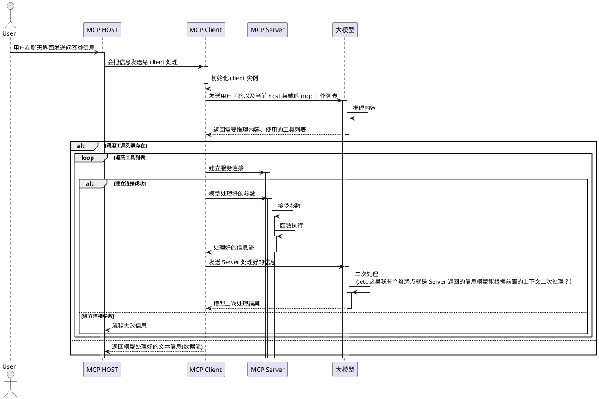

# Model Context Protocol

## 基本概念

Model Context Protocol 简写为 MCP，一句话总结：MCP 是大语言模型通过调用外部数据源、工具扩展自身能力的通用协议. 在 MCP 里边有几个比较关键的概念：
- MCP Host：chat 客户端
- MCP Client：客户端实现的一个本地服务
- MCP server：远程或本地启动服务
  
具体交互流程梳理如下：



所以我们可以一句话概括：MCP Host 内置实现了 MCP Client，在接受到用户的提问输入后通过 MCP Client 与大模型和 MCP Server 进行往返交互最后输出问答结果

## MCP Server

### 原理

其实 MCP Server 可以理解为启动了一个 Node / Python 服务，服务里边内置了一些特定的行为逻辑来完成指定任务。对于本身了解 JS / Python 开发的人来说，MCP Server 就是一个标准的应用程序，只是它遵循 MCP 协议规范来与外部系统通信。

MCP Server 的核心特点：
- **协议标准化**：基于 JSON-RPC 2.0 进行通信
- **能力声明**：通过 `capabilities` 声明自己支持的功能
- **工具注册**：可以注册多个工具供 LLM 调用
- **状态管理**：可以维护会话状态和上下文

### 案例实现

[@bestzy/mcp-cos-markdown](https://github.com/jzyismylover/zy-npm-package)：实现了两个 tools，一个是上传文件到腾讯云 cos，一个是将 markdown 中的本地文件替换为 cos 存储的图片

1. 项目目录

```markdown
mcp
├── CHANGELOG.md
├── README.md
├── package.json
├── src
│   ├── __test__        # 单元测试
│   │   ├── README.md
│   │   ├── images
│   │   └── index.spec.ts
│   ├── cos.ts          # 实现 cos 文件上传
│   ├── index.ts        # 主入口
│   └── markdown.ts     # 实现 markdown 解析 
├── tsconfig.json       
├── types
│   └── module.d.ts
└── vitest.config.ts
```

2. 依赖

核心是依赖了 `@modelcontextprotocol/sdk`，`@modelcontextprotocol/sdk` 是官方提供的 Typescript SDK，主要的作用是

1.  统一的 AI 连接标准

- 提供了一个标准化的协议，AI 应用能够与外部的数据源和工具无缝集成
- 解决了 AI 应用连接各种数据源时多映射的问题

2. 三大核心功能

- 提供 McpServer 类

```ts
import { McpServer } from "@modelcontextprotocol/sdk/server/mcp.js";
import { StdioServerTransport } from "@modelcontextprotocol/sdk/server/stdio.js";

const mcpServer = new McpServer({
  name: '@modelcontextprotocol/cos-markdown-mcp',
  description: 'markdown & cos',
  version: '1.0.0'
})
```

- 注册工具提供给 AI 模型调用
```ts
server.registerTool(
  "upload",
  {
    title: "上传一张图片到腾讯云 COS, 并返回上传地址",
    description: "腾讯云 COS 上传工具",
    inputSchema: {
      filePath: z.string().describe("图片本地路径"),
    },
    outputSchema: {
      url: z.string().describe("上传地址"),
    },
  },
  async ({ filePath }: { filePath: string }): Promise<McpResult> => {
    try {
      const cosService = new COSService();

      const url = await cosService.uploadFile(filePath);

      // mcp client 接受的 特定格式
      return { content: [{ type: "text", text: url }] };
    } catch (error) {
      console.error(error);
      // mcp server 异常
      throw new Error(`Failed to upload image: ${error}`);
    }
  },
);
```

- 提供调用入口
```ts
async function main() {
  const transport = new StdioServerTransport();
  await server.connect(transport);
}

main().catch((error) => {
  console.error("Fatal error in main():", error);
  process.exit(1);
});
```

:::info
一个最简单的 MCP Server 其实就是由以上三部分组成，至于一些能力的扩展其实都是工具内部的逻辑
:::


#### 本地调试

本地开发调试的方式也比较简单，其实就是让 node / python 去运行指定目录下的代码。比如当前开发 mcp 插件的目录是 `~/programmer/npmPackage/packages/mcp`，那么可以独立在 `mcp.json` 里边新增一个配置

```json
  "mcpServers": {
    "cos": {
      "command": "node",
      "args": [
        "~/programmer/npmPackage/packages/mcp/dist/index.js"
      ]
    }
  }
```

配置完后可看加载插件的时候是否有一些异常，在 cursor 里边可以在 “输出” 选择 MCP Logs 看到加载插件的一些日志，很多时候插件无法正常启动就可以先根据这里面的 error 信息查看是否是配置上的问题亦或者是运行时 server main 函数入口存在阻塞性报错


#### 环境变量读取

因为 cos 上传涉及到一些账号相关信息不能硬编码在 js 文件里边，所以前边是放到了 .env 环境变量中。然后在 cosService 实现里边使用 dotEnv 去读取环境变量

```ts
import COS from "cos-nodejs-sdk-v5";
import dotenv from "dotenv";

// 加载环境变量
dotenv.config();

export class COSService {
  private cos: COS;
  private bucket: string;
  private region: string;

  constructor() {
    this.cos = new COS({
      SecretId: process.env.COS_SECRET_ID,
      SecretKey: process.env.COS_SECRET_KEY,
    });
    this.bucket = process.env.COS_BUCKET!;
    this.region = process.env.COS_REGION!;
  }
}
```
最后是需要在 `mcp.json` 中加入对应环境变量的配置

```json
  "mcpServers": {
    "cos": {
      "command": "npx",
      "args": [
        "-y @bestzy/mcp-cos-markdown"
      ],
      "env": {
        "COS_SECRET_ID": "",
        "COS_SECRET_KEY": "",
        "COS_BUCKET": "",
        "COS_REGION": ""
      }
    }
  }
```