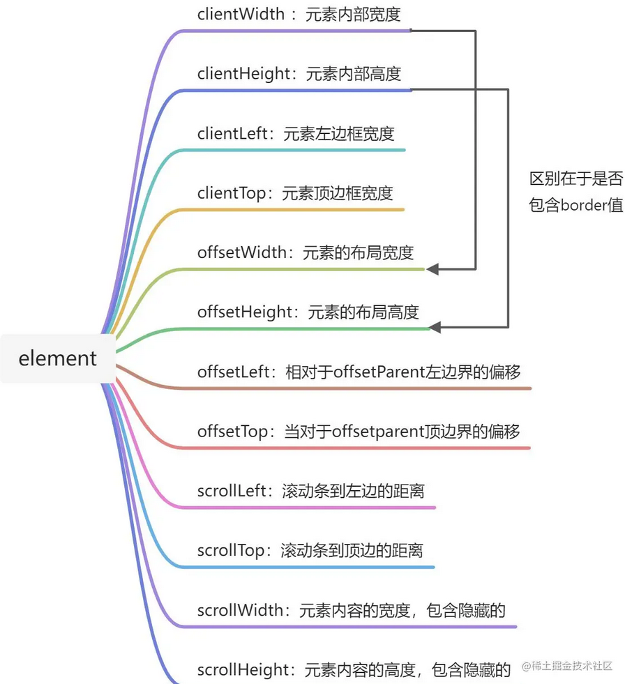
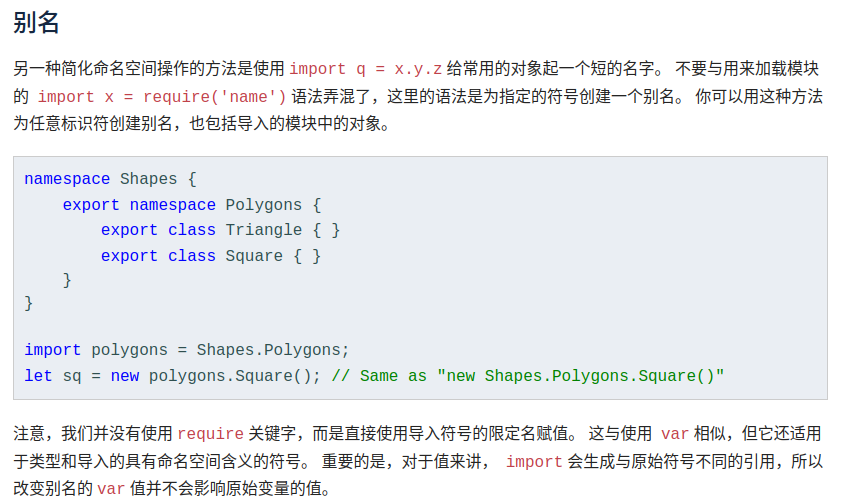

# 浏览器搜索记录

## element位置计算



> 在需要手动操作滚动数值的时候，给定一个容器和容器内需要滚动的 `items`

计算公示：`scrollTop = item.offsetTop + item.offsetHeight - wrapper.offsetHeight`

当 `item.offsetTop + item.offsetHeight ==== wrapper.offsetHeight` 时刚好处于临界状态，即无滚动情况下列表某元素已经到达容器底部


- [innerWidth ](https://segmentfault.com/a/1190000010746091)
- [clientWidth & scrollHeight](https://juejin.cn/post/7116306912198524959#heading-25)： 同时包含 `offsetWidth`、`offsetLeft` 等比较不熟悉的 `API`
- [:not()](https://developer.mozilla.org/zh-CN/docs/Web/CSS/:not)：`DOM` 选择器
- [npm package qrcode](https://www.npmjs.com/package/qrcode)：生成二维码

- [ts error](https://bobbyhadz.com/blog/typescript-uncaught-referenceerror-exports-is-not-defined)：`ReferenceError: exports is not define in typescript`



- `String.prototype.split`

  ```js
  split(separator);
  split(separator, limit); // limit限制切割seperator次数
  ```


## `Array.prototype.splice` 实现

```js
Array.prototype.splice = function (start, deleteCount) {
  let max = Math.max, // 函数定义
    min = Math.min,
    delta,
    element, // 代表每个单元元素
    insertCount = max(arguments.length - 2, 0), // 新增元素的个数
    k = 0,
    len = this.length,
    new_len,
    result = [], // 存储删除的数组
    shift_count;

  start = start || 0;
  if (start < 0) {
    start += len;
  }
  start = max(min(start, len), 0);
  deleteCount = max(
    min(typeof deleteCount === "number" ? deleteCount : len, len - start),
    0
  );
  delta = insertCount - deleteCount; // 变化的长度
  new_len = len + delta; // 新长度

  while (k < deleteCount) {
    element = this[start + k];
    if (element !== undefined) {
      result[k] = element;
    }
    k += 1;
  }

  // ### 关键：需要整体移动的次数 ###
  shift_count = len - start - deleteCount;

  if (delta < 0) {
    // ### k 初始值 ###
    k = start + insertCount;
      
    // 向左平移填补 deleteCount > inserCount 的空缺
    while (shift_count) {
      this[k] = this[k - delta];
      k += 1;
      shift_count -= 1;
    }
    this.length = new_len;
  } else if (delta > 0) {
    // 末尾开始向右平移 n 次 保证能容纳下新增数组元素数量
    k = 1;
    while (shift_count) {
      this[new_len - k] = this[len - k];
      k += 1;
      shift_count -= 1;
    }
    this.length = new_len;
  }
  for (k = 0; k < insertCount; k += 1) {
    this[start + k] = arguments[k + 2];
  }
  return result;
};
```

## Blob 定义

- 定义：Blob 是前端用来进行文件操作的二进制对象. (File 对象接口继承了 Blob 的功能)
- 构造函数参数
  - array：可迭代对象 Array，包含 ArrayBuffer、DateVIew、 Blob、String 或者任意这些元素混合
  - options
    - type：存储到 blob 中的数据 MIME 类型
    - endings：定义数据是文本的情况下如何解析其中的换行符号. 
      - transparent： 会将换行符复制到 blob 中而不会改变它们. 
      - native：将换行符转换为主机系统的本地约定


## requestIdleCallback 定义

- 定义：性能优化 api，在浏览器空闲的时候执行回调队列中的函数
- 参数
  - callback
    - IdleDeadline
      - timeRemaining：用来表示当前闲置周期的预估剩余毫秒数
      - didTimeout：判断回调是否因为超过了设置的超时时间而被执行的
  - options
    - timeout：如果该回调事件在 timeout 内都没有执行的话会放入下一个事件循环的宏任务队列中. （对性能可能会有副作用影响）

使用 requestIdleCallback 的目的是充分利用空闲时间，使用注意事项如下：

- 对非高优先级的任务使用空闲回调
- 空闲回调应尽可能不超支配到的时间
- 避免在空闲回调中改变 DOM
- 避免运行时间内执行无法预测的任务


## vue computed set 方法

`Vue computed ` 默认使用了 `get` 方法，而 `set` 方法一般用不上

```ts 
computed: {
    editData: {
      get () {
        return this.value
      },
      set (v) {
        this.$emit('input', v)
      }
    }
 }

// 触发 computed set 方法的条件
this.editData = 2 
```


## animation

`animation` & `keyframes` 是 `css` 设置动画的方式，属性多相对难以理解，从 `animation-*` 设置来说：

- `animation-name`：动画名（一个 `animation` 可以指定多个动画 `,` 作为分隔）
- `animation-duration`：动画持续时间(可设置 `s`  或者 `ms` 数值)
- `animation-fill-mode`：设置动画执行前和之后如何将样式应用在目标上
  - `forwards ` 动画结束后保留最后一个关键帧的样式
  - `backwards` 动画开始前应用第一个关键帧的样式
  - `both` `forwards` 和 `backwards` 同时生效
  - `none` 默认值
- `animation-delay`：动画延时开始时间
- `animation-direction`：动画播放方向
  - `normal` 正向播放
  - `reverse` 反向播放
  - `alternate` 正反交替，从正向开始
  - `alternate-reverse` 正反交替，从反向开始
- `animation-iteration-count`：设置动画播放次数
  - `infinite` 永久播放 

- `animation-timing-function`：动画周期函数
  - `linear` 线性
  - `cubic-bezier` 贝塞尔曲线
  - `step` 定义动画被分隔等长时间段数量（是否包含两端或者只包含一端）
- `animation-play-state`：动画是否正常运行


🔐 统一遵循以下 `animation`顺序定义规则

```text
animation = 
  <single-animation>#

<single-animation> = 
  <time>  duration                            ||
  <easing-function>                   ||
  <time>  delay                            ||
  <single-animation-iteration-count>  ||
  <single-animation-direction>        ||
  <single-animation-fill-mode>        ||
  <single-animation-play-state>       ||
  [ none | <keyframes-name> ]   
```


## 链接记录


- [npm package getopts](https://www.npmjs.com/package/getopts)：提供了一组规则集用于获取命令行对应的选项映射

  ```js
  getopts(['-abc'])
  {
      _: []
      a: true,
      b: true,
      c: true
  }
  ```

  其他规则详见其 npm 发布主页

- `Promise.race`：状态变更跟随传入`最先执行` 完成的异步任务

- `git clone [options] resposity directory`

  - `resposity`：需要 `clone` 的仓库
  - `directory`：文件存储的目录（默认在当前目录创建仓库同名文件夹）

- `eslint parser ` [作用](https://zhuanlan.zhihu.com/p/295291463)

- `tyconfig.json.compileOptions.moduleResolution`: node & classic

  - node: `node_modules`
  - classic: `filename`

- `vue3 template`: 在`template`上使用 `v-for` 通常 `key` 绑定在其第一个子元素上 [issue](https://v3-migration.vuejs.org/breaking-changes/key-attribute.html#with-template-v-for)