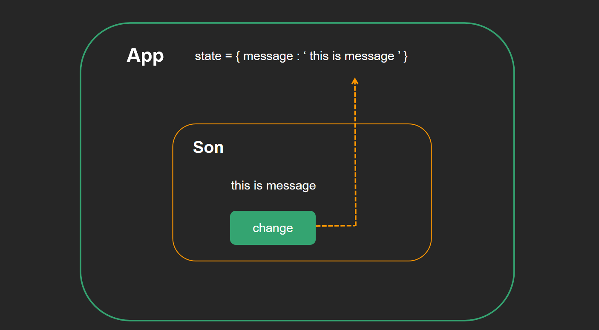

#  React基础

## React介绍

`目标任务:`  了解什么是React以及它的特点

**React是什么**

​     一个专注于构建用户界面的 JavaScript 库，和vue和angular并称前端三大框架，不夸张的说，react引领了很多新思想，世界范围内是最流行的js前端框架，最近发布了18版本，加入了很多新特性

​	React英文文档（https://reactjs.org/）

​	React中文文档 （https://zh-hans.reactjs.org/）

​	React新文档	（https://beta.reactjs.org/）（开发中....）

**React有什么特点**

1. 声明式UI（JSX）

   写UI就和写普通的HTML一样，抛弃命令式的繁琐实现

   

2. 组件化

   组件是react中最重要的内容，组件可以通过搭积木的方式拼成一个完整的页面，通过组件的抽象可以增加复用能力和提高可维护性

   

3. 一次学习，矿平台编写

   react既可以开发web应用也可以使用同样的语法开发原生应用（react-native），比如安卓和ios应用，甚至可以使用react开发VR应用，想象力空间十足，react更像是一个 `元框架`  为各种领域赋能

   

## 环境初始化

`目标任务:`   能够独立使用React脚手架创建一个react项目

### 1. 使用脚手架创建项目


- 打开命令行窗口

- 执行命令

  ```bash
  npx create-react-app react-basic
  ```

  说明：

  1. npx create-react-app 是固定命令，`create-react-app`是React脚手架的名称
  2. react-basic表示项目名称，可以自定义，保持语义化
  3. npx 命令会帮助我们临时安装create-react-app包，然后初始化项目完成之后会自自动删掉，所以不需要全局安装create-react-app

- 启动项目

  ```bash
  yarn start
  or
  npm start
  ```

### 2. 项目目录说明调整

- 目录说明

  1. `src` 目录是我们写代码进行项目开发的目录

  2. `package.json`  中俩个核心库：react 、react-dom

- 目录调整

  1. 删除src目录下自带的所有文件，只保留app.js根组件和index.js
  2. 创建index.js文件作为项目的入口文件，在这个文件中书写react代码即可
  
- 入口文件说明

  ```jsx
  import React from 'react'
  import ReactDOM from 'react-dom'
  import './index.css'
  // 引入根组件App
  import App from './App'
  // 通过调用ReactDOM的render方法渲染App根组件到id为root的dom节点上
  ReactDOM.render(
    <React.StrictMode>
      <App />
    </React.StrictMode>,
    document.getElementById('root')
  )
  ```

## JSX基础

### 1. JSX介绍

`目标任务:`   能够理解什么是JSX，JSX的底层是什么

概念：JSX是 JavaScript XML（HTML）的缩写，表示在 JS 代码中书写 HTML 结构

作用：在React中创建HTML结构（页面UI结构）

优势：

1. 采用类似于HTML的语法，降低学习成本，会HTML就会JSX
2. 充分利用JS自身的可编程能力创建HTML结构

注意：JSX 并不是标准的 JS 语法，是 JS 的语法扩展，浏览器默认是不识别的，脚手架中内置的 [@babel/plugin-transform-react-jsx](@babel/plugin-transform-react-jsx) 包，用来解析该语法。(可以理解为是 react 帮我们自动处理)


### 2. JSX中使用js表达式

`目标任务:`   能够在JSX中使用表达式

**语法**

`{ JS 表达式 }`

```jsx
const name = '柴柴'

<h1>你好，我叫{name}</h1>   //    <h1>你好,我叫柴柴</h1>
```

**可以使用的表达式**

1. 字符串、数值、布尔值、null、undefined、object（ [] / {} ）
2. 1 + 2、'abc'.split('')、['a', 'b'].join('-')
3. fn()

**特别注意**！！！

​	if 语句/ switch-case 语句/ 变量声明语句，这些叫做语句，不是表达式，不能出现在 `{}` 中！！

### 3. JSX列表渲染

`目标任务:`   能够在JSX中实现列表渲染(非常常见的需求)

> 页面的构建离不开重复的列表结构，比如歌曲列表，商品列表等，我们知道vue中用的是v-for，react这边如何实现呢？

实现：使用数组的`map` 方法

案例：

```jsx
// 来个列表
const songs = [
  { id: 1, name: '痴心绝对' },
  { id: 2, name: '像我这样的人' },
  { id: 3, name: '南山南' }
]

function App() {
  return (
    <div className="App">
      <ul>
        {
          songs.map(item => <li>{item.name}</li>)
        }
      </ul>
    </div>
  )
}

export default App
```

注意点：需要为遍历项添加 `key` 属性


1. key 在 HTML 结构中是看不到的，是 React 内部用来进行性能优化时使用
2. key 在当前列表中要唯一的字符串或者数值（String/Number）
3. 如果列表中有像 id 这种的唯一值，就用 id 来作为 key 值
4. 如果列表中没有像 id 这种的唯一值，就可以使用 index（下标）来作为 key 值(当然对性能的提升不大甚至还可能会起到副作用)

### 4. JSX条件渲染

`目标任务:`   能够在JSX中实现条件渲染

作用：根据是否满足条件生成HTML结构，比如Loading效果

实现：可以使用 `三元运算符` 或   `逻辑与(&&)运算符`

案例：

```jsx
// 来个布尔值
const flag = true
function App() {
  return (
    <div className="App">
      {/* 条件渲染字符串 */}
      {flag ? 'react真有趣' : 'vue真有趣'}
      {/* 条件渲染标签/组件 */}
      {flag ? <span>this is span</span> : null}
    </div>
  )
}
export default App
```


### 5. JSX样式处理

`目标任务:`   能够在JSX中实现css样式处理

- 行内样式 - style

  ```jsx
  function App() {
    return (
      <div className="App">
        <div style={{ color: 'red' }}>this is a div</div>
      </div>
    )
  }
  
  export default App
  ```

- 行内样式 - style - 更优写法

  ```jsx
  const styleObj = {
      color:red
  }
  
  function App() {
    return (
      <div className="App">
        <div style={ styleObj }>this is a div</div>
      </div>
    )
  }
  
  export default App
  ```

  

- 类名 - className（推荐）

  `app.css`

  ```css
  .title {
    font-size: 30px;
    color: blue;
  }
  ```

  `app.js`

  ```jsx
  import './app.css'
  
  function App() {
    return (
      <div className="App">
        <div className='title'>this is a div</div>
      </div>
    )
  }
  export default App
  ```
  
- 类名 - className - 动态类名控制

  ```jsx
  import './app.css'
  const showTitle = true
  function App() {
    return (
      <div className="App">
        <div className={ showTitle ? 'title' : ''}>this is a div</div>
      </div>
    )
  }
  export default App
  ```

### 6. JSX注意事项

`目标任务:`   掌握JSX在实际应用时的注意事项

1. JSX必须有一个根节点，如果没有根节点，可以使用`<></>`（幽灵节点）替代
2. 所有标签必须形成闭合，成对闭合或者自闭合都可以
3. JSX中的语法更加贴近JS语法，属性名采用驼峰命名法  `class -> className`  `for -> htmlFor`
4. JSX支持多行（换行），如果需要换行，需使用`()` 包裹，防止bug出现

## 格式化配置

`目标任务:`   基于vscode配置格式化工具，提高开发效率

1. 安装vsCode prettier插件

2. 修改配置文件 `setting.json`

   ```json
   {
     "git.enableSmartCommit": true,
     // 修改注释颜色
     "editor.tokenColorCustomizations": {
       "comments": {
         "fontStyle": "bold",
         "foreground": "#82e0aa"
       }
     },
     // 配置文件类型识别
     "files.associations": {
       "*.js": "javascript",
       "*.json": "jsonc",
       "*.cjson": "jsonc",
       "*.wxss": "css",
       "*.wxs": "javascript"
     },
     "extensions.ignoreRecommendations": false,
     "files.exclude": {
       "**/.DS_Store": true,
       "**/.git": true,
       "**/.hg": true,
       "**/.svn": true,
       "**/CVS": true,
       "**/node_modules": false,
       "**/tmp": true
     },
     // "javascript.implicitProjectConfig.experimentalDecorators": true,
     "explorer.confirmDragAndDrop": false,
     "typescript.updateImportsOnFileMove.enabled": "prompt",
     "git.confirmSync": false,
     "editor.tabSize": 2,
     "editor.fontWeight": "500",
     "[json]": {},
     "editor.tabCompletion": "on",
     "vsicons.projectDetection.autoReload": true,
     "editor.fontFamily": "Monaco, 'Courier New', monospace, Meslo LG M for Powerline",
     "[html]": {
       "editor.defaultFormatter": "vscode.html-language-features"
     },
     "editor.fontSize": 16,
     "debug.console.fontSize": 14,
     "vsicons.dontShowNewVersionMessage": true,
     "editor.minimap.enabled": true,
     "emmet.extensionsPath": [
       ""
     ],
     // vue eslint start 保存时自动格式化代码
     "editor.formatOnSave": true,
     // eslint配置项，保存时自动修复错误
     "editor.codeActionsOnSave": {
       "source.fixAll": true
     },
     "vetur.ignoreProjectWarning": true,
     // 让vetur使用vs自带的js格式化工具
     // uni-app和vue 项目使用
     "vetur.format.defaultFormatter.js": "vscode-typescript",
     "javascript.format.semicolons": "remove",
     // // 指定 *.vue 文件的格式化工具为vetur
     "[vue]": {
       "editor.defaultFormatter": "octref.vetur"
     },
     // // 指定 *.js 文件的格式化工具为vscode自带
     "[javascript]": {
       "editor.defaultFormatter": "vscode.typescript-language-features"
     },
     // // 默认使用prettier格式化支持的文件
     "editor.defaultFormatter": "esbenp.prettier-vscode",
     "prettier.jsxBracketSameLine": true,
     // 函数前面加个空格
     "javascript.format.insertSpaceBeforeFunctionParenthesis": true,
     "prettier.singleQuote": true,
     "prettier.semi": false,
     // eslint end
     // react
     // 当按tab键的时候，会自动提示
     "emmet.triggerExpa nsionOnTab": true,
     "emmet.showAbbreviationSuggestions": true,
     "emmet.includeLanguages": {
       // jsx的提示
       "javascript": "javascriptreact",
       "vue-html": "html",
       "vue": "html",
       "wxml": "html"
     },
     // end
     "[jsonc]": {
       "editor.defaultFormatter": "vscode.json-language-features"
     },
     // @路径提示
     "path-intellisense.mappings": {
       "@": "${workspaceRoot}/src"
     },
     "security.workspace.trust.untrustedFiles": "open",
     "git.ignoreMissingGitWarning": true,
     "window.zoomLevel": 1
   }
   ```
   
   

## 阶段小练习


练习说明

1. 拉取准备好的项目模块到本地 ，安装依赖，run起来项目

   https://gitee.com/react-course-series/react-jsx-demo

2. 按照图示，完成 `评论数据渲染`  `tab内容渲染`  `评论列表点赞和点踩`  三个视图渲染


# React组件基础

## 组件概念


## 函数组件

`目标任务:`   能够独立使用函数完成react组件的创建和渲染

**概念**

> 使用 JS 的函数（或箭头函数）创建的组件，就叫做`函数组件`

**组件定义与渲染**

```jsx
// 定义函数组件
function HelloFn () {
  return <div>这是我的第一个函数组件!</div>
}

// 定义类组件
function App () {
  return (
    <div className="App">
      {/* 渲染函数组件 */}
      <HelloFn />
      <HelloFn></HelloFn>
    </div>
  )
}
export default App
```

**约定说明**

1. 组件的名称**必须首字母大写**，react内部会根据这个来判断是组件还是普通的HTML标签
2. 函数组件**必须有返回值**，表示该组件的 UI 结构；如果不需要渲染任何内容，则返回 null

3. 组件就像 HTML 标签一样可以被渲染到页面中。组件表示的是一段结构内容，对于函数组件来说，渲染的内容是函数的**返回值**就是对应的内容
4. 使用函数名称作为组件标签名称，可以成对出现也可以自闭合

## 类组件

`目标任务:`   能够独立完成类组件的创建和渲染

> 使用 ES6 的 class 创建的组件，叫做类（class）组件

**组件定义与渲染**

```jsx
// 引入React
import React from 'react'

// 定义类组件
class HelloC extends React.Component {
  render () {
    return <div>这是我的第一个类组件!</div>
  }
}

function App () {
  return (
    <div className="App">
      {/* 渲染类组件 */}
      <HelloC />
      <HelloC></HelloC>
    </div>
  )
}
export default App
```

**约定说明**

1. **类名称也必须以大写字母开头**

2. 类组件应该继承 React.Component 父类，从而使用父类中提供的方法或属性 

3. 类组件必须提供 render 方法**render 方法必须有返回值，表示该组件的 UI 结构**


## 事件绑定

`目标任务:`   能够独立绑定任何事件并能获取到事件对象e

### 1. 如何绑定事件

- 语法    

  on + 事件名称 = { 事件处理程序 } ，比如：`<div onClick={()=>{}}></div>`

- 注意点

  react事件采用驼峰命名法，比如：onMouseEnter、onFocus

- 样例

  ```jsx
  // 函数组件
  function HelloFn () {
    // 定义事件回调函数
    const clickHandler = () => {
      console.log('事件被触发了')
    }
    return (
      // 绑定事件
      <button onClick={clickHandler}>click me!</button>
    )
  }
  
  // 类组件
  class HelloC extends React.Component {
    // 定义事件回调函数
    clickHandler = () => {
      console.log('事件被触发了')
    }
    render () {
      return (
        // 绑定事件
        <button onClick={this.clickHandler}>click me!</button>
      )
    }
  }
  ```

### 2. 获取事件对象

- 通过事件处理程序的参数获取事件对象e

  ```jsx
  // 函数组件
  function HelloFn () {
    // 定义事件回调函数
    const clickHandler = (e) => {
      e.preventDefault()
      console.log('事件被触发了', e)
    }
    return (
      // 绑定事件
      <a href="http://www.baidu.com/" onClick={clickHandler}>百度</a>
    )
  }
  ```


## 组件状态

`目标任务:`   能够为组件添加状态和修改状态的值

> 一个前提：在react hook出来之前，函数式组件是没有自己的状态的，所以我们统一通过类组件来讲解
>


### 1. 初始化状态

- 通过class的实例属性state来初始化

- state的值是一个对象结构，表示一个组件可以有多个数据状态

  ```jsx
  class Counter extends React.Component {
    // 初始化状态
    state = {
      count: 0
    }
    render() {
      return <button>计数器</button>
    }
  }
  ```

### 2. 读取状态

- 通过this.state来获取状态

  ```jsx
  class Counter extends React.Component {
    // 初始化状态
    state = {
      count: 0
    }
    render() {
      // 读取状态
      return <button>计数器{this.state.count}</button>
    }
  }
  ```
  

### 3. 修改状态

- 语法

  `this.setState({ 要修改的部分数据 })`

- setState方法作用

  1. 修改state中的数据状态
  2. 更新UI

- 思想

  ​	数据驱动视图，也就是只要修改数据状态，那么页面就会自动刷新，无需手动操作dom

- 注意事项

  ​	**不要直接修改state中的值，必须通过setState方法进行修改**


```jsx
class Counter extends React.Component {
  // 定义数据
  state = {
    count: 0
  }
  // 定义修改数据的方法
  setCount = () => {
    this.setState({
      count: this.state.count + 1
    })
  }
  // 使用数据 并绑定事件
  render () {
    return <button onClick={this.setCount}>{this.state.count}</button>
  }
}
```

## this问题说明


这里我们作为了解内容，随着js标准的发展，主流的写法已经变成了class fields，无需考虑太多this问题

## React的状态不可变

`目标任务:`  能够理解不可变的意义并且知道在实际开发中如何修改状态

**概念**：不要直接修改状态的值，而是基于当前状态创建新的状态值

**1. 错误的直接修改**

```js
state = {
  count : 0,
  list: [1,2,3],
  person: {
     name:'jack',
     age:18
  }
}
// 直接修改简单类型Number
this.state.count++
++this.state.count
this.state.count += 1
this.state.count = 1

// 直接修改数组
this.state.list.push(123)
this.state.list.spice(1,1)

// 直接修改对象
this.state.person.name = 'rose'
```

**2. 基于当前状态创建新值**

```js
this.setState({
    count: this.state.count + 1
    list: [...this.state.list, 4],
    person: {
       ...this.state.person,
       // 覆盖原来的属性 就可以达到修改对象中属性的目的
       name: 'rose'
    }
})
```

## 表单处理

`目标任务:`  能够使用受控组件的方式获取文本框的值

使用React处理表单元素，一般有俩种方式：

1. 受控组件 （推荐使用）

2. 非受控组件 （了解）

### 1. 受控表单组件

> 什么是受控组件？  `input框自己的状态被React组件状态控制`
>
> React组件的状态的地方是在state中，input表单元素也有自己的状态是在value中，React将state与表单元素的值（value）绑定到一起，由state的值来控制表单元素的值，从而保证单一数据源特性

**实现步骤**

以获取文本框的值为例，受控组件的使用步骤如下：

1. 在组件的state中声明一个组件的状态数据
2. 将状态数据设置为input标签元素的value属性的值
3. 为input添加change事件，在事件处理程序中，通过事件对象e获取到当前文本框的值（`即用户当前输入的值`）

4. 调用setState方法，将文本框的值作为state状态的最新值

**代码落地**

```jsx
import React from 'react'

class InputComponent extends React.Component {
  // 声明组件状态
  state = {
    message: 'this is message',
  }
  // 声明事件回调函数
  changeHandler = (e) => {
    this.setState({ message: e.target.value })
  }
  render () {
    return (
      <div>
        {/* 绑定value 绑定事件*/}
        <input value={this.state.message} onChange={this.changeHandler} />
      </div>
    )
  }
}


function App () {
  return (
    <div className="App">
      <InputComponent />
    </div>
  )
}
export default App
```

### 2. 非受控表单组件

> 什么是非受控组件？
>
> 非受控组件就是通过手动操作dom的方式获取文本框的值，文本框的状态不受react组件的state中的状态控制，直接通过原生dom获取输入框的值

**实现步骤**

1. 导入`createRef` 函数
2. 调用createRef函数，创建一个ref对象，存储到名为`msgRef`的实例属性中
3. 为input添加ref属性，值为`msgRef`
4. 在按钮的事件处理程序中，通过`msgRef.current`即可拿到input对应的dom元素，而其中`msgRef.current.value`拿到的就是文本框的值

**代码落地**

```jsx
import React, { createRef } from 'react'

class InputComponent extends React.Component {
  // 使用createRef产生一个存放dom的对象容器
  msgRef = createRef()

  changeHandler = () => {
    console.log(this.msgRef.current.value)
  }

  render() {
    return (
      <div>
        {/* ref绑定 获取真实dom */}
        <input ref={this.msgRef} />
        <button onClick={this.changeHandler}>click</button>
      </div>
    )
  }
}

function App () {
  return (
    <div className="App">
      <InputComponent />
    </div>
  )
}
export default App
```

## 阶段小练习


练习说明

 1. 拉取项目模板到本地，安装依赖，run起来项目

    https://gitee.com/react-course-series/react-component-demo

2. 完成tab点击切换激活状态交互

3. 完成发表评论功能

   注意：生成独立无二的id 可以使用  uuid 包  `yarn add uuid`

   ```js
   import {v4 as uuid} from 'uuid'
   uuid() // 得到一个独一无二的id
   ```

4. 完成删除评论功能

# React组件通信

## 组件通信的意义

`目标任务:`   了解为什么需要组件通信

组件是独立且封闭的单元，默认情况下组件**只能使用自己的数据（state）**

组件化开发的过程中，完整的功能会拆分多个组件，在这个过程中不可避免的需要互相传递一些数据

为了能让各组件之间可以进行互相沟通，数据传递，这个过程就是组件通信

1. 父子关系 -  **最重要的**
2. 兄弟关系 -  自定义事件模式产生技术方法 eventBus  /  通过共同的父组件通信
3. 其它关系 -  **mobx / redux / 基于hook的方案**

## 父传子实现

`目标任务:`   实现父子通信中的父传子，把父组件中的数据传给子组件

**实现步骤**

1. 父组件提供要传递的数据  -  `state`

2. 给子组件标签`添加属性`值为 state中的数据  

3. 子组件中通过 `props` 接收父组件中传过来的数据

   1. 类组件使用this.props获取props对象
   2. 函数式组件直接通过参数获取props对象

   


**代码实现**

```jsx
import React from 'react'

// 函数式子组件
function FSon(props) {
  console.log(props)
  return (
    <div>
      子组件1
      {props.msg}
    </div>
  )
}

// 类子组件
class CSon extends React.Component {
  render() {
    return (
      <div>
        子组件2
        {this.props.msg}
      </div>
    )
  }
}
// 父组件
class App extends React.Component {
  state = {
    message: 'this is message'
  }
  render() {
    return (
      <div>
        <div>父组件</div>
        <FSon msg={this.state.message} />
        <CSon msg={this.state.message} />
      </div>
    )
  }
}

export default App
```

## props说明

`目标任务:`   知道props传递时的一些注意事项

**1.  props是只读对象（readonly）**

根据单项数据流的要求，子组件只能读取props中的数据，不能进行修改

**2. props可以传递任意数据**

数字、字符串、布尔值、数组、对象、`函数、JSX`

```jsx
class App extends React.Component {
  state = {
    message: 'this is message'
  }
  render() {
    return (
      <div>
        <div>父组件</div>
        <FSon 
          msg={this.state.message} 
          age={20} 
          isMan={true} 
          cb={() => { console.log(1) }} 
          child={<span>this is child</span>}
        />
        <CSon msg={this.state.message} />
      </div>
    )
  }
}
```


## 子传父实现

`目标任务:`   实现父子通信中的子传父

**口诀：** 父组件给子组件传递回调函数，子组件调用

**实现步骤**

1. 父组件提供一个回调函数 - 用于接收数据
2. 将函数作为属性的值，传给子组件
3. 子组件通过props调用 回调函数
4. 将子组件中的数据作为参数传递给回调函数



**代码实现**

```jsx
import React from 'react'

// 子组件
function Son(props) {
  function handleClick() {
    // 调用父组件传递过来的回调函数 并注入参数
    props.changeMsg('this is newMessage')
  }
  return (
    <div>
      {props.msg}
      <button onClick={handleClick}>change</button>
    </div>
  )
}


class App extends React.Component {
  state = {
    message: 'this is message'
  }
  // 提供回调函数
  changeMessage = (newMsg) => {
    console.log('子组件传过来的数据:',newMsg)
    this.setState({
      message: newMsg
    })
  }
  render() {
    return (
      <div>
        <div>父组件</div>
        <Son
          msg={this.state.message}
          // 传递给子组件
          changeMsg={this.changeMessage}
        />
      </div>
    )
  }
}

export default App
```

## 兄弟组件通信

`目标任务:`   实现兄弟组件之间的通信

**核心思路：** 通过状态提升机制，利用共同的父组件实现兄弟通信


**实现步骤**

1. 将共享状态提升到最近的公共父组件中，由公共父组件管理这个状态

   - 提供共享状态 

   - 提供操作共享状态的方法

2. 要接收数据状态的子组件通过 props 接收数据
3. 要传递数据状态的子组件通过props接收方法，调用方法传递数据


**代码实现**

```jsx
import React from 'react'

// 子组件A
function SonA(props) {
  return (
    <div>
      SonA
      {props.msg}
    </div>
  )
}
// 子组件B
function SonB(props) {
  return (
    <div>
      SonB
      <button onClick={() => props.changeMsg('new message')}>changeMsg</button>
    </div>
  )
}

// 父组件
class App extends React.Component {
  // 父组件提供状态数据
  state = {
    message: 'this is message'
  }
  // 父组件提供修改数据的方法
  changeMsg = (newMsg) => {
    this.setState({
      message: newMsg
    })
  }

  render() {
    return (
      <>
        {/* 接收数据的组件 */}
        <SonA msg={this.state.message} />
        {/* 修改数据的组件 */}
        <SonB changeMsg={this.changeMsg} />
      </>
    )
  }
}

export default App
```

## 跨组件通信Context

`目标任务:`   了解Context机制解决的问题和使用步骤

**问题场景**


> 上图是一个react形成的嵌套组件树，如果我们想从App组件向任意一个下层组件传递数据，该怎么办呢？目前我们能采取的方式就是一层一层的props往下传，显然很繁琐
>
> 那么，Context 提供了一个**无需为每层组件手动添加 props，就能在组件树间进行数据传递的方法**


**实现步骤**

1. 创建Context对象 导出 Provider 和 Consumer对象

   ```js
   // 只有当所处的组件树中没有匹配到 Provider时，defaultValue 参数才会生效
   const { Provider, Consumer } = createContext(defaultValue)
   ```

2. 使用Provider包裹根组件提供数据 

   ```jsx
   <Provider value={this.state.message}>
       {/* 根组件 */}
   </Provider>
   ```

3. 需要用到数据的组件使用Consumer包裹获取数据

   ```jsx
   <Consumer >
       {value => /* 基于 context 值进行渲染*/}
   </Consumer>
   ```

   

**代码实现**

```jsx
import React, { createContext }  from 'react'

// 1. 创建Context对象 
const { Provider, Consumer } = createContext()


// 3. 消费数据
function ComC() {
  return (
    <Consumer >
      {value => <div>{value}</div>}
    </Consumer>
  )
}

function ComA() {
  return (
    <ComC/>
  )
}

// 2. 提供数据
class App extends React.Component {
  state = {
    message: 'this is message'
  }
  render() {
    return (
      <Provider value={this.state.message}>
        <div className="app">
          <ComA />
        </div>
      </Provider>
    )
  }
}

export default App
```

:key: tips 

1. 一个 Provider 可以和多个消费组件有对应关系。多个 Provider 也可以嵌套使用，里层的会覆盖外层的数据（但是好像都是挂载到 App.jsx 里面）。
2. 值的变化使得 Consumer 重新渲染（数据比较的方式使用的是 Object.js )


另外的一种解决方案是使用组件组合的方式，组件组合其实就是通过返回一个组件将需要使用数据的组件传递下去从而中间的一些组件就不需要知道实际需要传递的数据了。

```jsx
function Page(props) {
  const user = props.user;
  const userLink = (
    <Link href={user.permalink}>
      <Avatar user={user} size={props.avatarSize} />
    </Link>
  );
  return <PageLayout userLink={userLink} />;
}

// 现在，我们有这样的组件：
<Page user={user} avatarSize={avatarSize} />
// ... 渲染出 ...
<PageLayout userLink={...} />
// ... 渲染出 ...
<NavigationBar userLink={...} />
// ... 渲染出 ...
{props.userLink}
```


## 阶段小练习

> 要求：App为父组件用来提供列表数据 ，ListItem为子组件用来渲染列表数据


```js
// 列表数据
[
  { id: 1, name: '超级好吃的棒棒糖', price: 18.8, info: '开业大酬宾，全场8折' },
  { id: 2, name: '超级好吃的大鸡腿', price: 34.2, info: '开业大酬宾，全场8折' },
  { id: 3, name: '超级无敌的冰激凌', price: 14.2, info: '开业大酬宾，全场8折' }
]
```

完整代码

```jsx
import React from 'react'

// 子组件
function ListItem(props) {
  const { name, price, info, id, delHandler } = props
  return (
    <div>
      <h3>{name}</h3>
      <p>{price}</p>
      <p>{info}</p>
      <button onClick={() => delHandler(id)}>删除</button>
    </div>
  )
}

// 父组件
class App extends React.Component {
  state = {
    list: [
      { id: 1, name: '超级好吃的棒棒糖', price: 18.8, info: '开业大酬宾，全场8折' },
      { id: 2, name: '超级好吃的大鸡腿', price: 34.2, info: '开业大酬宾，全场8折' },
      { id: 3, name: '超级无敌的冰激凌', price: 14.2, info: '开业大酬宾，全场8折' }
    ]
  }

  delHandler = (id) => {
    this.setState({
      list: this.state.list.filter(item => item.id !== id)
    })
  }

  render() {
    return (
      <>
        {
          this.state.list.map(item =>
            <ListItem
              key={item.id}
              {...item}
              delHandler={this.delHandler} 
            />
          )
        }
      </>
    )
  }
}

export default App
```


# React组件进阶

## children属性

`目标任务:`  掌握props中children属性的用法

**children属性是什么**

表示该组件的子节点，只要组件内部有子节点，props中就有该属性

**children可以是什么**

1. 普通文本
2. 普通标签元素
3. 函数
4. JSX

## props校验-场景和使用

`目标任务:`  掌握组件props的校验写法，增加组件的健壮性

> 对于组件来说，props是由外部传入的，我们其实无法保证组件使用者传入了什么格式的数据，如果传入的数据格式不对，就有可能会导致组件内部错误，有一个点很关键 - **组件的使用者可能报错了也不知道为什么**，看下面的例子


面对这样的问题，如何解决？ **props校验**

**实现步骤**

1. 安装属性校验包：`yarn add prop-types`
2. 导入`prop-types` 包
3. 使用 `组件名.propTypes = {}` 给组件添加校验规则

**核心代码**

```jsx
import PropTypes from 'prop-types'

const List = props => {
  const arr = props.colors
  const lis = arr.map((item, index) => <li key={index}>{item.name}</li>)
  return <ul>{lis}</ul>
}

List.propTypes = {
  colors: PropTypes.array
}
```

## props校验-规则说明

`目标任务:`  掌握props常见的规则

**四种常见结构**

1. 常见类型：array、bool、func、number、object、string
2. React元素类型：element
3. 必填项：isRequired
4. 特定的结构对象：shape({})

**核心代码**

```js
// 常见类型
optionalFunc: PropTypes.func,
// 必填 只需要在类型后面串联一个isRequired
requiredFunc: PropTypes.func.isRequired,
// 特定结构的对象
optionalObjectWithShape: PropTypes.shape({
	color: PropTypes.string,
	fontSize: PropTypes.number
})
```

官网文档更多阅读：https://reactjs.org/docs/typechecking-with-proptypes.html


## props校验-默认值

`目标任务:`  掌握如何给组件的props提供默认值

> 通过 `defaultProps` 可以给组件的props设置默认值，在未传入props的时候生效

### 1. 函数组件

直接使用函数参数默认值

```jsx
function List({pageSize = 10}) {
  return (
    <div>
      此处展示props的默认值：{ pageSize }
    </div>
  )
}

// 不传入pageSize属性
<List />
```

### 2. 类组件

使用类静态属性声明默认值，`static defaultProps = {}`

```jsx
class List extends Component {
  static defaultProps = {
    pageSize: 10
  }
    
  render() {
    return (
      <div>
        此处展示props的默认值：{this.props.pageSize}
      </div>
    )
  }
}
<List />
```

## 生命周期 - 概述

`目标任务:`  能够说出组件生命周期一共几个阶段

> 组件的生命周期是指组件从被创建到挂载到页面中运行起来，再到组件不用时卸载的过程，注意，只有类组件才有生命周期（类组件 实例化  函数组件 不需要实例化）


<http://projects.wojtekmaj.pl/react-lifecycle-methods-diagram/>


## 生命周期 - 挂载阶段

`目标任务:`  能够说出在组件挂载阶段执行的钩子函数和执行时机


| 钩子 函数         | 触发时机                                            | 作用                                                         |
| ----------------- | --------------------------------------------------- | ------------------------------------------------------------ |
| constructor       | 创建组件时，最先执行，初始化的时候只执行一次        | 1. 初始化state  2. 创建 Ref 3. 使用 bind 解决 this 指向问题等 |
| render            | 每次组件渲染都会触发                                | 渲染UI（**注意： 不能在里面调用setState()** ）               |
| componentDidMount | 组件挂载（完成DOM渲染）后执行，初始化的时候执行一次 | 1. 发送网络请求   2.DOM操作                                  |

## 生命周期 - 更新阶段

`目标任务:`  能够说出组件的更新阶段的钩子函数以及执行时机


| 钩子函数           | 触发时机                  | 作用                                                         |
| ------------------ | ------------------------- | ------------------------------------------------------------ |
| render             | 每次组件渲染都会触发      | 渲染UI（与 挂载阶段 是同一个render）                         |
| componentDidUpdate | 组件更新后（DOM渲染完毕） | DOM操作，可以获取到更新后的DOM内容，**不要直接调用setState** |

## 生命周期 - 卸载阶段

`目标任务:`  能够说出组件的销毁阶段的钩子函数以及执行时机

| 钩子函数             | 触发时机                 | 作用                               |
| -------------------- | ------------------------ | ---------------------------------- |
| componentWillUnmount | 组件卸载（从页面中消失） | 执行清理工作（比如：清理定时器等） |

## 阶段小练习 - todoMVC

案例仓库地址：https://gitee.com/react-course-series/react-todo-mvc

**项目演示步骤：**

1. 克隆项目到本地

   ```bash
   git clone  https://gitee.com/react-course-series/react-todo-mvc.git
   ```

2. 安装必要依赖

   ```bash
   yarn
   ```

3. 开启mock接口服务，**保持窗口不关闭**  ！！！！！

   ```bash
   # 启动mock服务
   yarn mock-serve
   ```

4. **另起一个bash窗口**开启前端服务

   ```bash
   yarn start
   ```

5. 浏览器输入 localhost:3000演示效果

**项目开发步骤：**

1. 切换到todo-test分支

   ```bash
   git checkout todo-test
   ```

2. 打开 app.js

   已有基础样板代码，在这个基础上编写业务逻辑即可

3. 接口文档

   | 接口作用 | 接口地址                              | 接口方法 | 接口参数               |
   | -------- | ------------------------------------- | -------- | ---------------------- |
   | 获取列表 | http://localhost:3001/data            | GET      | 无                     |
   | 删除     | http://localhost:3001/data/:id        | DELETE   | id                     |
   | 搜索     | http://localhost:3001/data/?q=keyword | GET      | name（以name字段搜索） |

**实现功能**

| 功能         | 核心思路                             |
| ------------ | ------------------------------------ |
| 表格数据渲染 | elementPlus el-table组件使用         |
| 删除功能     | 获取当前id  调用接口                 |
| 搜索功能     | 用的依旧是列表接口，多传一个name参数 |
| 清除搜索功能 | 清空搜索参数  重新获取列表           |

# Hooks基础

## Hooks概念理解

`本节任务:` 能够理解hooks的概念及解决的问题

### 1. 什么是hooks

> Hooks的本质：**一套能够使函数组件更强大，更灵活的“钩子”**

React体系里组件分为 类组件 和 函数组件

经过多年的实战，函数组件是一个更加匹配React的设计理念 `UI = f(data)`，也更有利于逻辑拆分与重用的组件表达形式，而先前的函数组件是不可以有自己的状态的，为了能让函数组件可以拥有自己的状态，所以从react v16.8开始，Hooks应运而生

**注意点：**

1. 有了hooks之后，为了兼容老版本，class类组件并没有被移除，俩者都可以使用
2. 有了hooks之后，不能在把函数成为无状态组件了，因为hooks为函数组件提供了状态
3. hooks只能在函数组件中使用

### 2. Hooks解决了什么问题

Hooks的出现解决了俩个问题    1. 组件的状态逻辑复用  2.class组件自身的问题

1. 组件的逻辑复用

   在hooks出现之前，react先后尝试了 mixins混入，HOC高阶组件，render-props等模式

   但是都有各自的问题，比如mixin的数据来源不清晰，高阶组件的嵌套问题等等

2. class组件自身的问题

   class组件就像一个厚重的‘战舰’ 一样，大而全，提供了很多东西，有不可忽视的学习成本，比如各种生命周期，this指向问题等等，而我们更多时候需要的是一个轻快灵活的'快艇'

## useState

### 1. 基础使用

`本节任务:` 能够学会useState的基础用法

**作用**

​	useState为函数组件提供状态（state）

**使用步骤**

1. 导入 `useState` 函数
2. 调用 `useState` 函数，并传入状态的初始值
3. 从`useState`函数的返回值中，拿到状态和修改状态的方法
4. 在JSX中展示状态
5. 调用修改状态的方法更新状态

**代码实现**

```jsx
import { useState } from 'react'

function App() {
  // 参数：状态初始值比如,传入 0 表示该状态的初始值为 0
  // 返回值：数组,包含两个值：1 状态值（state） 2 修改该状态的函数（setState）
  const [count, setCount] = useState(0)
  return (
    <button onClick={() => { setCount(count + 1) }}>{count}</button>
  )
}
export default App
```

### 2. 状态的读取和修改

`本节任务:` 能够理解useState下状态的读取和修改

**读取状态**

​	该方式提供的状态，是函数内部的局部变量，可以在函数内的任意位置使用

**修改状态**

1. setCount是一个函数，参数表示`最新的状态值`
2. 调用该函数后，将使用新值替换旧值
3. 修改状态后，由于状态发生变化，会引起视图变化

**注意事项**

​	修改状态的时候，一定要使用新的状态替换旧的状态，不能直接修改旧的状态，尤其是引用类型

### 3. 组件的更新过程 

`本节任务:`  能够理解使用hook之后组件的更新情况

函数组件使用 **useState** hook 后的执行过程，以及状态值的变化 

- 组件第一次渲染
  1. 从头开始执行该组件中的代码逻辑
  2. 调用 `useState(0)` 将传入的参数作为状态初始值，即：0
  3. 渲染组件，此时，获取到的状态 count 值为： 0

- 组件第二次渲染
  1. 点击按钮，调用 `setCount(count + 1)` 修改状态，因为状态发生改变，所以，该组件会重新渲染
  2. 组件重新渲染时，会再次执行该组件中的代码逻辑
  3. 再次调用 `useState(0)`，此时 **React 内部会拿到最新的状态值而非初始值**，比如，该案例中最新的状态值为 1
  4. 再次渲染组件，此时，获取到的状态 count 值为：1

注意：**useState 的初始值(参数)只会在组件第一次渲染时生效**。也就是说，以后的每次渲染，useState 获取到都是最新的状态值，React 组件会记住每次最新的状态值

```jsx
import { useState } from 'react'

function App() {
  const [count, setCount] = useState(0)
  // 在这里可以进行打印测试
  console.log(count)
  return (
    <button onClick={() => { setCount(count + 1) }}>{count}</button>
  )
}
export default App
```


### 4. 使用规则

`本节任务:`  能够记住useState的使用规则

1. `useState` 函数可以执行多次，每次执行互相独立，每调用一次为函数组件提供一个状态

   ```js
   function List(){
     // 以字符串为初始值
     const [name, setName] = useState('cp')
     // 以数组为初始值
     const [list,setList] = useState([])
   }
   ```

2. `useState` 注意事项

   1. 只能出现在函数组件中

   2. 不能嵌套在if/for/其它函数中（react按照hooks的调用顺序识别每一个hook）

      ```js
      let num = 1
      function List(){
        num++
        if(num / 2 === 0){
           const [name, setName] = useState('cp') 
        }
        const [list,setList] = useState([])
      }
      // 俩个hook的顺序不是固定的，这是不可以的！！！
      ```

   3. 可以通过开发者工具查看hooks状态
   
   

### 5. 快照

react render 的时机

1. 初始化
2. state 的数据发生变化

具体的流程就是 state 数据更新 -> react 重新执行组件 -> 返回新的 jsx 快照-> 根据快照更新视图 -> 监听 state 的变化

```jsx
export default function Counter() {
  const [number, setNumber] = useState(0);

  return (
    <>
      <h1>{number}</h1>
      <button onClick={() => {
        setNumber(number + 1);
        setNumber(number + 1);
        setNumber(number + 1);
      }}>+3</button>
    </>
  )
}
```

总的来说 number 最后也只会变成  1，上面的执行可以看做是这个流程

```jsx
export default function Counter() {
  const [number, setNumber] = useState(0);

  return (
    <>
      <h1>{number}</h1>
      <button onClick={() => {
        setNumber(0 + 1);
        setNumber(0 + 1);
        setNumber(0 + 1);
      }}>+3</button>
    </>
  )
}
```


上面是在同步的情况下，那如果存在异步的情况下更新效果会不会一样呢？

```jsx
export default function Counter() {
  const [number, setNumber] = useState(0);

  return (
    <>
      <h1>{number}</h1>
      <button onClick={() => {
        setNumber(number + 5);
        setTimeout(() => {
          alert(number); // 这里可以看成是 alert(0)
        }, 3000);
      }}>+5</button>
    </>
  )
}
```


:key:React 在一个呈现的事件处理程序中保持状态值“固定”。具体是什么意思呢？其实就是在一个事件中，state 的初始状态是什么后面就一直是什么，不会因为当前方法内存在异步的情况然后用户更新数据而导致当前轮次的 state 数据进行更新。

```jsx
import { useState } from 'react';

export default function Form() {
  const [to, setTo] = useState('Alice');
  const [message, setMessage] = useState('Hello');

  // 设想一个场景：先给 Alice 发信息，2s后再切换 Blob，最后是给 Alice还是给 Blob 发信息
  // 因为上面的那个机制其实最后还是给一开始的 Alice 发信息
  function handleSubmit(e) {
    e.preventDefault();
    setTimeout(() => {
      alert(`You said ${message} to ${to}`);
    }, 5000);
  }

  return (
    <form onSubmit={handleSubmit}>
      <label>
        To:{' '}
        <select
          value={to}
          onChange={e => setTo(e.target.value)}>
          <option value="Alice">Alice</option>
          <option value="Bob">Bob</option>
        </select>
      </label>
      <textarea
        placeholder="Message"
        value={message}
        onChange={e => setMessage(e.target.value)}
      />
      <button type="submit">Send</button>
    </form>
  );
}

```


:key: 运行 useState() 的过程是怎么样的？

[^React Beta 官网描述]: Setting state requests a new render.React stores state outside of your component, as if on a shelf.When you call `useState`, React gives you a snapshot of the state *for that render*.Variables and event handlers don’t “survive” re-renders. Every render has its own event handlers.Every render (and functions inside it) will always “see” the snapshot of the state that React gave to *that* render.You can mentally substitute state in event handlers, similarly to how you think about the rendered JSX.Event handlers created in the past have the state values from the render in which they were created.

总体看下来的话

1. 除了初次执行 useState 的时候会把初始值进行赋值，后面每次的 re-render 都会取快照里面的值(快照其实就是我们使用 setState 更新以后所保存的值)
2. 组件内的事件处理函数都是独立的，每次 re-render 都会创建新的函数(因此像防抖或者节流这样的函数的话需要用 useCallback / useMemo 来进行缓存)
3. setState 改变的只是下一个 render 的数据，当前 render 的数据不受影响


## useEffect

### 1. 理解函数副作用

`本节任务:` 能够理解副作用的概念(可以理解为是 Vue 的 watch)

**什么是副作用**

​	副作用是相对于主作用来说的，一个函数除了主作用，其他的作用就是副作用。对于 React 组件来说，**主作用就是根据数据（state/props）渲染 UI**，除此之外都是副作用（比如，手动修改 DOM）

**常见的副作用**

1. 数据请求 ajax发送
2. 手动修改dom
3. localstorage操作

useEffect函数的作用就是为react函数组件提供副作用处理的！

### 2. 基础使用

`本节任务:` 能够学会useEffect的基础用法并且掌握默认的执行执行时机

**作用**

​	为react函数组件提供副作用处理

**使用步骤**

1. 导入 `useEffect` 函数
2. 调用 `useEffect` 函数，并传入回调函数
3. 在回调函数中编写副作用处理（dom操作）
4. 修改数据状态
5. 检测副作用是否生效

**代码实现**

```jsx
import { useEffect, useState } from 'react'

function App() {
  const [count, setCount] = useState(0)
 
  useEffect(()=>{
    // dom操作
    document.title = `当前已点击了${count}次`
  })
  return (
    <button onClick={() => { setCount(count + 1) }}>{count}</button>
  )
}

export default App

```


### 3. 依赖项控制执行时机

`本节任务:` 能够学会使用依赖项控制副作用的执行时机(在 DOM 渲染完成后执行)

**1. 不添加依赖项**

> 组件首次渲染执行一次，以及不管是哪个状态更改引起组件更新时都会重新执行
>
> 1. 组件初始渲染
> 2. 组件更新 （不管是哪个状态引起的更新）

```jsx
useEffect(()=>{
    console.log('副作用执行了')
})
```


**2. 添加空数组**

> 组件只在首次渲染时执行一次

```jsx
useEffect(()=>{
	 console.log('副作用执行了')
},[])
```


**3. 添加特定依赖项**

> 副作用函数在首次渲染时执行，在依赖项发生变化时重新执行

```jsx
function App() {  
    const [count, setCount] = useState(0)  
    const [name, setName] = useState('zs') 
    
    useEffect(() => {    
        console.log('副作用执行了')  
    }, [count])  
    
    return (    
        <>      
         <button onClick={() => { setCount(count + 1) }}>{count}</button>      
         <button onClick={() => { setName('cp') }}>{name}</button>    
        </>  
    )
}
```

**注意事项**

useEffect 回调函数中用到的数据（比如，count）就是依赖数据，就应该出现在依赖项数组中，如果不添加依赖项就会有bug出现

## 阶段小练习 - 自定义hook

**需求描述**：自定义一个hook函数，实现获取滚动距离Y

> `const [y] = useWindowScroll()`

```js
import { useState } from "react"

export function useWindowScroll () {
  const [y, setY] = useState(0)
  window.addEventListener('scroll', () => {
    const h = document.documentElement.scrollTop
    setY(h)
  })
  return [y]
}
```

**需求描述：** 自定义hook函数，可以自动同步到本地LocalStorage 

> `const [message, setMessage] = useLocalStorage(key，defaultValue)`
>
> 1. message可以通过自定义传入默认初始值
> 2. 每次修改message数据的时候 都会自动往本地同步一份

```js
import { useEffect, useState } from 'react'

export function useLocalStorage (key, defaultValue) {
  const [message, setMessage] = useState(defaultValue)
  // 每次只要message变化 就会自动同步到本地ls
  useEffect(() => {
    window.localStorage.setItem(key, message)
  }, [message, key])
  return [message, setMessage]
} 
```


# Hooks进阶

## useState - 回调函数的参数

`本节任务:`  能够理解useState回调函数作为参数的使用场景

**使用场景**

参数只会在组件的初始渲染中起作用，后续渲染时会被忽略。如果初始 state 需要通过计算才能获得，则可以传入一个函数，在函数中计算并返回初始的 state，此函数只在初始渲染时被调用

**语法**

```jsx
const [name, setName] = useState(()=>{    // 编写计算逻辑    return '计算之后的初始值'})
```

**语法规则**

1. 回调函数return出去的值将作为 `name` 的初始值
2. 回调函数中的逻辑只会在组件初始化的时候执行一次

**语法选择**

1. 如果就是初始化一个普通的数据 直接使用 `useState(普通数据)` 即可
2. 如果要初始化的数据无法直接得到需要通过计算才能获取到，使用`useState(()=>{})` 

> 计算的定义：只要无法直接确定，需要通过一定的操作才能获取就可以理解计算

**来个需求**


```jsx
import { useState } from 'react'

function Counter(props) {
  const [count, setCount] = useState(() => {
    return props.count
  })
  return (
    <div>
      <button onClick={() => setCount(count + 1)}>{count}</button>
    </div>
  )
}

function App() {
  return (
    <>
      <Counter count={10} />
      <Counter count={20} />
    </>
  )
}

export default App
```


## useEffect - 清理副作用

`本节任务:`  能够掌握清理useEffect的方法

**使用场景**

在组件被销毁时，如果有些副作用操作需要被清理，就可以使用此语法，比如常见的定时器 

**语法及规则**

```js
useEffect(() => {   
    console.log('副作用函数执行了')    
    // 副作用函数的执行时机为: 在下一次副作用函数执行之前执行   
    return () => {      
        console.log('清理副作用的函数执行了')      
        // 在这里写清理副作用的代码    
    }
})
```

**定时器小案例**

> 添加副作用函数前：组件虽然已经不显示了，但是定时器依旧在运行

```jsx
import { useEffect, useState } from 'react'
function Foo() {  
    useEffect(() => {    
        setInterval(() => {     
            console.log('副作用函数执行了')    
        }, 1000)  
    }) 
    return <div>Foo</div>  
}


function App() {  
    const [flag, setFlag] = useState(true)  
    return (    
        <>      
          <button onClick={() => setFlag(false)}>click</button>      
         {flag ? <Foo/> : null}    
        </>  
    )
}

export default App
```

> 添加清理副作用函数后：一旦组件被销毁，定时器也被清理

```jsx
import { useEffect, useState } from 'react'

function Foo() {  
    useEffect(() => {   
        const timerId = setInterval(() => {      
            console.log('副作用函数执行了')    
        }, 1000)   
        // 添加清理副作用函数    
        return () => {      
            clearInterval(timerId)    
        }  
    })  
    return <div>Foo</div>
}
function App() {  
    const [flag, setFlag] = useState(true)  
    return (   
        <>      
          <button onClick={() => setFlag(false)}>click</button>      
         {flag ? <Foo/> : null}    
        </>    
    )
}

export default App
```

## useEffect - 发送网络请求

`本节任务:`  能够掌握使用useEffect hook发送网络请求


> 在类组件中，生命周期钩子函数 componentDidMounted  在组件挂载(DOM 渲染完成)后执行并只执行一次，对应到 useEffect 里面就是依赖项为空数组的情况。

**使用场景**

如何在useEffect中发送网络请求，并且封装同步 async await操作

**语法要求**

不可以直接在useEffect的回调函数外层直接包裹 await ，因为**异步会导致清理函数无法立即返回**

```js
useEffect(async ()=>{    
    const res = await axios.get('http://geek.itheima.net/v1_0/channels')   
    console.log(res)
},[])
```

**正确写法**

在内部单独定义一个函数，然后把这个函数包装成同步

```jsx
useEffect(()=>{   
    async function fetchData(){      
       const res = await axios.get('http://geek.itheima.net/v1_0/channels')                            console.log(res)   
    } 
    
    fetchData()
},[])
```

## useRef

`本节任务:`  能够掌握使用useRef获取真实dom或组件实例的方法

**使用场景**

在函数组件中获取真实的dom元素对象或者是组件对象

**使用步骤**

1. 导入 `useRef` 函数
2. 执行 `useRef` 函数并传入null，返回值为一个对象 内部有一个current属性存放拿到的dom对象（组件实例）
3. 通过ref 绑定 要获取的元素或者组件

**获取dom**

```jsx
import { useEffect, useRef } from 'react'
function App() {  
    const h1Ref = useRef(null)  
    useEffect(() => {    
        console.log(h1Ref)  
    },[])  
    return (    
        <div>      
            <h1 ref={ h1Ref }>this is h1</h1>    
        </div>  
    )
}
export default App
```

**获取组件实例**

> 函数组件由于没有实例，不能使用ref获取，如果想获取组件实例，必须是类组件

`Foo.js`

```jsx
class Foo extends React.Component {  
    sayHi = () => {    
        console.log('say hi')  
    }  
    render(){    
        return <div>Foo</div>  
    }
}
    
export default Foo
```

`App.js`

```jsx
import { useEffect, useRef } from 'react'
import Foo from './Foo'
function App() {  
    const h1Foo = useRef(null)  
    useEffect(() => {    
        console.log(h1Foo)  
    }, [])  
    return (    
        <div> <Foo ref={ h1Foo } /></div>  
    )
}
export default App
```

## useContext

`本节任务:`  能够掌握hooks下的context使用方式


**实现步骤**

1. 使用`createContext` 创建Context对象
2. 在顶层组件通过`Provider` 提供数据
3. 在底层组件通过`useContext`函数获取数据

**代码实现**

```jsx
import { createContext, useContext } from 'react'
// 创建Context对象
const Context = createContext()

function Foo() {  
    return <div>Foo <Bar/></div>
}

function Bar() {  
    // 底层组件通过useContext函数获取数据  
    const name = useContext(Context)  
    return <div>Bar {name}</div>
}

function App() {  
    return (    
        // 顶层组件通过Provider 提供数据    
        <Context.Provider value={'this is name'}>     
            <div><Foo/></div>    
        </Context.Provider>  
    )
}

export default App
```

## 阶段小练习-todoMvc-hook版

案例仓库地址：https://gitee.com/react-course-series/react-tomvc-hook

**项目演示步骤：**

1. 克隆项目到本地

   ```bash
   git clone  https://gitee.com/react-course-series/react-tomvc-hook.git
   ```

2. 安装必要依赖

   ```bash
   yarn
   ```

3. 开启mock接口服务，**保持窗口不关闭**  ！！！！！

   ```bash
   # 启动mock服务
   yarn mock-serve
   ```

4. **另起一个bash窗口**开启前端服务

   ```bash
   yarn start
   ```

5. 浏览器输入 localhost:3000演示效果

**项目开发步骤：**

1. 切换到todo-test分支

   ```bash
   git checkout todo-test
   ```

2. 打开 app.js

   已有基础样板代码，在这个基础上编写业务逻辑即可

3. 接口文档

   | 接口作用 | 接口地址                              | 接口方法 | 接口参数               |
   | -------- | ------------------------------------- | -------- | ---------------------- |
   | 获取列表 | http://localhost:3001/data            | GET      | 无                     |
   | 删除     | http://localhost:3001/data/:id        | DELETE   | id                     |
   | 搜索     | http://localhost:3001/data/?q=keyword | GET      | name（以name字段搜索） |

**实现功能**

| 功能         | 核心思路                             |
| ------------ | ------------------------------------ |
| 表格数据渲染 | elementPlus el-table组件使用         |
| 删除功能     | 获取当前id  调用接口                 |
| 搜索功能     | 用的依旧是列表接口，多传一个name参数 |
| 清除搜索功能 | 清空搜索参数  重新获取列表           |

 


# React 高级指引

[react 高级指引文档](https://react.docschina.org/docs/getting-started.html)： 这部分的内容可能更多涉及到 react 进阶的一些知识，包括错误处理，性能优化的一些地方，比较适合在了解了一定的 react 基础以后再去阅读。


## Context


### 动态 context

```jsx
// ------store.js
export const themes = {
  light: {
    foreground: '#000000',
    background: '#eeeeee',
  },
  dark: {
    foreground: '#ffffff',
    background: '#222222',
  },
};
export const ThemeContext = React.createContext(
  themes.dark // 默认值
);

// ------ThemedButton.jsx
import {ThemeContext} from './theme-context';
class ThemedButton extends React.Component {
  render() {
    let props = this.props;
    let theme = this.context;
    return (
      <button
        {...props}
        style={{backgroundColor: theme.background}}
      />
    );
  }
}
ThemedButton.contextType = ThemeContext;
export default ThemedButton;

// ------App.jsx
import {ThemeContext, themes} from './theme-context';
import ThemedButton from './themed-button';

// 一个使用 ThemedButton 的中间组件
function Toolbar(props) {
  return (
    <ThemedButton onClick={props.changeTheme}>
      Change Theme
    </ThemedButton>
  );
}

class App extends React.Component {
  constructor(props) {
    super(props);
    this.state = {
      theme: themes.light,
    };

    this.toggleTheme = () => {
      this.setState(state => ({
        theme:
          state.theme === themes.dark
            ? themes.light
            : themes.dark,
      }));
    };
  }

  render() {
    // 在 ThemeProvider 内部的 ThemedButton 按钮组件使用 state 中的 theme 值，
    // 而外部的组件使用默认的 theme 值
    return (
      <Page>
        <ThemeContext.Provider value={this.state.theme}>
          <Toolbar changeTheme={this.toggleTheme} />
        </ThemeContext.Provider>
        <Section>
            {/* 内部的contextType 指向的是当前的 Provider */}
          <ThemedButton />
        </Section>
      </Page>
    );
  }
}
```


### 嵌套组件更新 Context

```jsx
// ------theme-context.js
export const ThemeContext = React.createContext({
  theme: themes.dark,
  toggleTheme: () => {},
});

// theme-toggler-button.js
import {ThemeContext} from './theme-context';
function ThemeTogglerButton() {
  // Theme Toggler 按钮不仅仅只获取 theme 值，它也从 context 中获取到一个 toggleTheme 函数
  return (
    <ThemeContext.Consumer>
      {({theme, toggleTheme}) => (
        <button onClick={toggleTheme}
          style={{backgroundColor: theme.background}}>

          Toggle Theme
        </button>
      )}
    </ThemeContext.Consumer>
  );
}

export default ThemeTogglerButton;

// ------App.jsx
class App extends React.Component {
  constructor(props) {
    super(props);

    this.toggleTheme = () => {// 更新函数
      this.setState(state => ({
        theme:
          state.theme === themes.dark
            ? themes.light
            : themes.dark,
      }));
    };

    // State 也包含了更新函数，因此它会被传递进 context provider。
    this.state = {
      theme: themes.light,
      toggleTheme: this.toggleTheme,
    };
  }

  render() {
    // 整个 state 都被传递进 provider
    return (
      <ThemeContext.Provider value={this.state}>
        <ThemeTogglerButton />
      </ThemeContext.Provider>
    );
  }
}
```


## Refs 转发

**Ref 转发是一个可选特性，其允许某些组件接收 `ref`，并将其向下传递（换句话说，“转发”它）给子组件。**这种场景通常出现在父组件或者高层组件需要控制子组件内部的行为。举个例子就是需要在外部触发内部的一个点击事件，在 vue 中可以通过绑定一个 ref 来做到，但在 react 绑定 ref 仅仅局限在是在同一个组件中，对于子组件貌似没有办法去实现这个功能。


`FancyButton` 封装 button，然后再外部定义一个 ref 绑定到内部的 dom。重点是调用 forwardRef 的方法，ref 作为回调函数的第二个参数传递 ref。

```tsx
const FancyButton = React.forwardRef((props, ref) => (
  <button ref={ref} className="FancyButton">
    {props.children}
  </button>
));

// 你可以直接获取 DOM button 的 ref：
const ref = React.createRef();
<FancyButton ref={ref}>Click me!</FancyButton>;
```


高阶组件封装

```jsx
function logProps(WrappedComponent) {
  // 将 WrappedComponent 封装到 LogProps 中
  class LogProps extends React.Component {
    // 但是实际渲染的是 WrappedComponent
    render() {
      return <WrappedComponent {...this.props} />;
    }
  }

  return LogProps;
}
```

然后就涉及到高阶组件如何传递 ref 的问题了，正常来说如果编写以下代码：

```jsx
// FancyButton.jsx
const FancyButton = () => {
    return (
        <button>点击</button>
    )
}
export default logProps(FancyButton) // 返回的是 LogProps

// App.tsx
import FancyButton from './FancyButton'

const ref = useRef()
const App = () => {
    return (
    	<FancyButton ref={ref}/>
    )
}
```

ref 绑定实际上绑定的不是 FancyButton，而是最外层的 LogProps，所以是不能通过 `ref.current.focus()` 来操作 button 的，此时的解决方法是：

```jsx
// 重构 logProps 方法
function logProps(WrappedComponent) {
    
  class LogProps extends React.Component {
    render() {
      const { forwardRef, ...ret } = this.props
      return <WrappedComponent ref={forwardRef} {...ret} />;
    }
  }

  return React.forwardRef((props, ref) => {
      return <LogProps {...props} forwardRef={ref} />
  });
}
```


[掘金讲得比较好的一个例子](https://juejin.cn/post/7055870683465089060)


## Fragments

其实就是当我们在构造组件的时候可能会存在多个同级的顶级 dom 节点，但是这在 react中是不允许的，因此 Fragments 的引出就是为了解决这个问题， 它允许我们将子列表分组而无需添加额外的 dom 节点。

```jsx
// 第一种
render() {
  return (
    <React.Fragment>
      <ChildA />
      <ChildB />
      <ChildC />
    </React.Fragment>
  );
}

// 第二种
  render() {
    return (
      <>
        <td>Hello</td>
        <td>World</td>
      </>
    );
  }
```

两种方法的区别在于第一种是可以指定 key 和属性值的，常用在 li, td 的一些封装(嵌套的规则是确定的)

```jsx
function Glossary(props) {
  return (
    <dl>
      {props.items.map(item => (
        // 没有`key`，React 会发出一个关键警告
        <React.Fragment key={item.id}>
          <dt>{item.term}</dt>
          <dd>{item.description}</dd>
        </React.Fragment>
      ))}
    </dl>
  );
}
```


## 高阶组件

高阶组件的定义：参数为组件，返回值为新组件的函数。(HOC 不是 react API 的一部分，是一种基于 react 的组合特性形成的设计模式)。HOC 可以理解为没有其他副作用，因为他不会更改组件内部的东西(传递数据)，因此它是一个纯函数。哪些地方要使用到高阶组件呢？

1. 自己封装第三方组件，比如是想个性化定制 antd 里面的某个组件。
2. 逻辑复用，可能某一处的逻辑在很多地方都是共用的


`属性代理`

1. 操作 props
2. 用其他元素包裹传入的组件 WrappedComponent
3. 通过 ref 访问到组件实例
4. 抽离 state

```jsx
// 操作 props
function MoziComponent(WrappedComponent) {
   return class extends WrappedComponent {
        render() {
            const newProps = {// 增加新 props
                mozi: 'mozi'
            }
      return <WrappedComponent {...this.props,..newProps} />
        }
    };
}
```

```jsx
// 包裹传入组件
function MoziComponent(WrappedComponent) {
   return class extends WrappedComponent {
        render() {
            const newProps = {
                mozi: 'mozi'
            }
      return  <div style={{display: 'block'}}>
                    <WrappedComponent/>
               </div>
        }
    };
}
```


实际用途

```jsx
// 组件性能追踪
//performance_hoc.js
const hoc = WrappedComponent => {
  return class performance_hoc extends WrappedComponent {
    constructor(props) {
        super(props);
        this.start = 0;
        this.end = 0;
    }
   componentWillMount() {
       // 组件挂载前计时一下
        super.componentWillMount && super.componentWillMount();
        this.start = Date.now();
    }
    componentDidMount() {
      // 组件正常渲染后计时一下  
      super.componentDidMount && super.componentDidMount();
      this.end = Date.now();
      console.log(`%c ${WrappedComponent.name} 组件渲染时间为 ${this.end - this.start} ms`,'font-size:20px;color:red;');
    }
    render() {
      return super.render()
    }
  };
};  

export default hoc;
```


## 深入 JSX


- 使用点语法直接引用组件

```jsx
const MyComponents = {
  DatePicker: function DatePicker(props) {
    return <div>Imagine a {props.color} datepicker here.</div>;
  }
}

function BlueDatePicker() {
  return <MyComponents.DatePicker color="blue" />;
}
```


- jsx 组件名不支持表达式

```jsx
// 需要通过表达式决定元素的类型
const components = {
  photo: PhotoStory,
  video: VideoStory
};

function Story(props) {
  // 错误！JSX 类型不能是一个表达式。
  return <components[props.storyType] story={props.story} />;
}
```

```jsx
const components = {
  photo: PhotoStory,
  video: VideoStory
};

function Story(props) {
  // 正确！JSX 类型可以是大写字母开头的变量。
  const SpecificStory = components[props.storyType];
  return <SpecificStory story={props.story} />;
}
```


- props 的默认值为 true

```jsx
// 两种形式是等价的
<MyTextBox autocomplete />

<MyTextBox autocomplete={true} />
```


- props 解构

```jsx
const Button = props => {
  const { kind, ...other } = props;
  const className = kind === "primary" ? "PrimaryButton" : "SecondaryButton";
  return <button className={className} {...other} />;
};

const App = () => {
  return (
    <div>
      <Button kind="primary" onClick={() => console.log("clicked!")}>
        Hello World!
      </Button>
    </div>
  );
};
```


- jsx 中的子元素

```jsx
// 下面的字符串都可以从 props.children 中获得
// 而且下面的写法是等价的
<div>Hello World</div>

<div>
  Hello World
</div>

<div>
  Hello
  World
</div>

<div>

  Hello World
</div>

```


## 性能优化

文档中有讲述打包的性能优化，这部分留到后续需要压缩打包体积再去详细了解。里面也有提到一个 react 的机制，没有更新的元素 diff 后是不会更新的，但是对于子元素来说，如果父元素 re-render 了，那么即使它自身没有更新也会被重新 render。这就会导致性能相关的问题。解决的方法就是通过使用 shouldComponentUpdate 或者 React.memo 来标识。


```jsx
shouldComponentUpdate(nextProps, nextState) {
    // 通过返回的 boolean 来判断是否更新组件
    if (this.props.color !== nextProps.color) {
      return true;
    }
    if (this.state.count !== nextState.count) {
      return true;
    }
    return false;
}
```


- 比较容易忽略的 bug

这涉及到 React.PureComponent 的机制，也就是它会进行一个浅比较，浅比较就是如果引用是相同的话则不会触发更新的操作，就相当于我对一个数组 push，那实际上改变的也还是这个数组，引用没有发生改变。

```jsx
class ListOfWords extends React.PureComponent {
  render() {
    return <div>{this.props.words.join(',')}</div>;
  }
}

class WordAdder extends React.Component {
  constructor(props) {
    super(props);
    this.state = {
      words: ['marklar']
    };
    this.handleClick = this.handleClick.bind(this);
  }

  handleClick() {
    // 页面不能刷新的原因就是始终变得都只是 words 这个数组
    // 引用没有发生改变
    const words = this.state.words;
    words.push('marklar');
    this.setState({words: words});
  }

  render() {
    return (
      <div>
        <button onClick={this.handleClick} />
        <ListOfWords words={this.state.words} />
      </div>
    );
  }
}
```

`正确的做法`

```jsx
handleClick() {
  this.setState(state => ({
    // 扩展运算返回的是一个新的数组
    words: [...state.words, 'marklar'],
  }));
};
```


## Portals

Portals 是可以指定一个元素挂载的位置，类似于 vue 里面的 teleport 可以改变当前元素的挂载位置

```jsx

const appRootEl = document.getElementById('app-root');
const modalRootEl = document.getElementById('modal-root');

class Modal extends React.Component {
  constructor(props) {
    super(props);
    this.el = document.createElement('div');
  }

  componentDidMount() {
    modalRootEl.appendChild(this.el);
  }

  componentWillUnmount() {
    modalRootEl.removeChild(this.el);
  }
  
  render() {
    // api 的语法就是将首个元素挂载到第二个元素
    return ReactDOM.createPortal(
      this.props.children,
      this.el,
    );
  }
}

class App extends React.Component {
  constructor(props) {
    super(props);
    this.state = {showModal: false};
    
    this.handleShow = this.handleShow.bind(this);
    this.handleHide = this.handleHide.bind(this);
  }

  handleShow() {
    this.setState({showModal: true});
  }
  
  handleHide() {
    this.setState({showModal: false});
  }

  render() {
    // 动态替换 modal 的过程  
    const modal = this.state.showModal ? (
      <Modal>
        <div className="modal">
          <div>
            With a portal, we can render content into a different
            part of the DOM, as if it were any other React child.
          </div>
          This is being rendered inside the #modal-container div.
          <button onClick={this.handleHide}>Hide modal</button>
        </div>
      </Modal>
    ) : null;

    return (
      <div className="app">
        This div has overflow: hidden.
        <button onClick={this.handleShow}>Show modal</button>
        {modal}
      </div>
    );
  }
}

const root = ReactDOM.createRoot(appRootEl);
root.render(<App />);

```


:exclamation: 需要注意的一个点是，即使元素的挂载位置变了，但是逻辑上还是他的子元素，因此子元素的事件依然会冒泡到逻辑上的父元素(事件冒泡不依赖于是否是它的直接子元素)

```jsx
// modal 和上面的一致
<Modal>
   <Child />
</Modal>

function Child() {
  // 这个按钮的点击事件会冒泡到父元素
  // 因为这里没有定义 'onClick' 属性
  return (
    <div className="modal">
      <button>Click</button>
    </div>
  );
}
```


## Profiler

可以理解为它会监控内部组件渲染以及更新的性能，可以作为埋点监控的有用工具

```jsx
// Profiler 需要绑定 onRender 函数
function onRenderCallback(
  id, // 发生提交的 Profiler 树的 “id”
  phase, // "mount" （如果组件树刚加载） 或者 "update" （如果它重渲染了）之一
  actualDuration, // 本次更新 committed 花费的渲染时间
  baseDuration, // 估计不使用 memoization 的情况下渲染整颗子树需要的时间
  startTime, // 本次更新中 React 开始渲染的时间
  commitTime, // 本次更新中 React committed 的时间
  interactions // 属于本次更新的 interactions 的集合
) {
  // 合计或记录渲染时间。。。
}
```

```jsx
  <Profiler onRender={onRenderCallback}>
    <App /> // 监听 App 组件
  </Profiler>
```


## 不使用 JSX 的 React

每个 JSX 元素只是调用 `React.createElement(component, props, ...children)` 的语法糖。因此，使用 JSX 可以完成的任何事情都可以通过纯 JavaScript 完成。

```jsx
class Hello extends React.Component {
  render() {
    return <div>Hello {this.props.toWhat}</div>;
  }
}

ReactDOM.render(
  <Hello toWhat="World" />,
  document.getElementById('root')
);
```


不使用 JSX 

```JSX
class Hello extends React.Component {
  render() {
    return React.createElement('div', null, `Hello ${this.props.toWhat}`);
  }
}

ReactDOM.render(
  // 传递 props 进去  
  React.createElement(Hello, {toWhat: 'World'}, null),
  document.getElementById('root')
);
```


## Refs 回调

react 支持一个ref属性，该属性可以添加到任何的组件上。该ref属性接收一个回调函数，这个回调函数在组件挂载或者卸载的时候被调用。当ref用于一个HTML元素的时候，ref指定的回调函数在调用的时候会接收一个参数，该参数就是指定的DOM元素。如下面的例子使用ref回调函数来保存对DOM节点的引用

```jsx
function BaseInput (props) {
  console.log(props)
  // 组件挂载的时候触发父组件传递进来的方法
  // 因此此时父组件的 inputElement 指向的就是当前的 input 元素了
  return <input ref={props?.baseRef} placeholder="请输入用户名信息" />
}

export default function App () {
  let inputElement = null
  const onInputFocus = () => {
    inputElement?.focus()
    inputElement.value = 'jzyismylover'
  }
  return (
    <>
      <div>Ref 转发 & Ref 回调</div>
      <BaseInput baseRef={element => inputElement = element} />
      <button onClick={onInputFocus}>input 触发焦点</button>
    </>
  )
}
```


## Render Props

Render Props 指的是在 React 组件之间使用一个值为函数的 prop 共享代码的简单技术


# React Router

[官方 v6 版本的英文文档](https://reactrouter.com/docs/en/v6/hooks/use-href)

默认的 React Router 已 

经到了 v6 版本，语法相比于 v5 还是有了一些变化，因为好像社区还没有中文版的文档所以也只能阅读英文的文档，然后记录下里面一些比较重要的部分方便后面查看。


- 基础包装(使得路由的一些函数可以使用在组件内部)

```js
import React from 'react'
import ReactDOM from 'react-dom'
import { BrowserRouter } from 'react-router-dom'
import App from './App'
import './index.css'


ReactDOM.render(
  <React.StrictMode>
    {/* 包裹整个应用(历史模式) */}
    {/* HashRouter(hash 模式) */}
    <BrowserRouter>
      <App />
    </BrowserRouter>
  </React.StrictMode>,
  document.getElementById('root')
)

```


- 路由详细信息配置(包括路径、嵌套层级……)

```js
// App.jsx
import { Routes, Route, Link } from 'react-router-dom'
import { useNavigate, useSearchParams, useParams } from 'react-router-dom';
import { DashBoard, DashBoardArticle, DashBoardTable } from './layout'

const Login = () => {
  const navigate = useNavigate()
  const go = (key) => {
    // 编程式导航 { replace: true } 不添加历史纪录
    if(key === 1) navigate('/home')
    // 编程式导航携带参数 searchParams
    else if (key === 2)  navigate('/home?id=1111&name=jzyismylover')
    // params 传参
    else if(key === 3)  navigate('/about/1001')
  }

  return (
    <div className='login'>
      LOGIN PAGE
      <div onClick={() => { go(1) }}>HOME PAGE(No Param)</div>
      <div onClick={() => go(2)}>HOME PAGE(Search Params)</div>
      <div onClick={() => go(3)}>ABOUT PAGE(Params)</div>
    </div>
  )
}

function Home () {
  // 返回的是一个数组 [ 参数一， 参数二 ]
  // 参数一提供了对 hash 列表的访问
  const [ param ] = useSearchParams()
  console.log(param.get('name'))
  const keys = param.keys()
  for(const item of keys) {/* keys 返回的是一个 iterator 对象(键值) */
    // 那么对应的就有一个 values 的方法
    console.log(item)
  }
   return (
    <>
      <main>
        <h2>Welcome to the homepage!</h2>
        <p>You can do this, I believe in you.</p>
      </main>
      <nav>
        {/* 最后会渲染为 a 链接元素 */}
        <Link to="/about">About</Link>
      </nav>
      <div>SearchParam = { param.get('id') || 'no SearchParams' }</div>
    </>
  )
}

function About () {
  // useParams 返回的是一个对象
  const param = useParams()
  return (
    <>
      <main>
        <h2>Who are we?</h2>
        <p>
          That feels like an existential question, don't you
          think?
        </p>
      </main>
      <nav>
        <Link to="/">Home</Link>
      </nav>
      <div>Param = { param.id }</div>
    </>
  );
}

function App () {
  return (
    <div className="App">
      <h1>Welcome to React Router</h1>
      <Routes>
        <Route path='/' element={<Login />}></Route>
        <Route path='home' element={<Home />}></Route>
        <Route path='about/:id' element={<About />}></Route>
        <Route path='dashboard' element={<DashBoard /> }>
          {/* 给路由添加 index 标记则为默认二级路由 */}
          <Route index element={<DashBoardArticle />}></Route>
          <Route path='table' element={<DashBoardTable />}></Route>
		
          { /* 需添加错误路径重定向 */ }
        </Route>
      </Routes>
    </div>
  )
}

export default App

```


* 嵌套路由的配置(通过 Outlet 作为二级的入口)

```jsx
import { Outlet } from "react-router-dom"

export function DashBoard() {
  return (
    <>
      <div>DashBoard Main</div>
      {/* 二级路由入口 */}
      <Outlet />
    </>
  )
}

// 二级路由的配置
export function DashBoardArticle() {
  return <>DashboardArticle</>
}
export function DashBoardTable() {
  return <>DashboardTable</>
}
```


- 添加 404 路由配置(错误路径重定向)

```js
{/* *只在所有路由不匹配后起作用 */}
<Route path='*' element={<div>NOT FOUND</div>}></Route>
```


## useLocation

获得一些当前路由的信息

对于 `http://localhost:3000/dashboard#search=hello%20world?name=jzy`，返回的对象如下

```js
{
    hash: "#search=hello%20world"
    key: "default"
    pathname: "/dashboard"
    search: "?name=jzy"
    state: null
}
```

有点好奇上面的 URL 为什么会出现 %20，含义是什么呢？其实啊，浏览器为了过滤到一些空格、汉字及一些特殊字符，会使用一个或者多个转移字符来进行替换。那么又有哪些 API 呢？

- encodeURI()

函数通过将特定字符的每个实例替换为一个、两个、三或四转义序列来对统一资源标识符 (URI) 进行编码 (该字符的 UTF-8 编码仅为四转义序列) 由两个 "代理" 字符组成)。但是对于一些字符是跳过转义的。具体查看 [MDN](https://developer.mozilla.org/zh-CN/docs/Web/JavaScript/Reference/Global_Objects/encodeURI)

```js
encodeURI('http://localhost:3000/?name=江振宇')
// http://localhost:3000/?name=%E6%B1%9F%E6%8C%AF%E5%AE%87
```

- encodeURIComponent()

encodeURIComponent() 其实是 encodeURI 的加强版，也就是对于所有 get/post 中的特殊字符都会进行转义($, #……)

```js
encodeURIComponent('http://localhost:3000?name=$')
// 'http%3A%2F%2Flocalhost%3A3000%3Fname%3D%24'

encodeURIComponent('http://localhost:3000?name=#')
//'http%3A%2F%2Flocalhost%3A3000%3Fname%3D%23'
```


:ticket: 对应上面两个转义方法，有两个逆转义方法。decodeURI & decodeURIComponent，作用就是对转义的字符进行还原


## Link & NavLink

都是用来页面导航的标签

```jsx
<ul>
        <li>
          <Link to='logo'>logo</Link>
        </li>
        <li>
          <NavLink
            to="messages"
            style={({ isActive }) =>
              isActive ? activeStyle : undefined
            }
          >
            Messages
          </NavLink>
        </li>
</ul>
```

to 导航的规则

1. /logo 默认就导航到根路径下 logo 也就是 `http://localhost/logo`
2. logo 就指的是导航到当前路径下的 logo，比如当前路径是 link, `http://localhost/link/logo`


## Outlet

原文：An `<Outlet>` should be used in parent route elements to render their child route elements. This allows nested UI to show up when child routes are rendered. If the parent route matched exactly, it will render a child index route or nothing if there is no index route.

可以理解为是在父路由中子路由的入口，等价于 vue 中的 router-view

```jsx
function Dashboard() {
  return (
    <div>
      <h1>Dashboard</h1>

      {/* This element will render either <DashboardMessages> when the URL is
          "/messages", <DashboardTasks> at "/tasks", or null if it is "/"
      */}
      <Outlet />
    </div>
  );
}

function App() {
  return (
    <Routes>
      <Route path="/" element={<Dashboard />}>
        <Route
          path="messages"
          element={<DashboardMessages />}
        />
        <Route path="tasks" element={<DashboardTasks />} />
      </Route>
    </Routes>
  );
}
```


