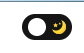
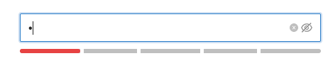
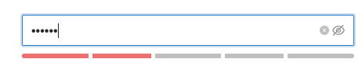
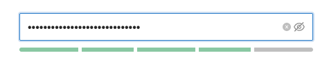

## svg

> svg —— 可缩放矢量图形，可渲染不同大小的图形。与 `png`、`jpg` 不同，`svg` 格式提供的是矢量图，图像能够被无限放大而不失真或降低质量，并且可以方便地修改内容。 [svg 元素列表](https://developer.mozilla.org/zh-CN/docs/Web/SVG/Element)

### use

`use` 可以复用 `svg` 中定义的节点并覆盖其属性`。x, y, width, height，href` 这几个属性，不管源元素是否有设置，都可以覆盖。 而其他属性，如果源 素已经设置，则无法覆盖，如果没有设置，则可以在 use 上设置。

```html
<svg viewBox="0 0 30 10" xmlns="http://www.w3.org/2000/svg">
  <circle id="myCircle" cx="5" cy="5" r="4" stroke="blue" />
  <!-- <use href="#myCircle" x="10" fill="blue" /> -->
  <!-- <use href="#myCircle" x="20" fill="white" stroke="red" /> -->
</svg>
<svg viewBox="0 0 30 10" xmlns="http://www.w3.org/2000/svg">
  <!-- <circle id="myCircle" cx="5" cy="5" r="4" stroke="blue" /> -->
  <use href="#myCircle" x="10" fill="blue" />
  <use href="#myCircle" x="20" fill="white" stroke="red" />
</svg>
```

上面即使 `use` 和 `circle` 并不在一个 `svg` 标签内部，但仍然可以复用内容，因此可以理解 `use` 的范围是 `html`

## less

> `less` 是 css 预处理器，可以帮助我们更好地组织以及编写 css

### 变量

```less
@width: 10px;
@height: @width + 10px;

#header {
  width: @width;
  height: @height;
}
```

:information_source: 变量这个概念其实 `css `也有，对应通过 `--` 来声明变量，`var()`来引入变量，理解 `继承性`和 `候补属性` 就能够比较好地理解这个概念。

```css
:root {
  --main-bg-color: brown;
}
element {
  background-color: var(--main-bg-color);
}
element {
  background-color: var(
    --main-bg-color,
    red
  ); /* red 为 --main-bg-color无效的替代值 */
}
```

### 混合

> 也叫混入，将一组属性从一个规则集应用到另外一个规则集

```css
.bordered {
  border-top: dotted 1px black;
  border-bottom: solid 2px black;
}

/* 应用上面规则集 */
#menu a {
  color: #111;
  .bordered();
}

.post a {
  color: red;
  .bordered();
}
```

### 转义

```less
// less 3.5 版本前
@min768: ~"(min-width: 768px)";
.element {
  @media @min768 {
    font-size: 1.2rem;
  }
}
// less 3.5 版本后
@min768: (min-width: 768px);
.element {
  @media @min768 {
    font-size: 1.2rem;
  }
}
```

编译后

```css
@media (min-width: 768px) {
  .element {
    font-size: 1.2rem;
  }
}
```

### 导入

通常来说可以使用 `@import` 引入其他 `less` 文件，默认会将所有的属性都进行导入

```less
@import (reference) "./index.less";
```

对于 `reference` 关键字声明的引入则按需导入，没有使用的不加入最后的编译

## windi css

> 支持大部分 tailwind css 语法且提供了更快速的 HMR。tailwind css 是一个可以通过定义 css 类名，不需要我们写额外 css 代码就能构建完整应用 css 框架。

快速集成

- 基于 vite 集成

```bash
$ npm i -D vite-plugin-windicss windicss
```

- `windi.config.ts` 配置

```ts
import { defineConfig } from "windicss/helpers";

function range(size, startAt = 1) {
  return Array.from(Array(size).keys()).map((item) => item + startAt);
}

export default defineConfig({
  darkMode: "class",
  safelist: [
    // 为了解决模板中 p-${size} 未知的配置
    "p-1 p-2 p-3 p-4 p-5",
    range(5).map((i) => `p-${i}`), // 等价于上面的配置
  ],
  plugins: [createEnterPlugin()],
  // 主题配置
  theme: {
    extend: {
      zIndex: {
        "-1": "-1",
      },
      colors: {
        primary: "#0960bd",
      },
      screens: {
        // 定义不明屏幕分辨率
        sm: "576px",
        md: "768px",
        lg: "992px",
        xl: "1200px",
        "2xl": "1600px",
      },
    },
  },
});

// 定义 transition 动画效果
function createEnterPlugin(maxOutput = 7) {
  const createCss = (index: number, d = "x") => {
    const upd = d.toUpperCase();
    return {
      // 右边过渡进入
      [`*> .enter-${d}:nth-child(${index})`]: {
        transform: `translate${upd}(50px)`,
      },
      // 左边过渡进入
      [`*> .-enter-${d}:nth-child(${index})`]: {
        transform: `translate${upd}(-50px)`,
      },
      [`* > .enter-${d}:nth-child(${index}),* > .-enter-${d}:nth-child(${index})`]:
        {
          "z-index": `${10 - index}`,
          opacity: "0",
          animation: `enter-${d}-animation 0.4s ease-in-out 0.3s`,
          "animation-fill-mode": "forwards",
          "animation-delay": `${(index * 1) / 10}s`,
        },
    };
  };
  const handler = ({ addBase }) => {
    const addRawCss = {};
    for (let index = 1; index < maxOutput; index++) {
      Object.assign(addRawCss, {
        ...createCss(index, "x"),
        ...createCss(index, "y"),
      });
    }
    addBase({
      ...addRawCss,
      [`@keyframes enter-x-animation`]: {
        to: {
          opacity: "1",
          transform: "translateX(0)",
        },
      },
      [`@keyframes enter-y-animation`]: {
        to: {
          opacity: "1",
          transform: "translateY(0)",
        },
      },
    });
  };
  return { handler };
}
```

上面的配置是 `vben admin` 的配置，具体理解每一项配置得深入学习

## tailwind css

- 使用传统构建页面的方式

```html
<div class="chat-notification">
  <div class="chat-notification-logo-wrapper">
    
  </div>
  <div class="chat-notification-content">
    <h4 class="chat-notification-title">ChitChat</h4>
    <p class="chat-notification-message">You have a new message!</p>
  </div>
</div>

<style>
  .chat-notification {
    display: flex;
    max-width: 24rem;
    margin: 0 auto;
    padding: 1.5rem;
    border-radius: 0.5rem;
    background-color: #fff;
    box-shadow: 0 20px 25px -5px rgba(0, 0, 0, 0.1), 0 10px 10px -5px rgba(0, 0, 0, 0.04);
  }
  .chat-notification-logo-wrapper {
    flex-shrink: 0;
  }
  .chat-notification-logo {
    height: 3rem;
    width: 3rem;
  }
  .chat-notification-content {
    margin-left: 1.5rem;
    padding-top: 0.25rem;
  }
  .chat-notification-title {
    color: #1a202c;
    font-size: 1.25rem;
    line-height: 1.25;
  }
  .chat-notification-message {
    color: #718096;
    font-size: 1rem;
    line-height: 1.5;
  }
</style>
```

- 采用 `tailwind css`

```html
<div
  class="p-6 max-w-sm mx-auto bg-white rounded-xl shadow-md flex items-center space-x-4"
>
  <div class="flex-shrink-0">
    
  </div>
  <div>
    <div class="text-xl font-medium text-black">ChitChat</div>
    <p class="text-gray-500">You have a new message!</p>
  </div>
</div>
```

对比发现总的 使用 `tailwind css` 的优势

- 不需要考虑 class 类名如何去定义
- css 代码不会增长（因为每次都是基于既定类名去实现样式）
- 修改更加安全，不需要担心一个地方的修改而导致破坏性行为

### 可响应

| Breakpoint prefix | Minimum width | CSS                                  |
| ----------------- | ------------- | ------------------------------------ |
| `sm`              | 640px         | `@media (min-width: 640px) { ... }`  |
| `md`              | 768px         | `@media (min-width: 768px) { ... }`  |
| `lg`              | 1024px        | `@media (min-width: 1024px) { ... }` |
| `xl`              | 1280px        | `@media (min-width: 1280px) { ... }` |
| `2xl`             | 1536px        | `@media (min-width: 1536px) { ... }` |

```html
<!-- Width of 16 by default, 32 on medium screens, and 48 on large screens -->

```

实际在使用的时候如上即可，熟悉多媒体查询的话应该也很容易上手。当然如果觉得上面表格提供的 `prefix` 不足以满足需求的话，可进行自定义

```js
// tailwind.config.js
module.exports = {
  theme: {
    screens: {
      tablet: "640px",
      // => @media (min-width: 640px) { ... }

      laptop: "1024px",
      // => @media (min-width: 1024px) { ... }

      desktop: "1280px",
      // => @media (min-width: 1280px) { ... }
    },
  },
};
```

### 伪元素

> hover、focus ...

- 语法规则

```html
focus:<css> hover:<css></css></css>
```

- 应用

```html
<form>
  <input
    class="border border-transparent focus:outline-none focus:ring-2 focus:ring-purple-600 focus:border-transparent ..."
  />
  <button
    class="bg-purple-600 hover:bg-purple-700 focus:outline-none focus:ring-2 focus:ring-purple-600 focus:ring-opacity-50 ..."
  >
    Sign up
  </button>
</form>
```

## attribute

- `vertical-align`: 指定行内元素（inline）或表格单元格（table-cell）元素的垂直对齐方式。

- `currentColor`：代表一个当前元素的颜色变量，若当前元素没有设置 `color` 属性可从父级继承。

  ```css
  fill: currentColor; /* svg 颜色填充由父级决定，可有效减少代码荣誉 */
  ```

- `data-*属性`：允许在标准、语义化的 HTML 元素中存储额外的信息 [MDN](https://developer.mozilla.org/zh-CN/docs/Learn/HTML/Howto/Use_data_attributes)

  ```html
  <article
    id="electriccars"
    data-columns="3"
    data-index-number="12314"
    data-parent="cars"
  >
    ...
  </article>
  ```

  在 js 中可通过 `dom.dataset` 获取，`article.dataset.columns`、`article.dataset.indexNumber`、`article.dataset.parent`

  在 css 中可通过属性选择器根据 `data` 改变样式

  ```css
  article[data-columns="3"] {
    width: 400px;
  }
  article[data-columns="4"] {
    width: 600px;
  }
  ```

  而在项目中，则是使用该特性来实现 `暗黑模式` 样式切换

- `will-change`：告知浏览器该元素会有哪些变化的方法，浏览器可以在元素真正发生变化前提前做好对应的优化准备工作

  ```css
  will-change: transform; /* 不应将 will-change 应用与过多元素 */
  ```

- `overflow`：`overflow` 设置成 `visible` 意味着不滚动但是元素不会被隐藏

## demo



```css
  .@{prefix-cls} {
    position: relative;
    display: flex;
    width: 50px;
    height: 26px;
    padding: 0 6px;
    margin-left: auto;
    cursor: pointer;
    background-color: #151515;
    border-radius: 30px;
    justify-content: space-between;
    align-items: center;

    &-inner { /* 中间滑块 */
      position: absolute;
      z-index: 1;
      width: 18px;
      height: 18px;
      background-color: #fff;
      border-radius: 50%;
      transition: transform 0.5s, background-color 0.5s;
      will-change: transform;
    }

    &--dark {
      .@{prefix-cls}-inner {
        transform: translateX(calc(100%));
      }
    }
```






