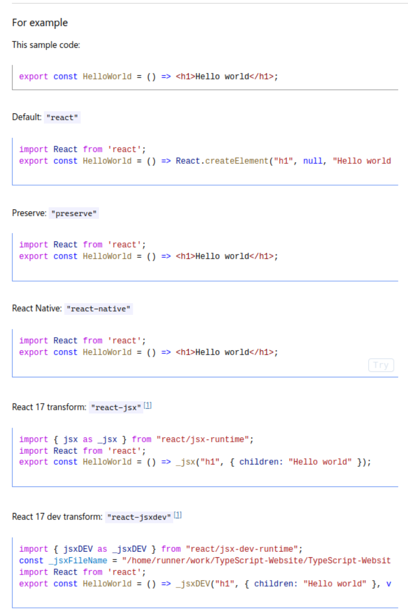
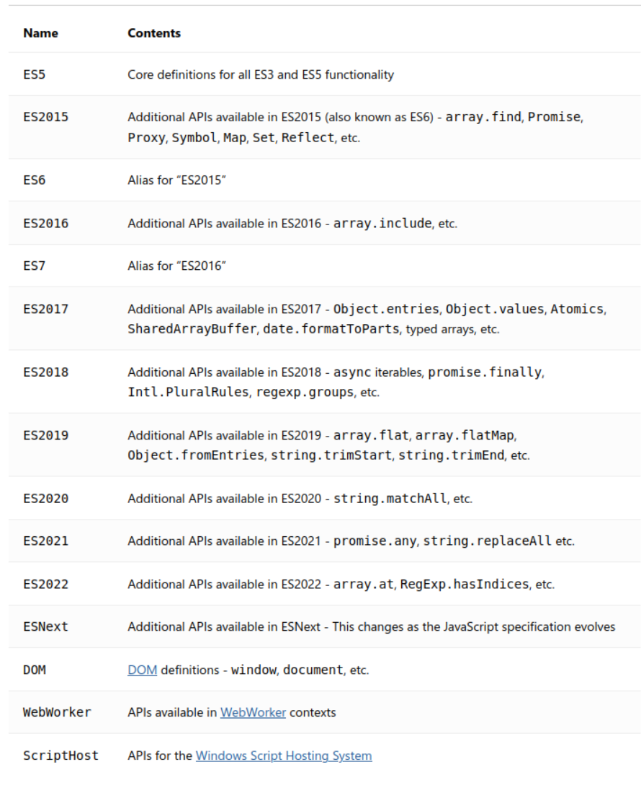
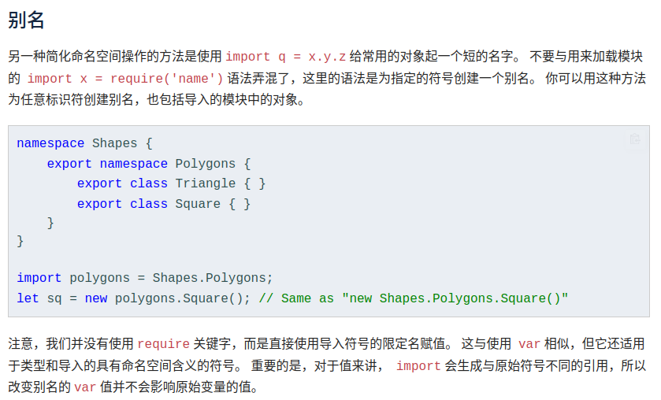

## declare global

`declare global` 位于 `types/global.d.ts` 下，主要作用是声明全局变量，且该全局变量不是我们自定义的而是来源于`第三方库`，所以也可以理解为使得模块的类型可以在全局使用而不需要多次引入。

```ts
declare global {
  interface Window {
    myGlobalVar: string;
  }
}

window.myGlobalVar = "Hello, world!";
console.log(window.myGlobalVar); // 输出：Hello, world!
```

## 函数重载

> 函数重载的出现是为了解决函数返回值通过联合类型确定，导致无法明确从输入值 -> 返回值的确定路线 [参考——掘金](https://juejin.cn/post/7055668560965681182)

```ts
// 说明上面的例子
function getUserInfo(value: number | string): User | User[] | undefined {
  if (typeof value === "number") {
    return userList.find((item) => item.id === value);
  } else {
    return userList.filter((item) => item.grades === value);
  }
}
```

不能明确输入 `value`为 `number`时返回的是什么，因此为了解决这个问题引入 `函数重载`

```ts
function getUserInfo(value: number): User | undefined;
function getUserInfo(value: string, count: number): User[];
// 最后一个参数类型要**兼容**前面的所有函数声明的参数类型
function getUserInfo(
  value: number | string,
  count: number = 1
): User | User[] | undefined {
  if (typeof value === "number") {
    return userList.find((item) => item.id === value);
  } else {
    return userList.filter((item) => item.grades === value).slice(0, count);
  }
}
```

## unknown

> unknown 可用于解决顶级类型 any 宽松的检查机制 —— 即一个参数定义为 any 则无论该参数赋值给任意形式都不会报错

`unknown` 的一些特性

- 与 `any` 类似，所有类型都可以被归为 `unknown`
- `unknown` 类型的变量只能赋值给 `any` & `unknown`

```ts
let value: unknown;

let value1: unknown = value; // OK
let value2: any = value; // OK
let value3: boolean = value; // Error
let value4: number = value; // Error
let value5: string = value; // Error
let value6: object = value; // Error
let value7: any[] = value; // Error
let value8: Function = value; // Error
```

## tsconfig.json

> 指定了编译项目所需的根目录下的文件以及编译选项

项目总体 `tsconfig.json` 配置如下，以下将详细理解每个选项代表的含义

```json
{
  "compilerOptions": {
    "target": "esnext",
    "module": "esnext",
    "moduleResolution": "node",
    "strict": true,
    "forceConsistentCasingInFileNames": true,
    "allowSyntheticDefaultImports": true,
    "strictFunctionTypes": false,
    "jsx": "preserve",
    "baseUrl": ".",
    "allowJs": true,
    "sourceMap": true,
    "esModuleInterop": true,
    "resolveJsonModule": true,
    "noUnusedLocals": true,
    "noUnusedParameters": true,
    "experimentalDecorators": true,
    "lib": ["dom", "esnext"],
    "types": ["vite/client"],
    "typeRoots": ["./node_modules/@types/", "./types"],
    "noImplicitAny": false,
    "skipLibCheck": true,
    "paths": {
      "/@/*": ["src/*"],
      "/#/*": ["types/*"]
    }
  },
  "include": [
    "tests/**/*.ts",
    "src/**/*.ts",
    "src/**/*.d.ts",
    "src/**/*.tsx",
    "src/**/*.vue",
    "types/**/*.d.ts",
    "types/**/*.ts",
    "build/**/*.ts",
    "build/**/*.d.ts",
    "mock/**/*.ts",
    "vite.config.ts"
  ],
  "exclude": ["node_modules", "tests/server/**/*.ts", "dist", "**/*.js"]
}
```

🔐 顶层属性有 `compilerOptions`、`include`、`exclude`、`references`、`extends`、`files`。其中 `compilerOptions` 为编译选项，后面的都是非编译选项

- 编译选项：编译过程中的行为
- 非编译选项：控制的是 `typescript` 编译器要编译的项目（文件）信息

[声明文件选项](https://pengfeixc.com/blogs/javascript/tsconfig) —— 这篇文章对于某些选项的讲解我觉得比较好

- `compilerOptions Language and Enviroment`

  - **target**：定义了某些 `emscript`语法会被转化或者保留`，如果要兼容低版本浏览器的话那么自然就不能写比较新的版本，但如果是确定要面向新版本浏览器的话则可不考虑语法兼容问题。
  - **experimentalDecorators**：是否支持使用装饰器
  - **jsx**：控制 `jsx` 的生成形式

  

  - **lib**：`ts` 默认包含了 一些`api` 的类型定义，像 `Math`、`document`，支持 `target` 字段定义的 `js` 版本的新特性。具体可设置为一个数组例如 `[dom, esnext]`



- `compilerOptions Modules`

  - **module**：定义 `.ts` 文件最后编译的 `js` 遵循的规范，可以设置为 `CommonJs`、`UMD`、`ESNext`......
  - **moduleResolution**：定义导入文件模块时的模块解析策略，即遵循一个怎么样的原则去寻找模块，ts 默认用 node 的解析策略，即相对的方式导入。可以定义为 `node`、`node16 / nodenext`
  - **baseUrl**：指定相对导入模块的根目录
  - **paths**：`typescript4.1` 版本之前，设置 `paths` 必须设定 `baseUrl`，但是现在如果没有设置 `baseUrl` 则基于 `tsconfig.json` 所在目录作为根目录。`path`s 的作用是定义导入模块路径别名。

  ```ts
  {
    "compilerOptions": {
      "paths": {
          "app/*": ["./src/app/*"],
          "config/*": ["./src/app/_config/*"],
          "environment/*": ["./src/environments/*"],
          "shared/*": ["./src/app/_shared/*"],
          "helpers/*": ["./src/helpers/*"],
          "tests/*": ["./src/tests/*"]
      },
  }
  ```

  :warning: 需要注意的是，`paths` 的设置仅仅是为了方便开发阶段能够使用快捷命名导入模块而不报错，并不影响像 `vite` 这些构建工具的默认机制，因此还需在这些工具内部配置别名映射

  ```ts
  alias: [
          {
            find: 'vue-i18n',
            replacement: 'vue-i18n/dist/vue-i18n.cjs.js',
          },
          // /@/xxxx => src/xxxx
          {
            find: /\/@\//,
            replacement: pathResolve('src') + '/',
          },
          // /#/xxxx => types/xxxx
          {
            find: /\/#\//,
            replacement: pathResolve('types') + '/',
          },
  ],
  ```

  - **resolveJsonModule**：允许导入 `json` 文件，`ts` 默认不支持导入 `json` 文件，因此该选项经常需要我们重置为 `true`
  - **types**：ts 编译器会默认引入 `typeRoot` 下所有的声明文件，`types` 可以通过指定模块名只引入想要的模块
  - **typeRoots**：指定默认的类型声明文件查找路径，默认为 `node_modules/@types`，指定 `typeRoots` 后，typescript 编译器会从指定路径引入声明路径

  :warning: `types` 和 `typeRoots` 只对 npm 安装的声明模块有效

- `compilerOptions JavaScript Support`

  - **allowJs**: 允许导入 `js` 文件

- `compilerOptions Type Checking`

  - **noUnusedLocals**：对没有引用的变量报错 `true`

  ```ts
  const createKeyboard = (modelID: number) => {
    const defaultModelID = 23;
  'defaultModelID' is declared but its value is never read.

    return { type: "keyboard", modelID };
  };
  ```

  - **noUnusedParameters**: 对方法没有使用的参数报错 `true`

  ```ts
  const createDefaultKeyboard = (modelID: number) => {
  'modelID' is declared but its value is never read.

    const defaultModelID = 23;
    return { type: "keyboard", modelID: defaultModelID };
  };
  ```

  - **strictFunctionTypes**: 当启用时，此标志会使函数参数得到更正确的检查。:walking: 这个特性仅仅针对函数定义生效，对于对象内再潜逃定义方法的情况不生效

  ```ts
  function fn(x: string) {
    console.log("Hello, " + x.toLowerCase());
  }

  type StringOrNumberFunc = (ns: string | number) => void;

  // Unsafe assignment is prevented
  let func: StringOrNumberFunc = fn;
  Type '(x: string) => void' is not assignable to type 'StringOrNumberFunc'.
    Types of parameters 'x' and 'ns' are incompatible.
      Type 'string | number' is not assignable to type 'string'.
        Type 'number' is not assignable to type 'string'.
  ```

  ```ts
  // 不生效
  type Methodish = {
    func(x: string | number): void;
  };

  function fn(x: string) {
    console.log("Hello, " + x.toLowerCase());
  }

  // Ultimately an unsafe assignment, but not detected
  const m: Methodish = {
    func: fn,
  };
  m.func(10);
  ```

  - **strict**：设置为 `true` 相当于使用 `use strict`

## 声明文件(.d.ts)

- [`declare var`](https://ts.xcatliu.com/basics/declaration-files.html#declare-var) 声明全局变量
- [`declare function`](https://ts.xcatliu.com/basics/declaration-files.html#declare-function) 声明全局方法
- [`declare class`](https://ts.xcatliu.com/basics/declaration-files.html#declare-class) 声明全局类
- [`declare enum`](https://ts.xcatliu.com/basics/declaration-files.html#declare-enum) 声明全局枚举类型
- [`declare namespace`](https://ts.xcatliu.com/basics/declaration-files.html#declare-namespace) 声明（含有子属性的）全局对象
- [`interface` 和 `type`](https://ts.xcatliu.com/basics/declaration-files.html#interface-和-type) 声明全局类型
- [`export`](https://ts.xcatliu.com/basics/declaration-files.html#export) 导出变量
- [`export namespace`](https://ts.xcatliu.com/basics/declaration-files.html#export-namespace) 导出（含有子属性的）对象
- [`export default`](https://ts.xcatliu.com/basics/declaration-files.html#export-default) ES6 默认导出
- [`export =`](https://ts.xcatliu.com/basics/declaration-files.html#export-1) commonjs 导出模块
- [`export as namespace`](https://ts.xcatliu.com/basics/declaration-files.html#export-as-namespace) UMD 库声明全局变量
- [`declare global`](https://ts.xcatliu.com/basics/declaration-files.html#declare-global) 扩展全局变量
- [`declare module`](https://ts.xcatliu.com/basics/declaration-files.html#declare-module) 扩展模块
- [`/// `](https://ts.xcatliu.com/basics/declaration-files.html#san-xie-xian-zhi-ling) 三斜线指令

🔐 其实最重要的是理解 `全局声明文件` 和 `模块声明文件`

- `全局声明文件`里面的类型定义全局生效，不需要引入就可以直接使
- `模块声明文件`里面的类型定义仅在模块内生效，在之前的一些版本中就是通过 `namespace` 去定义，因此需要引入后才能使用

🔐 `namespace`



`yuindex` 项目里面经常会见到在 `vue` 文件里面使用：

```vue
<script setup lang="ts">
import OutputType = YuTerminal.OutputType;
</script>
```

其实就像上面说的，这种语法是一种 `创建别名` 语法。
