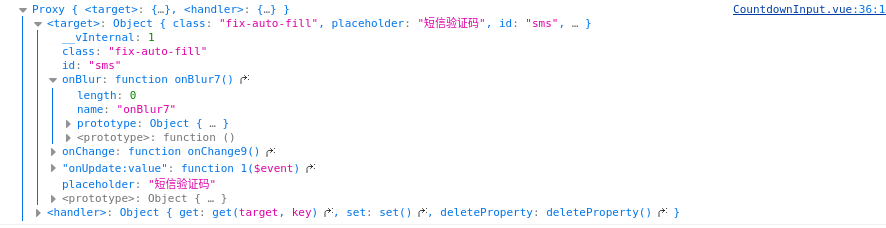
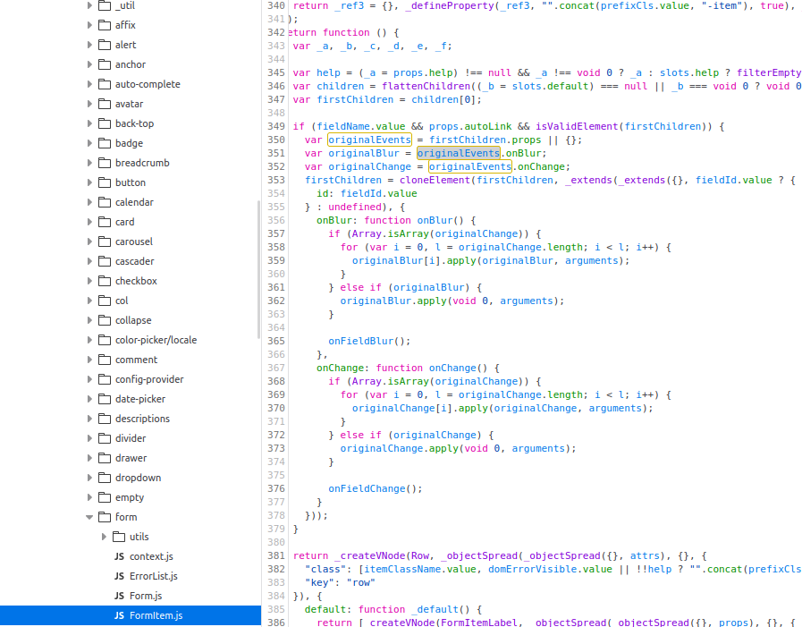
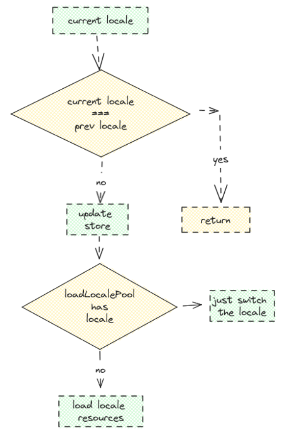

> vben-admin 开源项目学习，以下主要记录里面涉及到的知识点

## 🔐 vue3

### api

> vue3 里面暴露出去的 api

#### InjectionKey

为 `provide / inject` 标注类型。 Vue 提供了一个 `InjectionKey` 接口，它是一个继承自 `Symbol` 的泛型类型，可以用来在提供者和消费者之间同步注入值的类型 [参考](https://cn.vuejs.org/guide/typescript/composition-api.html#typing-provide-inject)

```tsx
import { provide, inject } from "vue";
import type { InjectionKey } from "vue";

const key = Symbol() as InjectionKey<string>;

provide(key, "foo"); // 若提供的是非字符串值会导致错误

const foo = inject(key); // foo 的类型：string | undefined
```

#### UnwrapRef

```ts
type UnwrapRef<T> = T extends Ref<infer R> ? R : T;

UnwrapRef<Ref<number>>; // number
```

#### unref

如果参数是 `ref`，则返回内部值；否则返回参数本身，等价于以下判断

```ts
val = isRef(val) ? val.value : val;
```

#### toRefs

将响应式对象（`reactive`）转换为普通对象，普通对象的每个属性都是值向原对象的 `ref`

```ts
const obj = reactive({
  name: "jzy",
  age: 18,
});
const { name, age } = toRefs(obj);
// name.value === obj.name
// age.value === obj.age
```

### hooks

> 里面比较有意思 hooks 函数

#### useMessage

`useMessage` 主要是配置封装`antd` 消息组件以便在全局引入使用

- `notifycation`

```ts
import {
  NotificationArgsProps,
  ConfigProps,
} from "ant-design-vue/lib/notification";

// Notifycation 组件提供的方法列表
export interface NotifyApi {
  info(config: NotificationArgsProps): void;
  success(config: NotificationArgsProps): void;
  error(config: NotificationArgsProps): void;
  warn(config: NotificationArgsProps): void;
  warning(config: NotificationArgsProps): void;
  open(args: NotificationArgsProps): void;
  close(key: String): void;
  config(options: ConfigProps): void;
  destroy(): void;
}

// 全局配置 notifycation 选项
notification.config({
  placement: "topRight", // 出现位置
  duration: 3, // 持续时间
});
```

- `model` ：配置较多，主要需要区分 `图标`、`弹出类型`

  - 定义 `model` 调用方法传入的参数类型

    ```ts
    export interface ModalOptionsEx extends Omit<ModalFuncProps, "iconType"> {
      iconType: "warning" | "success" | "error" | "info";
    }
    export type ModalOptionsPartial = Partial<ModalOptionsEx>;
    ```

  - 定义 `model` 组件 `icon`

    ```ts
    import {
      InfoCircleFilled,
      CheckCircleFilled,
      CloseCircleFilled,
    } from "@ant-design/icons-vue";

    function getIcon(iconType: string) {
      if (iconType === "warning") {
        return <InfoCircleFilled class="modal-icon-warning" />;
      } else if (iconType === "success") {
        return <CheckCircleFilled class="modal-icon-success" />;
      } else if (iconType === "info") {
        return <InfoCircleFilled class="modal-icon-info" />;
      } else {
        return <CloseCircleFilled class="modal-icon-error" />;
      }
    }
    ```

  - 定义 `model` 内容渲染函数（需要区分是 `组件类型` 还是`普通文本` ）

    ```ts
    function renderContent({ content }: Pick<ModalOptionsEx, "content">) {
      if (isString(content)) {
        return <div innerHTML={`<div>${content as string}</div>`}></div>;
      } else {
        return content;
      }
    }
    ```

  - 定义 `model` 基础配置，如 `确认按钮文字` 、`是否垂直居中`，同时提供一个 `options` 创建函数，合并 `baseOptions` 以及外部传入的参数

    ```ts
    const getBaseOptions = () => {
      const { t } = useI18n();
      return {
        okText: t("common.okText"), // 确认按钮文字
        centered: true, // 垂直剧中展示 Modal
      };
    };

    // 初始化配置
    function createModalOptions(
      options: ModalOptionsPartial,
      icon: string
    ): ModalOptionsPartial {
      return {
        ...getBaseOptions(),
        ...options,
        content: renderContent(options),
        icon: getIcon(icon),
      };
    }
    ```

  - 有了配置信息，就是去创建对应的实例方法以便直接导出使用

    ```ts
    function createConfirm(options: ModalOptionsEx) {
      const iconType = options.iconType || "warning";
      Reflect.deleteProperty(options, "iconType");
      const opt: ModalFuncProps = {
        centered: true,
        icon: getIcon(iconType),
        ...options,
        content: renderContent(options),
      };
      return Modal.confirm(opt);
    }

    function createSuccessModal(options: ModalOptionsPartial) {
      return Modal.success(createModalOptions(options, "success"));
    }

    function createErrorModal(options: ModalOptionsPartial) {
      return Modal.error(createModalOptions(options, "close"));
    }

    function createInfoModal(options: ModalOptionsPartial) {
      return Modal.info(createModalOptions(options, "info"));
    }

    function createWarningModal(options: ModalOptionsPartial) {
      return Modal.warning(createModalOptions(options, "warning"));
    }
    ```

#### useEventListener

> addEventListener、removeEventListener 应用

常用的就是在 `window` 窗口发生变化的时候更新 `info`从而在页面根据这些信息进行自适应

```ts
interface UseEventParams {
  el: Element | Window | any; // 需要监听事件触发的DOM对象
  listener: EventListener; // 事件触发回调函数
  name: string; // 监听事件名
  isDebounce?: boolean; // 是否启动防抖,
  wait?: number; // 防抖时间
  autoRemove?: boolean; // 是否在DOM变化后自动清除上一个周期绑定的事件监听函数
}
```

伪代码

```ts
function useEventListener(options: UseEventParmas): (removeFn: () => void) {
	// remove函数初始化
    remove = () => {}
    flag = false // flag 标识el是否已经对name进行监听
    if el:
        // 事件防抖
        isDebounce ? useDebounce(listener, wait) ? listener
    	// 绑定事件监听
    	watch(ref, (v, _ov, cleanup) => { // watch 立即执行
          存在 v:
           flag = false && addEventListener
          cleanup(() => {
              removeEventListener
          })
		})
}
```

#### useFormItem

> 表单数据绑定

```vue
<!-- 父组件 -->
<FormItem name="sms" class="enter-x">
        <CountdownInput
          size="large"
          class="fix-auto-fill"
          v-model:value="formData.sms"
          :placeholder="t('sys.login.smsCode')"
        />
</FormItem>

<!-- 自组件 -->
<a-input v-bind="$attrs" :class="prefixCls" :size="size" :value="state" />
```

以上场景非常常见，即在 `FormItem` 内嵌套一个自定义组件，通过 `v-model`进行数据绑定。

常见的语法也是通过 `props` & `emits` 绑定 `value` 和 `update:value` 来实现。

而项目中给了一种比较 **新奇** 的方式：

```ts
export function useRuleFormItem<T extends Recordable>(
  props: T,
  key: keyof T = "value",
  changeEvent = "change",
  emitData?: Ref<any[]>
) {
  const instance = getCurrentInstance();
  const emit = instance?.emit;

  const innerState = reactive({
    value: props[key],
  });

  watchEffect(() => {
    innerState.value = props[key];
  });

  const state: any = computed({
    get() {
      return innerState.value;
    },
    set(value) {
      if (isEqual(value, defaultState.value)) return;

      innerState.value = value as T[keyof T];
      nextTick(() => {
        // 保证 ant design 表单的 change 事件能够触发用于规则校验
        emit?.(changeEvent, value, ...(toRaw(unref(emitData)) || []));
      });
    },
  });

  return [state];
}
```

凡是通过 `v-model:value` 绑定的值，在自组件中使用如下代码均可完成双向绑定

```vue
<a-input v-bind="$attrs" :value="state"></a-input>

const [state] = useRuleFormItem(props)
```

🔐 理解这个过程



可以在自组件内部打印下 `attrs`，出现以上结果；但实际上属性明显从父组件继承下去只有 `placeholder` 和 `class`，那多余的像 `onBlur`、`onChange`、`onUpdate:value` 的出现就得深究。

- `onBlur`、`onChange`、`id` 都是`FormItem`附加在 `firstChild` 上的，表单校验时需在子项变化后执行校验函数，因此需要拓展子项 `onChange` 方法来执行 `onFieldsChange`



- `onUpdate:value` 方法则是 `v-model` 编译后的余项。因此要实现双向绑定，就要触发 `onUpdate:value` 来更新数据

```js
onUpdate: value = (val) => (formData.sms = val);
```

上面代码的思路其实就是跳过这个过程。**`props` 本身在子组件是 `readOnly`，但实际上也是在更新的**，`innerState`是对于 `props` 的引用 而现在将 `state` 定义为 是 `innerState` 的 `computed` 属性， `formData.sms = state` === `formData.sms = innerState.value`，`innerState` 的更新导致了组件的重渲染，**重新读取模板数据**触发 `state` 的 `get`方法。

#### useCountDown

一个用于倒计时的 `hooks`

- `currentCount`：保留给外部的倒计时当前值
- `methods`：`start`、`reset`、`stop`、`clear` 对于倒计时本身的操作方法

```ts
export function useCountdown(count: number) {
  const currentCount = ref(count);

  const isStart = ref(false);

  let timerId: ReturnType<typeof setInterval> | null;

  function clear() {
    timerId && window.clearInterval(timerId);
  }

  function stop() {
    isStart.value = false;
    clear();
    timerId = null;
  }

  function start() {
    if (unref(isStart) || !!timerId) {
      return;
    }
    isStart.value = true;
    timerId = setInterval(() => {
      // 濒临结束
      if (unref(currentCount) === 1) {
        stop();
        currentCount.value = count;
      } else {
        currentCount.value -= 1;
      }
    }, 1000);
  }

  function reset() {
    currentCount.value = count;
    stop();
  }

  function restart() {
    reset();
    start();
  }

  // vueuse-core
  tryOnUnmounted(() => {
    reset();
  });

  return { start, reset, restart, clear, stop, currentCount, isStart };
}
```

### vue-router

> 初始化实例

```ts
export const router = createRouter({
  history: createWebHashHistory(""),
  routes: basicRoutes,
  strict: true, // 禁用尾部 /
  scrollBehavior: () => ({ left: 0, top: 0 }),
});
```

- `history` ：采用 `hash` 还是 `history`
- `strict`：通常来说，`/user` 可以匹配浏览器输入 `/user`、`/user/`，`strict` 配置为 `true` 则只允许第一种情况即没有尾部 `/` 的情况匹配成功

- `scrollBehavior`：路由切换完成滚动条的位置

### vue-i18n

> 实现网站国际化 —— 多语种切换

:key: 整体文件目录

```text
locales
├─helper.ts # utils（包括 setHtmlPageLang 、setLocalePool、genMessage）
├─setupI18n.ts # 初始化实例
├─useLocale.ts # 提供获取/更新当前语言环境的函数
├─lang # 资源包
|  ├─en.ts
|  ├─zh_CN.ts
|  ├─zh-CN
|  |   ├─common.ts
|  |   ├─component.ts
|  |   ├─layout.ts
|  |   ├─sys.ts
|  |   ├─routes
|  |   |   ├─basic.ts
|  |   |   ├─dashboard.ts
|  |   |   └demo.ts
|  ├─en
|  | ├─common.ts
|  | ├─component.ts
|  | ├─layout.ts
|  | ├─sys.ts
|  | ├─routes
|  | |   ├─basic.ts
|  | |   ├─dashboard.ts
|  | |   └demo.ts
```

对于 `i18n` 整个流程，其实可以分为：

- 自定义语种资源包
- 将资源包整合为一个 `object`
- `i18n` 实例创建，包括资源和配置初始化
- 提供获取和更新 `locale` 的 hooks `useLocale`
- 提供在 `模板` 和 `ts` 文件中使用的 `t函数` hooks `useI18n`

1. 安装依赖

```bash
$ pmpm install vue-i18n
```

2. 定义获取资源包代码 —— 该步骤主要根据资源整合生成语种`资源映射`。具体在 `zh_CN.ts` 内部，基于 `vite` 提供的模块导入机制，通过 `genMessage` 将各个模块整合成对象，整个 `export default ` 出去的就是语言环境为中文的情况下的资源信息

```ts
import { genMessage } from "../helper";
import antdLocale from "ant-design-vue/es/locale/zh_CN";
import momentLocale from "moment/dist/locale/zh-cn";

const modules: Recordable = import.meta.glob("./zh-CN/**/*.ts", {
  eager: true,
});
export default {
  message: {
    ...genMessage(modules, "zh-CN"),
    antdLocale,
  },
  momentLocale,
  momentLocaleName: "zh-cn",
};
```

- `utils` —— 将资源名称以及对应的值整合成一个对象
  - 提取文件名作为 `object key`
  - 区分一级目录和二级目录 `routes/sys` & `common`

```ts
/**
 * @param langs { './zh-CN/common.ts': { default: {} }}
 * @param prefix language name
 * @return { setting: {
 *  login: { loginButton: '登陆' }
 * }, header: {} }
 */
export function genMessage(
  langs: Record<string, Record<string, any>>,
  prefix = "lang"
) {
  const obj: Recordable = {};

  Object.keys(langs).forEach((key) => {
    const langFileModule = langs[key]?.default;
    let filename = key.replace(`./${prefix}/`, "").replace(/^\.\//, "");
    const lastIndex = filename.lastIndexOf(".");
    filename = filename.substring(0, lastIndex); // 去除文件后缀
    const keyLists = filename.split("/"); // 基于文件目录是 routes/xxx
    const moduleName = keyLists.shift();

    if (moduleName) {
      if (keyLists.length) {
        set(obj, moduleName, obj[moduleName] || {});
        set(obj[moduleName], keyLists[0], langFileModule);
      } else {
        set(obj, moduleName, langFileModule || {});
      }
    }
  });

  return obj;
}
```

3. 提供 `i18n` 初始化函数
   1. 执行资源加载 `zh_CN.ts`
   2. 自定义 `i18n` 选项
   3. 暴露 `setupI18n` 给 `main.ts`

```ts
async function createI18nOptions(): Promise<I18nOptions> {
  const localeStore = useLocaleStoreWithout(); // 语言环境 store
  const locale = localeStore.getLocale; // 获得当前语言环境
  const defaultLocale = await import(`./lang/${locale}.ts`); // 获得加载资源包函数
  const message = defaultLocale.default?.message ?? {};

  setHtmlPageLang(locale);
  // 标识资源包已经被加载了
  setLocalePool((loadLocalePool) => {
    loadLocalePool.push(locale);
  });

  // i18n 配置选项
  return {
    legacy: false, // 使用 composition api 模式
    locale,
    fallbackLocale: fallback, // 回退语言
    availableLocales,
    messages: {
      [locale]: message,
    },
    silentTranslationWarn: true, // 禁止本地化失败警告
    missingWarn: false,
    silentFallbackWarn: true, // 仅在根本没有可用的转换时生成警告
  };
}

// main.ts 中用于初始化 i18n
export async function setupI18n(app: App<Element>) {
  const options = await createI18nOptions();
  i18n = createI18n(options) as I18n;
  app.use(i18n);
}
```

4. 有了初始化函数后初始的资源显示就没有问题了，但是缺少一个用于更新的函数 —— 当语言环境更新的时候需要进行什么操作

   1. 更新 `store locale`
   2. 判断当前语言环境情况

   

5. 最后 `i18n` 的配置、更新都设置好了，就是如何在`模板`或者 `ts` 文件中引入的问题。实际可以抽取成一个 `hooks`

```ts
// 类型定义
type I18nGlobalTranslation = {
  (key: string): string;
  (key: string, locale: string): string;
  (key: string, locale: string, list: unknown[]): string;
  (key: string, locale: string, named: Record<string, unknown>): string;
  (key: string, list: unknown[]): string;
  (key: string, named: Record<string, unknown>): string;
};
interface I18nGlobalOptions extends Omit<typeof i18n.global, "t"> {
  t: I18nGlobalTranslation;
}
type I18nTranslationRestParameters = [string, any];

// composition api hooks
export function useI18n(namespace?: string): {
  t: I18nGlobalTranslation;
} {
  const normalFn = {
    t: (key: string) => {
      // return getKey(namespace, key); namespace 作用暂不明确
      return key;
    },
  };

  if (!i18n) {
    return normalFn;
  }

  const { t, ...methods } = i18n.global as I18nGlobalOptions;

  const tFn: I18nGlobalTranslation = (key: string, ...arg: any[]) => {
    if (!key) return "";
    if (!key.includes(".") && !namespace) return key;
    return t(getKey(namespace, key), ...(arg as I18nTranslationRestParameters));
  };
  return {
    ...methods,
    t: tFn,
  };
}

// 在 setup 函数以外使用
export const t = (key: string) => key;
```

在用的时候就可以

```vue
<template>
  <div>{{ t("sys.login.loginButton") }}</div>
</template>

<script setup lang="ts">
const { t } = useI18n();
</script>
```

> 为了在 vscode 中有对应信息提示，得下载一个 `i18 ally` 插件，并在项目 `settings.json` 中配置

```json
{
  "i18n-ally.localesPaths": ["src/locales/lang"], // 指定资源所在路径
  "i18n-ally.keystyle": "nested",
  "i18n-ally.sortKeys": true,
  "i18n-ally.namespace": true,
  "i18n-ally.pathMatcher": "{locale}/{namespaces}.{ext}",
  "i18n-ally.enabledParsers": ["json", "ts"],
  "i18n-ally.sourceLanguage": "en",
  "i18n-ally.displayLanguage": "zh-CN",
  "i18n-ally.enabledFrameworks": ["vue", "react"]
}
```

### pinia

> vue 目前流行的状态管理工具

```ts
export const useCounterStore = defineStore("counter", {
  state: () => ({ count: 0 }),
  getters: {
    double: (state) => state.count * 2,
  },
  actions: {
    increment() {
      this.count++;
    },
  },
});
```

- `state`：`store` 中的数据
- `getter`：`store` 中的计算属性
- `actions`：`store` 中的 `method`

以上是最简 `pinia` 配置

当然除了以上 `option configuration`，也支持在构造函数内使用 `composition api` 的方式定义数据、计算属性和方法。

```ts
export const useCounterStore = defineStore("counter", () => {
  const count = ref(0);
  function increment() {
    count.value++;
  }

  return { count, increment };
});
```

> :imp: 解构响应式属性 `storeToRefs `

```ts
<script setup>
  import {storeToRefs} from 'pinia' const store = useCounterStore() // `name` 和
  `doubleCount` 是响应式的 ref // 会跳过所有的 action 或非响应式 (不是 ref 或
  reactive) 的属性 const {(name, doubleCount)} = storeToRefs(store) // 作为
  action 的 increment 可以直接解构 const {increment} = store
</script>
```

> :imp: 使用 store

如果是在 `script setup` 内部的话，直接导入并执行函数即可

```ts
<script setup>
  import {useCounterStore} from '@/stores/counter' const store =
  useCounterStore()
</script>
```

如果不能使用组合式 `api`则需要使用映射辅助函数

```ts
export default defineComponent({
  computed: {
    // 允许访问 this.counterStore 和 this.userStore
    ...mapStores(useCounterStore, useUserStore)
    // 允许读取 this.count 和 this.double
    ...mapState(useCounterStore, ['count', 'double']),
  },
  methods: {
    // 允许读取 this.increment()
    ...mapActions(useCounterStore, ['increment']),
  },
})
```

## 🔐 components

项目在 `components` 内部封装了若干公共组件，包括 `Dropdown`、`Menu`……，以下主要从封装思路去描述

### dropDown

> 下拉框

从下拉框的基本使用需求来说，需要提供

- 下拉菜单列表数据
- 默认菜单选中选项
- 触发条件(单击、双击、悬浮)
- 触发事件

更高级的话可以增加一个是否确认的标识 `popConfirm` —— 在触发条件后需要用户确认再触发事件；而实际 `confirm`、`cancel` 的配置则放入到 `dropMenuList` 中，因此对 `dropMenuList` 需要约定类型

```ts
interface DropMenu {
  text: string;
  key: string;
  confirm?: () => void;
  cancel?: () => void;
}

interface DropDownOptions {
  dropMenuList: DropMenu[];
  selectedKeys: string[];
  trigger: string[]; // click/doubleclick...
  menuEvent: () => void;
  popConfirm: boolean;
}
```

### countdown

> 计数器(获取验证码阶段倒计时)

从计时器本身来说 `CountButton`，需要提供

- 倒计时初始值
- 倒计时执行前需要执行的请求函数

```ts
interface CountButtonParams {
  count: number;
  beforeFn: () => void;
}
```

同时需要提供 `reset`、`start`、`restart`、`stop` 等等与计时相关方法

```ts
(reset) => {
  count = defaultValue;
};

(start) => {
  setInterval(() => {}, count);
};

(restart) => {
  reset();
  start();
};

(stop) => {
  clearInterval();
};
```

## 🔐 vite

- 初始化 `vue-ts` 项目

```bash
$ pnpm create vite vue-ts-project --template vue-ts
```

- 集成 `typescript` 环境

```bash
$ pnpm add typescript @typescript-eslint/eslint-plugin @typescript-eslint/parser eslint eslint-plugin-vue -D
```

配置 `eslintrc`

### plugin

> 插件列表主要是拓展项目功能

- `@vitejs/plugin-vue`：支持 `vue` 项目

- `@vitejs/plugin-vue-jsx`：支持 `vue` 使用 `jsx` 或者 `tsx` 语法

  在开发的时候遇到一个问题，经过了漫长的排错最终才发现是项目并不支持使用 `jsx` 语法

  ```js
  SyntaxError: expected expression, got '<'
  ```

### glob

`glob` 在 vite 中用于动态导入，构建时会分离为独立 chunk

```ts
const modules = import.meta.glob("./dir/*.js");

// vite 生成的代码
const modules = {
  "./dir/foo.js": () => import("./dir/foo.js"),
  "./dir/bar.js": () => import("./dir/bar.js"),
};
```

```ts
// 遍历访问模块
for (const path in modules) {
  modules[path]().then((mod) => {
    console.log(path, mod);
  });
}
```

## 🔐 lint

> `eslint` 、`prettier`、 `husky`、`lint-staged`、`commitlint`

### eslint

[宝藏配置](http://www.huhaowb.com/2022/10/11/vite%E5%88%9B%E5%BB%BAVue3%E9%A1%B9%E7%9B%AE%E9%85%8D%E7%BD%AEESLint/)： 覆盖了绝大部分的 `eslint` 、`prettier` 配置，非常好的一篇文章

- 依赖安装

```bash
$ pnpm install eslint eslint-plugin-vue @typescript-eslint/eslint-plugin @typescript-eslint/parser prettier eslint-config-prettier eslint-plugin-prettier
-D
```

- `prettier`：prettier 的核心代码
- `eslint-config-prettier`：这将禁用 ESLint 中的格式化规则，而 Prettier 将负责处理这些规则
- `eslint-plugin-prettier` ：把 Prettier 推荐的格式问题的配置以 ESLint rules 的方式写入，统一代码问题的来源。
- `eslint`： ESLint 的核心代码
- `@typescript-eslint/parser` ：SLint 的解析器，用于解析 typescript，从而检查和规范 Typescript 代码
- `@typescript/eslint/eslint-plugin`：包含了各类定义好的检测 Typescript 代码的规范
- `eslint-plugin-vue `：支持对 vue 文件检验 [规则集](https://eslint.vuejs.org/rules/max-len.html)
- `vue-eslint-parser`：这个解析器允许我们检测.vue 文件的 `<template> `。

- `eslint.js`

```js
// @ts-check
const { defineConfig } = require("eslint-define-config");
module.exports = defineConfig({
  root: true,
  env: {
    browser: true,
    node: true,
    es6: true,
  },
  parser: "vue-eslint-parser",
  parserOptions: {
    parser: "@typescript-eslint/parser",
    ecmaVersion: 2020,
    sourceType: "module",
    jsxPragma: "React",
    ecmaFeatures: {
      jsx: true,
    },
  },
  extends: [
    "plugin:vue/vue3-recommended",
    "plugin:@typescript-eslint/recommended",
    "prettier",
    "plugin:prettier/recommended",
  ],
  rules: {
    "vue/script-setup-uses-vars": "error",
    "@typescript-eslint/ban-ts-ignore": "off",
    "@typescript-eslint/explicit-function-return-type": "off",
    "@typescript-eslint/no-explicit-any": "off",
    "@typescript-eslint/no-var-requires": "off",
    "@typescript-eslint/no-empty-function": "off",
    "vue/custom-event-name-casing": "off",
    "no-use-before-define": "off",
    "@typescript-eslint/no-use-before-define": "off",
    "@typescript-eslint/ban-ts-comment": "off",
    "@typescript-eslint/ban-types": "off",
    "@typescript-eslint/no-non-null-assertion": "off",
    "@typescript-eslint/explicit-module-boundary-types": "off",
    "@typescript-eslint/no-unused-vars": [
      "error",
      {
        argsIgnorePattern: "^_",
        varsIgnorePattern: "^_",
      },
    ],
    "no-unused-vars": [
      "error",
      {
        argsIgnorePattern: "^_",
        varsIgnorePattern: "^_",
      },
    ],
    "space-before-function-paren": "off",

    "vue/attributes-order": "off",
    "vue/v-on-event-hyphenation": "off",
    "vue/multi-word-component-names": "off",
    "vue/one-component-per-file": "off",
    "vue/html-closing-bracket-newline": "off",
    "vue/max-attributes-per-line": "off",
    "vue/multiline-html-element-content-newline": "off",
    "vue/singleline-html-element-content-newline": "off",
    "vue/attribute-hyphenation": "off",
    "vue/require-default-prop": "off",
    // 'vue/html-self-closing': [
    //   'error',
    //   {
    //     html: {
    //       void: 'always',
    //       normal: 'never',
    //       component: 'always',
    //     },
    //     svg: 'always',
    //     math: 'always',
    //   },
    // ],
  },
});
```

- `prettier.config.js`

```js
module.exports = {
  printWidth: 100, // 单行最大长度
  semi: true, //  句尾默认添加分号
  vueIndentScriptAndStyle: true, // 缩进Vue文件中脚本和样式
  singleQuote: true, // 字符串使用单引号
  trailingComma: "all", // 尾逗号
  proseWrap: "never", // 对于 markdown 文件来说不强制换行 https://github.com/prettier/prettier/issues/6766
  htmlWhitespaceSensitivity: "strict",
  endOfLine: "auto", // 换行符跟随像
};
```

> `eslint`、`prettier` 主要在工作区阶段对我们编写的代码进行格式限制，但实际并不影响代码执行，一旦 `git `提交到远程仓库，会混淆仓库内文件格式，导致别人在拉代码后报错（即使不影响执行，但爆红就很不好）。

- `husky`：监听 `git` 各个钩子周期
- `lint-staged`：针对暂存区的内容进行代码格式校验
- `commitlint`：针对 `commit msg` 进行格式校验

### husky

- 依赖安装

```bash
$ pnpm install -D husky
```

- 配置 `npm install` 之前执行 `husky install`

```json
{
  "script": {
    "prepare": "husky install"
  }
}
```

### lint-staged

- 依赖安装

```bash
$ pnpm install -D lint-staged
```

- 配置文件 `lintstagedrc.js`

```js
module.exports = {
  "*.{js,jsx,ts,tsx}": ["eslint --fix", "prettier --write"],
  "{!(package)*.json,*.code-snippets,.!(browserslist)*rc}": [
    "prettier --write--parser json",
  ],
  "package.json": ["prettier --write"],
  "*.vue": ["eslint --fix", "prettier --write"],
  "*.md": ["prettier --write"],
};
```

- 配置 `script` 钩子执行

```json
{
  "script": {
    "lint:lint-staged": "lint-staged -c ./.husky/lintstagedrc.js"
  }
}
```

- `pre-commit` 钩子执行 `lint-staged`

```bash
$ npx husky add .husky/pre-commit 'npm run lint:lint-staged'
```

### commitlint

- 依赖安装

```bash
$ pnpm install -D @commitlint/cli @commitlint/config-conventional
```

- `commit-msg` 钩子执行 `lint-staged`

```bash
$ npx husky add .husky/commit-msg "npx --no -- commitlint --edit $1"
```
